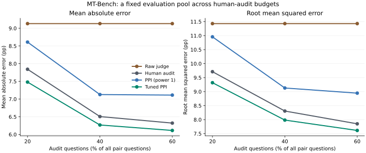
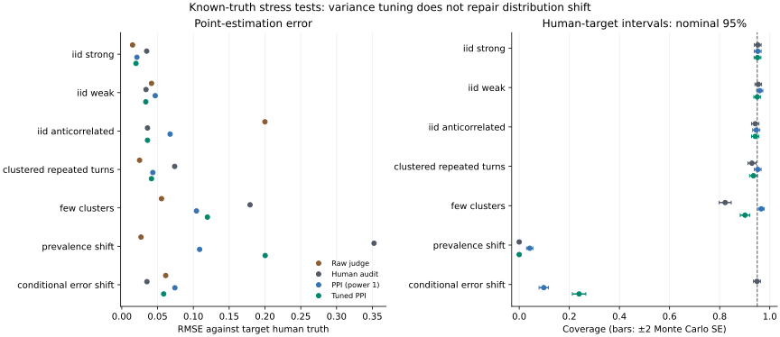
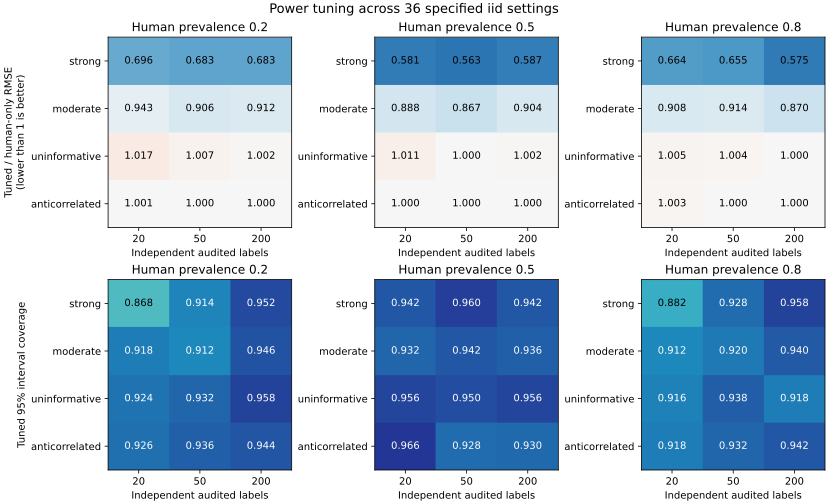
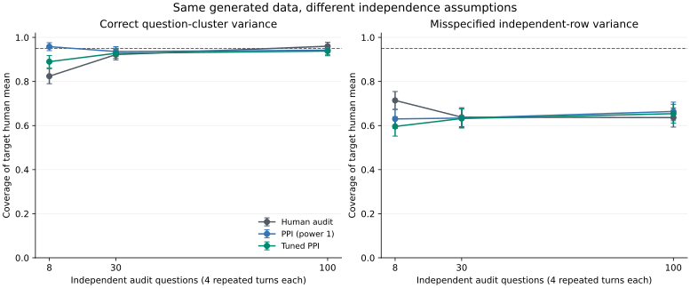
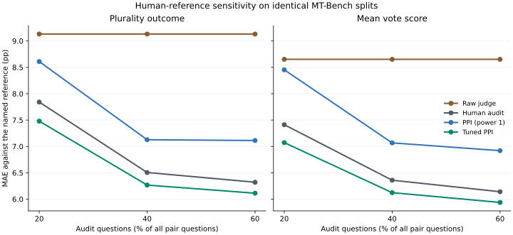

# judgecal

[](https://github.com/Siquan-Wang/llm-judge-calibration/actions/workflows/ci.yml)

**When does an imperfect LLM judge help a limited human audit—and when does it hurt?**

A research toolkit for human-preference estimation: prediction-powered inference,
adaptive reliance on a judge, question-level dependence, and explicit failure
analysis. It combines established statistical methods with reproducible empirical
studies. Raw judge predictions, human references and corrected estimates remain
separate. This project does not claim a new PPI estimator.

## Research study: audit reliability

The [full report](reports/research/REPORT.md), [analysis plan](docs/RESEARCH_PROTOCOL.md)
and [mathematical methods](docs/METHODS.md) compare four estimators on identical
samples: raw GPT-4 judge, human audit only, coefficient-one PPI and tuned PPI.
All **15 eligible MT-Bench model pairs** and **30 deterministic splits** are retained.
Evaluation questions stay fixed while audit budgets grow; complete questions,
including their repeated turns, remain disjoint. No evaluation human labels tune
the estimator. The analysis is retrospective, not preregistered.



| Audit budget | Raw judge MAE | Human-only MAE | PPI MAE | Tuned PPI MAE |
|---:|---:|---:|---:|---:|
| 20% | 9.132 pp | 7.842 pp | 8.610 pp | 7.480 pp |
| 40% | 9.132 pp | 6.506 pp | 7.127 pp | 6.267 pp |
| 60% | 9.132 pp | 6.321 pp | 7.112 pp | 6.113 pp |

Tuning yields a modest aggregate improvement over human-only on this case study;
it does not win on every pair or split. Errors target the realized heldout human
plurality mean. Correlated repeated splits are descriptive, not independent
replications or tests of population interval coverage.

Seven known-truth scenarios examine judge quality, repeated-turn dependence,
few independent questions, prevalence shift and changing judge error rates.
Each has **1,000 independent replications** with complete trial records and
Monte Carlo errors. Small-cluster undercoverage and transfer failures are
retained: optimizing estimated variance does not remove distribution-shift bias.



The [historical coefficient-one study](reports/mtbench/REPORT.md) remains intact.
Its evaluation subset shrinks with audit budget, so its numbers answer a
different question. Neither study establishes guaranteed annotation savings,
finite-sample validity or reliability on contemporary judge families.

## Follow-up: where the methods fail

The [factorial stress report](reports/stress/REPORT.md) expands to **36 iid
settings** across human prevalence, judge quality and audit size, plus six
analyses of paired dependence-ablation data. Each setting uses 500 replications;
all **84,000 method/trial rows** are retained in deterministic compressed CSV.



The tuned method improves observed RMSE in all 18 strong/moderate-judge cells.
Uninformative judges provide no reliable gain and can slightly worsen error.
For a strong judge with only 20 audit labels, tuned 95% coverage is 86.8% at
human prevalence 0.2 and 88.2% at prevalence 0.8. These are simulation-specific
findings with Monte Carlo uncertainty, not distribution-free guarantees.



The dependence experiment analyzes identical generated data with and without
question grouping. Naive independent-row intervals substantially undercover;
correct grouping helps but does not make few-cluster normal inference reliable.
The report includes paired method-difference Monte Carlo errors, rather than
treating competing estimates on the same draws as independent.

An [optional numerical comparison](docs/REFERENCE_BASELINE.md) pins the PPI
authors' `ppi-python==0.2.3` implementation. It verifies fixed-weight algebra
and explicitly retains the expected finite-sample differences in automatic
power and interval variance conventions.

## Follow-up: which human reference?

The [reference-sensitivity report](reports/sensitivity/REPORT.md) repeats
the fixed-target experiment with both plurality outcomes and the mean
recorded vote score within each comparison. All splits, frozen judge scores
and audit costs are identical. The latter averages comparisons equally;
it does not pool individual votes or claim to recover latent consensus.

The snapshot has 1,814 comparisons and 3,354 unique votes; 854 comparisons
have only one vote. The two outcome scores differ on 305 comparisons.
Averages alone cannot distinguish unanimous ties from polarized A/B votes,
so the artifact retains the underlying counts and every paired outcome.



Each method is evaluated against its own named reference. Differences in
error across reference definitions do not establish which definition is
better. The [retrospective protocol](docs/REFERENCE_SENSITIVITY.md) specifies
the estimands, sampling, weighting and limits of the comparison.

Tuned PPI retains a modest aggregate MAE advantage over human-only at all
three budgets under both definitions (about 0.20–0.36 percentage points).
The direction of the pair-level comparison changes in 5 of 45 matched
pair/budget cases. The aggregate finding is stable here, while individual
model-pair conclusions can depend on how human votes are summarized.

## Install

```bash
git clone https://github.com/Siquan-Wang/llm-judge-calibration.git
cd llm-judge-calibration
pip install -e ".[dev]"
```

Core dependencies: NumPy, SciPy and pandas. The `data` extra downloads pinned
MT-Bench judgments; `report` adds plotting. The research study uses committed
public labels and synthetic draws, with no model API key or paid calls.

## Prediction-powered win rates

Let `Y_L` be human preference scores on an audit, `F_L` the matching judge scores
and `F_U` judge scores on a separate target pool. A target win scores 1, a loss 0
and a tie 0.5. The power-weighted mean estimator is:

```text
human preference rate = mean(Y_L) + power * (mean(F_U) - mean(F_L))
SE² = Var(mean(Y_L - power * F_L)) + power² * Var(mean(F_U))

power=0       human audit only
power=1       original PPI (backward-compatible default)
power="auto"  minimize the estimated per-pool variance over [0, 1]
```

```python
from judgecal import prediction_powered_win_rate

result = prediction_powered_win_rate(
    judge_labeled=["A", "A", "B", "tie", "B", "A"],
    human_labeled=["A", "B", "B", "tie", "A", "A"],
    judge_unlabeled=["A", "B", "A", "tie", "A", "B", "B", "A"],
    labeled_groups=[1, 1, 2, 2, 3, 3],
    unlabeled_groups=[4, 4, 5, 5, 6, 6, 7, 7],
    power="auto",
)
print(result.point, result.interval.low, result.interval.high)
print(result.selected_power, result.estimated_variance_ratio)
print(result.as_dict())
```

This tiny input illustrates the API, not adequate sample size for valid normal inference. Group IDs enable question-cluster variance and reject overlapping audit/evaluation questions. Unequal clusters retain an observation-weighted estimand. Without groups, rows are treated as independent and the caller must ensure disjoint pools.

Both pools must represent the same target population and use the same frozen
judge. Normal intervals need sufficiently many independent observations or
clusters. Estimates and intervals are not clipped to [0, 1].

The method follows [PPI](https://arxiv.org/abs/2301.09633) and the
[PPI++ mean-estimation framework](https://arxiv.org/abs/2311.01453).
This implementation minimizes a **per-pool sample/sandwich variance**, rather
than the pooled prediction variance in the authors' `ppi_py` software. Its
optional one-way cluster adaptation is documented explicitly. The fitted scalar
power can use audit labels, while the underlying judge must remain frozen.
Estimated-variance reduction is not a finite-sample MSE or coverage guarantee.
See [Methods](docs/METHODS.md) for equations, attribution and assumptions.

For bounded numeric predictions or fractional human outcomes, use the
same inference through `prediction_powered_mean`:

```python
from judgecal import prediction_powered_mean

result = prediction_powered_mean(
    predictions_labeled=[0.2, 0.8, 0.6, 0.1],
    outcomes_labeled=[1/3, 1.0, 2/3, 0.0],
    predictions_unlabeled=[0.3, 0.7, 0.5, 0.9, 0.2],
    power="auto",
)
print(result.point, result.prediction_mean, result.outcome_mean)
```

This is another small API illustration. Inputs must be finite numeric
scores in `[0,1]`; fractional values are preserved. The result estimates
the population mean of the explicitly defined outcome, with the same
sampling assumptions and untruncated normal intervals as above.

## Other tools

| Question | API | Interpretation |
|---|---|---|
| Does the judge agree with humans? | `agreement_rate`, `agreement_with_ci`, `cohens_kappa` | Explicit tie handling; Bayesian intervals assume independent agreement observations. |
| What is the raw model win rate? | `win_rate_with_ci`, `compare_models` | Ties count as half a win; raw uncertainty is labeled separately. |
| Can binary judge error be corrected? | `judge_confusion`, `rogan_gladen_correction`, `compare_models` | Rogan–Gladen requires a binary estimand and transferable sensitivity/specificity. |
| How uncertain is the correction? | `compare_models(..., calibration_judge=..., calibration_human=...)` | Resamples calibration pairs and independent evaluation judgments; reports invalid draws. |
| Are numeric judge scores calibrated? | `platt_scaling`, `isotonic_calibration` | Fit on calibration data, evaluate separately; duplicate isotonic scores are pooled. |
| Which judge agrees more with humans? | `paired_agreement_gap` | The paired difference has its own bootstrap interval. |

Rogan–Gladen uses `p_true = (p_observed + specificity - 1) / (sensitivity + specificity - 1)`. Plugging in estimated error rates and clipping is not generally unbiased. The correction does not repair selection bias or distribution shift. Binary correction rejects ties rather than silently changing its estimand. Summary confusion statistics alone do not supply calibration-uncertainty intervals.

Inter-annotator agreement is a reference, not a universal ceiling. Overlapping confidence intervals do not establish equivalence. Repeated annotations or comparisons sharing a question are not independent trials.

## Run the experiments

```bash
pip install -e ".[data,dev,report]"
python examples/demo_mtbench.py
python examples/benchmark_mtbench.py --plot

# Offline: reuse the committed derived public labels.
python examples/benchmark_mtbench.py --input reports/mtbench/labels.csv --output reports/reproduced

# New fixed-target study and seven known-truth stress tests, fully offline.
python examples/research_study.py --output reports/reproduced/research --plot
python examples/stress_grid.py --output reports/reproduced/stress --plot
python examples/reference_sensitivity.py --output reports/reproduced/sensitivity --plot
```

The loader pins the dataset revision, canonicalizes model order, aggregates unique human votes by plurality, retains ties and records transformation counts. [Data attribution](reports/mtbench/DATA_LICENSE.md) explains the license and changes. The committed label snapshot contains no prompts, model responses or private user material.

The research runner validates the input hash and exports package versions,
source/artifact checksums, every trial and all split IDs. Use a fresh output
directory or the same options when rerunning; stale figures cannot silently enter
a new manifest. `--repetitions 5 --seeds 2` is an explicitly recorded smoke run.

## Test

```bash
pytest -q
python -m pip wheel --no-deps . --wheel-dir dist
```

Tests cover analytic covariance and variance, power limits, weak-judge fallback,
clustered dependence, target reversal, ties, nested disjoint splits, hidden-label
isolation, calibration uncertainty, degenerate inputs, artifact provenance and
seeded simulation. CI runs offline tests and both study smoke tests across
supported Python versions.

## Related work

- [PPI / PPI++ and ppi_py](https://github.com/aangelopoulos/ppi_py): the statistical foundation; this project applies those ideas to judge reliability rather than claiming the estimator as novel.
- [R-AutoEval+](https://arxiv.org/abs/2505.18659): adaptive automated evaluation and model selection; its sequential setting differs from the fixed-sample mean intervals here.
- [How to Correctly Report LLM-as-a-Judge Evaluations](https://arxiv.org/abs/2511.21140): complementary work on misclassification correction and evaluation uncertainty.
- [AlpacaEval](https://github.com/tatsu-lab/alpaca_eval): evaluator validation and length-controlled comparisons.
- [FastChat / MT-Bench](https://github.com/lm-sys/FastChat): the cached human and GPT-4 judgments used here.

## Roadmap

- [x] PPI win rates with optional question-cluster variance.
- [x] Question-disjoint MT-Bench benchmark with pinned provenance and complete results.
- [x] Joint calibration/evaluation bootstrap for binary Rogan–Gladen correction.
- [x] Power tuning with explicit cluster adaptation and diagnostics.
- [x] Fixed-target, nested-budget study and known-truth dependence/shift stress tests.
- [x] Broader prevalence/sample-size grids and pinned author-implementation checks.
- [ ] Sensitivity to human-vote aggregation and judge-order inconsistency.
- [ ] Dedicated swapped-order and verbosity-bias estimators; the loader currently preserves source inconsistency flags only.
- [ ] Hierarchical category reliability and validated label-budget planning.
- [ ] Broader benchmarks on newer model judgments.

## License

Code: [MIT](LICENSE). The derived MT-Bench snapshot retains the dataset's **CC BY 4.0** license and attribution, separately from the code license.
