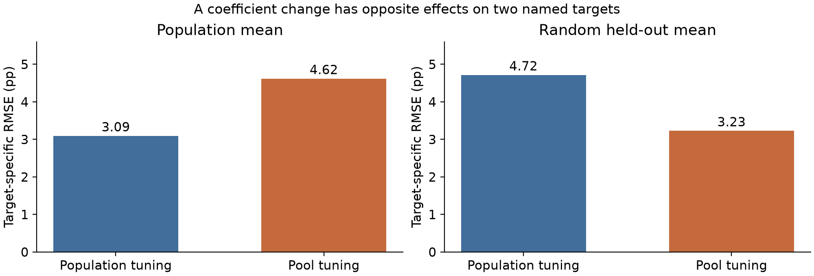

# judgecal

[](https://github.com/Siquan-Wang/llm-judge-calibration/actions/workflows/ci.yml)

**When does an imperfect LLM proxy improve a limited reference audit, and what can we say separately about uncertainty?**

A reproducible research toolkit for prediction-assisted estimation of LLM-evaluation
means. It applies established difference-estimation, control-variate and PPI
methods to public cached judgments and known-truth simulations. The studies
separate human preference, judge reference-correctness, population means and
realized held-out means. Every experiment retains its failures and assumptions.

**[Technical report](docs/TECHNICAL_REPORT.md) · [PDF](reports/synthesis/judgecal_technical_report.pdf) · [Evidence index](docs/RESEARCH_EVIDENCE.md) · [API guide](docs/API_GUIDE.md)**

## Main findings

- **The target changes the preferred correction.** On the same synthetic draws,
  switching from population tuning to pool tuning changes population RMSE from
  0.0309 to 0.0462, while held-out-mean RMSE changes from 0.0472 to 0.0323.
  Those are separate within-target comparisons, not a contest between targets.
- **Useful corrections can have small, heterogeneous benefits.** In RewardBench's
  non-LLMBar component, population tuning improves MAE over reference-audit-only
  in all six judge/budget cells, by approximately 0.011-0.252 percentage points.
  Fixed coefficient-one correction worsens five of six. Raw agreement can still
  outperform correction for one judge and budget; MAE and RMSE can disagree.
- **Point accuracy does not establish interval validity.** In a near-boundary
  simulation with 20 audit labels, tuned correction improves RMSE while its
  nominal 95% interval covers in only 52.4% of 1,000 repetitions. Applicable
  finite-sample bounds have a substantial width cost. Grouping helps with
  dependence, but few groups and audit-to-target shift remain failure modes.



These findings are retrospective and conditional on the named designs. The
[claim-to-artifact crosswalk](docs/research_evidence.json) records exact selectors,
metrics, denominators, hashes and overlap. There is no pooled improvement score
across incomparable targets, no empirical fixed-pool coverage claim from a
population interval, and no guaranteed deployment or annotation saving.

## Evidence and complete experiments

| Study | Main question | Complete evidence |
|---|---|---|
| MT-Bench fixed target | Does correction improve observed human-preference estimation? | [Report](reports/research/REPORT.md) |
| Reference sensitivity | Does plurality versus mean recorded vote change conclusions? | [Report](reports/sensitivity/REPORT.md) |
| Factorial stress and dependence | How do audit size, proxy quality and repeated questions matter? | [Report](reports/stress/REPORT.md) |
| Finite-sample intervals | What width is paid for applicable conservative coverage? | [Report](reports/finite-sample/REPORT.md) |
| LLMBar | Can order consistency be confidently wrong? | [Report](reports/llmbar-audit/REPORT.md) |
| Signed coefficients | When does inverse signal help or fitted flexibility hurt? | [Report](reports/signed-power/REPORT.md) |
| Population versus pool | How do target covariance and coefficient choice interact? | [Report](reports/estimand/REPORT.md) |
| RewardBench | Does one cross-judge agreement signal serve two accuracy targets? | [Report](reports/rewardbench-audit/REPORT.md) |

These are linked analyses, not eight independent datasets. LLMBar extensions
reuse the same comparisons; RewardBench contains 419 verified LLMBar overlaps.
Its primary component excludes those rows, while the full mixture and overlap
component remain visible sensitivities. Exact prompts stay together across
subsets. Historical model caches, heterogeneous references and semantic
relationships beyond exact prompt matches limit external validity.

## Install and use

```bash
git clone https://github.com/Siquan-Wang/llm-judge-calibration.git
cd llm-judge-calibration
pip install -e ".[dev,report]"
```

The core requires NumPy, SciPy and pandas. A bounded numeric mean example:

```python
from judgecal import prediction_powered_mean

result = prediction_powered_mean(
    predictions_labeled=[0.2, 0.8, 0.6, 0.1],
    outcomes_labeled=[1/3, 1.0, 2/3, 0.0],
    predictions_unlabeled=[0.3, 0.7, 0.5, 0.9, 0.2],
    power="auto",
)
print(result.point, result.interval, result.selected_power)
```

This small example illustrates the signature, not adequate sample size.
`prediction_powered_mean` targets a population outcome mean; its normal interval
requires the stated sampling assumptions. Group IDs enable a one-way cluster
variance, and explicit `power_bounds=(-1,1)` allows signed tuning. Estimates
and intervals are not clipped to the outcome range.

The [API guide](docs/API_GUIDE.md) preserves categorical preference examples and
other utilities. It distinguishes `predict_heldout_mean` (iid marginal pool
prediction), `audit_residual_mean` (grouped point estimation only), and
`finite_sample_mean` (fixed/grid coefficients under bounded iid assumptions).
The [mathematical methods](docs/METHODS.md) and
[pinned author-implementation comparison](docs/REFERENCE_BASELINE.md) explain
contracts and finite-sample implementation differences.

## Reproduce and verify

All committed empirical analyses run offline without model keys or new labels:

```bash
python examples/rewardbench_audit.py --output reports/reproduced/rewardbench --plot
python examples/research_evidence.py --check
pytest -q
```

Each full report gives its own reproduction command. Source preparers can rebuild
pinned numeric snapshots from public bytes; the `data` extra supplies optional
readers. Small `--seeds` or `--repetitions` runs are explicitly recorded as smoke
checks, not substituted for the published full experiments. Historical reports
retain the source fingerprints of their own versions.

To rebuild the technical report and its figures from the checked evidence:

```bash
pip install -e ".[paper]"
python examples/build_research_report.py --output-directory reports/reproduced/synthesis
```

The synthesis creates no new experiment. It records manuscript, evidence, code,
figure and PDF fingerprints. CI runs numerical/contract tests and offline study
smoke tests on Python 3.9, 3.11 and 3.12; separate Python 3.11 jobs check the
pinned author reference and report build. A hash
or passing test is provenance evidence, not a statistical-validity guarantee.

## Foundations and scope

Difference and regression estimation, NLP control variates, PPI/PPI++, bounded
concentration and finite-sample tuning limits supply the statistical foundation.
The report's [related work](docs/TECHNICAL_REPORT.md#5-related-work-and-claim-boundaries)
attributes these methods and distinguishes fixed-budget means from sequential
model selection and judge-misclassification transfer methods. The contribution
is an auditable comparison of established corrections under explicit targets,
references and sampling designs. Prospective current-model validation,
unequal-group fixed-corpus intervals and a validated budget planner remain open.

## Licenses and sources

Code: [MIT](LICENSE). Source data retain their own terms:
[MT-Bench](reports/mtbench/DATA_LICENSE.md),
[LLMBar](reports/llmbar/DATA_LICENSE.md), and
[RewardBench](reports/rewardbench/NOTICE.md). RewardBench's independently hosted
cached results have no named license at the pinned revision; the package license
does not relicense those records. Committed derived panels contain numeric
labels and identifiers rather than source prompts, responses or completions.
