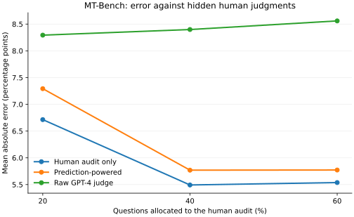

# judgecal

[](https://github.com/Siquan-Wang/llm-judge-calibration/actions/workflows/ci.yml)

**Estimate human preference from imperfect LLM judgments, with a human-audit budget and uncertainty.**

A Python library for prediction-powered win-rate inference, measurement-error correction, agreement measures, Bayesian credible intervals and bootstrap confidence intervals. Raw judge results and corrected estimates are reported separately.

## Reproducible MT-Bench case study

The [benchmark report](reports/mtbench/REPORT.md) compares raw GPT-4 judgments, human-only estimates and prediction-powered estimates across **15 model pairs**, at **20%, 40% and 60% human-audit question budgets**, with 30 fixed splits per budget. Within each model pair, every turn of a question stays in one pool. Evaluation human labels enter only the final error calculation.



Pinned public labels, every trial, per-pair results, explicit question split IDs and a separate known-truth simulation are committed. Repeated-split errors describe this dataset; they do not establish population CI coverage or guaranteed annotation savings.

In this case study, PPI lowers raw-judge error at all three budgets, while human-only estimates remain more accurate. The report retains both findings and the synthetic cases where the normal approximation undercovers.

## Install

```bash
git clone https://github.com/Siquan-Wang/llm-judge-calibration.git
cd llm-judge-calibration
pip install -e ".[dev]"
```

Core dependencies: NumPy, SciPy and pandas. The `data` extra downloads pinned MT-Bench judgments; `report` adds plotting. No model API key is needed for the examples or benchmark.

## Prediction-powered win rates

Let `Y_L` be human preference scores on an audit, `F_L` the matching judge scores and `F_U` judge scores on a separate evaluation pool. A target win scores 1, a loss 0 and a tie 0.5. Original, fixed-weight PPI estimates:

```text
human preference rate = mean(F_U) + mean(Y_L - F_L)
SE² = Var(mean(F_U)) + Var(mean(Y_L - F_L))
```

```python
from judgecal import prediction_powered_win_rate

result = prediction_powered_win_rate(
    judge_labeled=["A", "A", "B", "tie", "B", "A"],
    human_labeled=["A", "B", "B", "tie", "A", "A"],
    judge_unlabeled=["A", "B", "A", "tie", "A", "B", "B", "A"],
    labeled_groups=[1, 1, 2, 2, 3, 3],
    unlabeled_groups=[4, 4, 5, 5, 6, 6, 7, 7],
)
print(result.point, result.interval.low, result.interval.high)
print(result.as_dict())
```

This tiny input illustrates the API, not adequate sample size for valid normal inference. Group IDs enable question-cluster variance and reject overlapping audit/evaluation questions. Unequal clusters retain an observation-weighted estimand. Without groups, rows are treated as independent and the caller must ensure disjoint pools.

Both pools must represent the same target population and use the same frozen judge. Normal intervals need sufficiently many independent observations or clusters. Estimates and intervals are not clipped to [0, 1]. Original PPI may be less efficient than human-only estimation for a weak judge. This implements [Angelopoulos et al. (2023)](https://arxiv.org/abs/2301.09633), with optional one-way cluster variance; it is not a new PPI estimator or PPI++.

## Other tools

| Question | API | Interpretation |
|---|---|---|
| Does the judge agree with humans? | `agreement_rate`, `agreement_with_ci`, `cohens_kappa` | Explicit tie handling; Bayesian intervals assume independent agreement observations. |
| What is the raw model win rate? | `win_rate_with_ci`, `compare_models` | Ties count as half a win; raw uncertainty is labeled separately. |
| Can binary judge error be corrected? | `judge_confusion`, `rogan_gladen_correction`, `compare_models` | Rogan–Gladen requires a binary estimand and transferable sensitivity/specificity. |
| How uncertain is the correction? | `compare_models(..., calibration_judge=..., calibration_human=...)` | Resamples calibration pairs and independent evaluation judgments; reports invalid draws. |
| Are numeric judge scores calibrated? | `platt_scaling`, `isotonic_calibration` | Fit on calibration data, evaluate separately; duplicate isotonic scores are pooled. |
| Which judge agrees more with humans? | `paired_agreement_gap` | The paired difference has its own bootstrap interval. |

Rogan–Gladen uses `p_true = (p_observed + specificity - 1) / (sensitivity + specificity - 1)`. Plugging in estimated error rates and clipping is not generally unbiased. The correction does not repair selection bias or distribution shift. Binary correction rejects ties rather than silently changing its estimand. Summary confusion statistics alone do not supply calibration-uncertainty intervals.

Inter-annotator agreement is a reference, not a universal ceiling. Overlapping confidence intervals do not establish equivalence. Repeated annotations or comparisons sharing a question are not independent trials.

## Run the experiments

```bash
pip install -e ".[data,dev,report]"
python examples/demo_mtbench.py
python examples/benchmark_mtbench.py --plot

# Offline: reuse the committed derived public labels.
python examples/benchmark_mtbench.py --input reports/mtbench/labels.csv --output reports/reproduced
```

The loader pins the dataset revision, canonicalizes model order, aggregates unique human votes by plurality, retains ties and records transformation counts. [Data attribution](reports/mtbench/DATA_LICENSE.md) explains the license and changes. The committed label snapshot contains no prompts, model responses or private user material.

## Test

```bash
pytest -q
python -m pip wheel --no-deps . --wheel-dir dist
```

Tests cover analytic variance, clustered dependence, target reversal, ties, disjoint splits, hidden-label leakage, calibration uncertainty, degenerate inputs and fixed-seed simulations. CI runs offline tests and a benchmark smoke test across supported Python versions.

## Related work

- [ppi_py](https://github.com/aangelopoulos/ppi_py): the statistical foundation for fixed-weight mean correction.
- [AlpacaEval](https://github.com/tatsu-lab/alpaca_eval): evaluator validation and length-controlled comparisons.
- [FastChat / MT-Bench](https://github.com/lm-sys/FastChat): the cached human and GPT-4 judgments used here.

## Roadmap

- [x] PPI win rates with optional question-cluster variance.
- [x] Question-disjoint MT-Bench benchmark with pinned provenance and complete results.
- [x] Joint calibration/evaluation bootstrap for binary Rogan–Gladen correction.
- [ ] Dedicated swapped-order and verbosity-bias estimators; the loader currently preserves source inconsistency flags only.
- [ ] Hierarchical category reliability and validated label-budget planning.
- [ ] Broader benchmarks on newer model judgments.

## License

Code: [MIT](LICENSE). The derived MT-Bench snapshot retains the dataset's **CC BY 4.0** license and attribution, separately from the code license.
