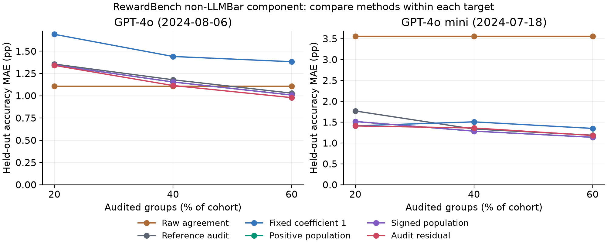
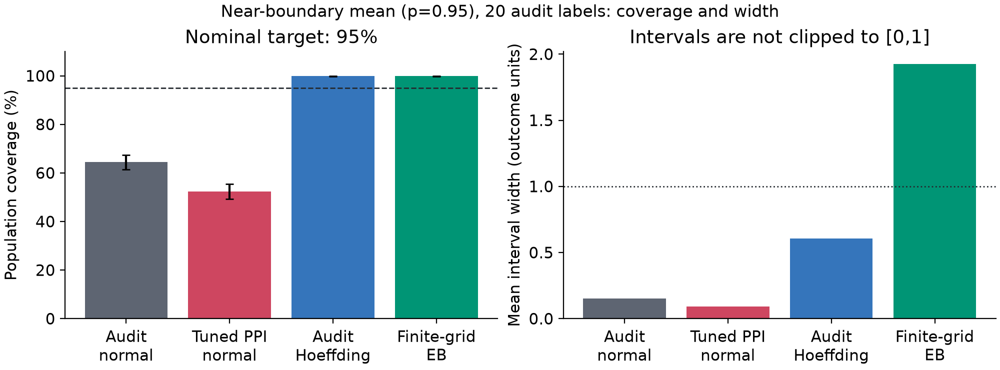

# Auditing LLM Evaluation with Imperfect Proxies

**Targets, useful corrections, and failure modes**

Siquan Wang

Technical report - retrospective empirical and methodological study

Evidence snapshot: [`b4bdeab08481a25b529d81fa909f96aab10f368f`](https://github.com/Siquan-Wang/llm-judge-calibration/tree/b4bdeab08481a25b529d81fa909f96aab10f368f).
This report synthesizes existing experiments; it introduces no new estimator
or theorem and is not presented as a peer-reviewed publication.

## Abstract

An inexpensive LLM judgment can supplement a reference audit without being
an accurate substitute for it. Whether that information helps depends on
the outcome, target, proxy relationship and sampling design. We study these
dependencies using established prediction-assisted mean estimators, public
cached judgments and known-truth simulations. Empirical experiments hold
evaluation groups fixed across nested audit budgets, while simulations
separately measure point error and target-matched interval coverage. The
results show modest, heterogeneous gains from adaptive correction, useful
inverse signals, and substantial failures of fixed reliance on agreement.
They also separate accuracy from uncertainty: in one near-boundary setting,
tuned correction improves RMSE while a nominal 95% normal interval covers
only 52.4% of repetitions. Applicable concentration bounds preserve their
finite-sample interpretation at a substantial width cost. Population and
random-pool targets can favor different coefficients, and neither tuning
nor correct grouping repairs arbitrary distribution shift. The contribution
is a reproducible comparison with explicit estimands, source provenance,
paired evidence and retained failures. Historical, overlapping benchmarks
and retrospective study development limit claims about new tasks, current
judges or deployment savings.

## 1. Question and contribution

The central question is: **when does a frozen proxy improve estimation of
a clearly defined reference mean under a limited audit, and what can be
said separately about uncertainty?** A reference may be a recorded human
preference or a benchmark's supplied correctness criterion. These meanings
are not interchangeable. Likewise, estimating an aggregate mean is
different from learning calibrated per-item probabilities or recovering
latent truth.

Prediction-powered inference (PPI) corrects predictions using paired audit
residuals [2]; efficient scalar tuning is developed in PPI++ [3]. The idea
also has classical difference-estimation roots [1] and direct predecessors
in automatic-metric correction for NLP [4]. We apply this established
framework to LLM-evaluation audits, including agreement proxies whose
relation to correctness may be weak or negative.

Three features make the comparison auditable. First, empirical methods
share reference budgets and whole-group splits, with evaluation labels
reserved for scoring. Second, simulation studies distinguish known
population truth, random held-out means and deliberate assumption
violations. Third, complete outcomes, input hashes, configurations and
split identities remain available, including cases where correction loses.
The analysis is retrospective: earlier findings motivated later choices.
No design or result is described as preregistered.

The [evidence index](RESEARCH_EVIDENCE.md) and
[machine-readable crosswalk](research_evidence.json) connect quantitative
claims to source artifacts, selectors, metric definitions and hashes.
Full reports provide the surrounding grids; examples in this synthesis
explain mechanisms rather than replacing those complete results.

## 2. One correction, different targets

Let `Y` be a bounded reference outcome and `F` a frozen proxy, both in
`[0,1]`. The audit contains `n` aligned outcome-proxy pairs. A separate
pool contains `N` proxy observations whose reference outcomes are hidden
from fitting. For coefficient `lambda`, write:

```text
theta_hat(lambda) = mean(Y_L)
                   + lambda * [mean(F_U) - mean(F_L)]
R(lambda) = Y - lambda * F
```

Zero power gives the reference-audit mean; power one gives the usual mean
correction. Fixed-power unbiasedness requires an unbiased audit outcome
mean and equal expected proxy means across pools. Independent draws from
the same relevant population with a frozen predictor supply a sufficient
setting. More prediction observations do not remove audit-selection bias
or a changed judge mechanism.

For a population target `theta = E[Y]`, independent iid pools give:

```text
Var(theta_hat - theta) = Var(R)/n + lambda^2 * Var(F)/N
lambda_population = [N/(n+N)] * Cov(Y,F)/Var(F)
```

The second expression is an unrestricted oracle when proxy variance is
positive. The implementation estimates a separate variance for each pool
and projects the resulting minimizer onto `[0,1]`, or explicitly onto
`[-1,1]` for signed numeric inference. Exact constant proxies receive zero
power. The fitted variance cannot exceed its zero-power endpoint, because
zero is feasible. This optimization fact does not guarantee lower realized
loss, smaller actual finite-sample variance or valid coverage.

For the random target `mean(Y_U)`, the estimation error instead equals the
difference of two residual means. The target shares proxy information with
the estimate, so their covariance matters:

```text
theta_hat - mean(Y_U) = mean(R_L) - mean(R_U)
Var(theta_hat - mean(Y_U)) = (1/n + 1/N) * Var(R)
lambda_pool = Cov(Y,F)/Var(F)
```

These are fixed-coefficient iid identities. Fitted coefficients remain
plug-in procedures with asymptotic interpretations. The associated pool
interval is a marginal prediction interval over draws of both pools, not
conditional coverage for every frozen pool. A perfect proxy illustrates
the distinction: power one recovers its pool's outcome mean exactly,
whereas population tuning combines information from both samples.

Fixed finite populations require their sampling design to supply the
randomness [5]. Under disjoint simple random partitions and fixed power,
negative cross-pool covariance cancels the familiar finite-population
corrections in the residual-mean difference. That identity does not make
adaptive tuning exact, and substituting row counts does not establish a
theorem for unequal prompt clusters. The empirical audit-residual candidate
therefore returns a point without a pool interval.

Grouped population diagnostics use centered cluster totals in a one-way
sandwich, retaining observation weights. They require sufficiently many
independent groups and suitable regularity, not merely valid group IDs.
The [Methods](METHODS.md) document gives equations, numerical conventions
and distinctions from the authors' `ppi-python==0.2.3` implementation. The
pinned comparison checks fixed-weight algebra and expected finite-sample
convention differences; it is not independent evidence of coverage.

## 3. Evidence and experimental design

The empirical and simulation components answer different questions. Their
metrics are kept separate throughout this report.

| Evidence | Outcome and scored target | Sampling unit | Important overlap |
|---|---|---|---|
| MT-Bench | Recorded preference; held-out mean | Complete question | Same data for reference sensitivity |
| LLMBar | Judge reference-correctness; held-out mean | Exact instruction | Signed and pool follow-ups reuse it |
| RewardBench | Judge reference-correctness; held-out mean | Exact prompt | Includes 419 LLMBar comparisons |
| Population simulation | Defined outcome; analytic `E[Y]` | Specified iid rows or clusters | Related generator families |
| Pool simulation | Defined outcome; random `mean(Y_U)` | Independent iid pools | Both targets use identical draws |

MT-Bench provides 1,814 retained comparisons and 3,354 unique human votes
across 80 questions. All 15 eligible model pairs are retained. A plurality
outcome scores an A win, B win or tie as 1, 0 or 0.5. A separate analysis
uses each comparison's mean recorded vote score. Averaging comparisons
equally does not pool all votes into one vote-weighted target. The frozen
categorical GPT-4 score supplies the proxy in both analyses.

LLMBar supplies 419 instruction-following comparisons and 418 exact
instruction groups for three historical judges. Its proxy records whether
both presentation orders produce valid, identical canonical choices.
Invalid outputs remain in denominators: invalid original-order choices
are incorrect, and invalidity in either order makes agreement zero.
The upstream cache already canonicalizes reversed choices; extraction
does not reverse them a second time.

RewardBench uses complete binary caches for GPT-4o 2024-08-06 and GPT-4o
mini 2024-07-18. For two judges choosing between the same two answers,
equality of their correctness bits reconstructs canonical choice agreement.
Reversing the common reference complements both bits but leaves equality
unchanged. An individual auxiliary correctness bit would retain gold
information and is not used as a predictor. A third inspected Gemini cache
has nonbinary fallback scores and is excluded as a whole under this binary
contract; no comparisons are removed from the selected panel.

The RewardBench primary component excludes LLMBar: 2,566 comparisons and
2,315 prompt groups. The full mixture and LLMBar component are sensitivity
analyses, not independent replications. Complete content and reference
checks establish the 419-record overlap. Remaining sources include
MT-Bench-derived material, so excluding LLMBar does not certify absence
of every shared benchmark lineage. RewardBench row means also differ
from its official weighted leaderboard score.

Each empirical study uses 30 deterministic splits. Evaluation contains
`floor(0.25*G)` complete groups; nested audits contain
`floor(b*G)` groups for `b` equal to 0.20, 0.40 or 0.60, where `G` is the
total eligible group count. Fractions are not percentages of the remaining
bank. Larger audits leave evaluation fixed. Repeated questions or exact
prompts stay together, including cross-subset repeats. Unused rows do not
enter fitting. Exact grouping does not establish independence of semantic
duplicates, related tasks or shared annotators.

Errors are scored against the realized held-out reference mean. Population
interval widths are diagnostics, not coverage tests for that target.
Empirical splits overlap, so their averages receive no iid Monte Carlo
standard error. Synthetic replications are independent within each
specified scenario and retain paired method contrasts and Monte Carlo
uncertainty. The historical complementary-pool MT-Bench study, whose
evaluation size shrinks with audit budget, remains separate.

## 4. Findings

### 4.1 Target and reference definitions change the comparison

In the positive-proxy simulation with prevalence 0.5, 200 audited rows and
100 prediction rows, replacing population tuning with pool tuning changes
population-target RMSE from 0.0309 to 0.0462. Against the pool target, RMSE
changes from 0.0472 to 0.0323. These are two within-target comparisons with
opposite directions, not evidence that one target is intrinsically easier
or more appropriate. Paired squared-error differences preserve the shared
draws and appear with Monte Carlo errors in the
[estimand report](../reports/estimand/REPORT.md).
Evidence E07 records the exact cell and target-specific columns.


*Figure 1. Existing simulation results for the positive proxy, prevalence
0.5, n=200 and N=100. Compare the two rules within each target's RMSE panel;
the opposite directions illustrate the target distinction. This selected
case does not summarize the complete grid or describe empirical coverage.*

Matching the oracle criterion is insufficient after fitting. For the
positive proxy at prevalence 0.95 with 20 audit and 10 prediction rows,
pool tuning worsens pool RMSE from 0.0728 to 0.0762; its nominal 95%
marginal prediction interval covers in 77.4% of repetitions. The complete
36-setting study retains these losses and every degenerate interval.

The outcome definition also matters. On MT-Bench, plurality and mean-vote
scores differ on 305 comparisons; 854 comparisons have only one vote.
Tuned PPI retains a modest aggregate MAE advantage over the reference audit
at all budgets under both definitions, but the direction of the pair-level
comparison changes in 5 of 45 matched pair/budget cases. Each method is
scored against its own named reference. A lower error under one definition
does not establish better truth recovery (E02). Vote counts remain necessary
because the same mean can represent unanimous ties or polarized choices.

### 4.2 Useful correction is target-specific and often modest

In the fixed-target MT-Bench analysis, tuned PPI improves aggregate MAE
over the reference-only audit by approximately 0.362, 0.238 and 0.208
percentage points at the three budgets. It does not improve every pair:
the lower-MAE counts are 10/15, 9/15 and 11/15. Fixed coefficient-one PPI
has higher aggregate MAE than the audit at each budget. These are
descriptive results on the selected pair/split cases, not a population
probability of improvement or an annotation-saving guarantee (E01).

Agreement has even more direct limitations. On LLMBar Adversarial,
ChatGPT's order agreement is 64.3% while original-order reference accuracy
is 28.2%. Of 205 consistent comparisons, 176 consistently choose the
reference-incorrect answer (E08). Consistency can therefore be confidently wrong.
For ChatGPT and LLaMA2 on this component, positive-only tuning selects zero
on every split and falls back to the audit; fixed-power correction worsens
MAE at every budget. The benchmark's ChatGPT-influenced adversarial
construction limits any general ranking of judge families.

RewardBench exposes the target dependence of one shared proxy. In the
primary NonLLMBar component, agreement is 89.95%, while reference accuracy
is 90.80% for GPT-4o and 86.67% for mini. Both judges agree on the wrong
answer in 160 comparisons (E09). Positive and signed population tuning have
identical results here and improve MAE in all six judge/budget cells,
whereas fixed coefficient one worsens five. The improvements range from
only about 0.011 to 0.252 percentage points; a favorable sign alone does
not establish practical importance (E10).



*Figure 2. Existing NonLLMBar results for both designated judges, all six
rules and all three audit budgets. Compare methods within the same target;
panel scales may differ. Positive and signed population curves coincide
in these primary data. Full-mixture and LLMBar sensitivities remain in the
complete report. Reused splits are not independent replications.*

Counterexamples remain important. For GPT-4o at the lowest primary budget,
raw agreement has MAE 1.107 percentage points, versus 1.356 for the audit
and 1.345 for population tuning. Correction does not uniformly beat the
raw surrogate. At the 40% budget, audit-residual tuning improves GPT-4o
MAE from 1.179 to 1.115 points but worsens RMSE from 1.421 to 1.432.
MAE and RMSE summarize different losses; presenting only the favorable
metric would overstate the evidence (E10).

### 4.3 Signed flexibility uses inverse signal and can fit noise

Negative coefficients are already allowed by the PPI++ mean framework
[3]. Applying negative weight to `F` is algebraically equivalent to
positive weight on `1-F`. The signed option expands the declared search
range to `[-1,1]`; it does not turn agreement into truth or erase the
uncertainty of choosing a coefficient from the audit.

The signed study makes the tradeoff concrete. With an inverse proxy,
prevalence 0.5 and 20 audit observations, signed tuning reduces population
RMSE from 0.1098 to 0.0683 relative to positive-only tuning (E05). With an
uninformative proxy at the same prevalence and audit size, RMSE increases
from 0.1108 to 0.1125 (E06). All methods share draws, and paired squared-loss
Monte Carlo errors are available in the
[complete signed study](../reports/signed-power/REPORT.md).

On unchanged LLMBar splits, signed tuning improves MAE over positive-only
tuning in 11 of 27 cells, ties in 12 and worsens four. This follow-up was
motivated by the earlier inverse association and reuses the corpus; it is
exploratory evidence, not independent validation. Same-audit coefficient
bias and finite-sample costs have prior treatments in NLP evaluation [4]
and PPI analysis [6]. The results illustrate those concerns under this
bounded, constrained implementation rather than discovering them anew.

### 4.4 Better point error does not validate uncertainty

The finite-sample study separates point estimation from interval coverage.
For a strong proxy, prevalence 0.95 and 20 audit observations, tuned normal
PPI has RMSE 0.0413 versus 0.0496 for the audit-only normal procedure.
Nevertheless, its nominal 95% interval covers in only 52.4% of 1,000
repetitions. The pointwise exact Monte Carlo interval is approximately
[49.3%,55.5%], and 353 intervals have zero width. A sample with no observed
outcome variation has not established population certainty (E03).

Established bounded-data inequalities provide a different guarantee under
their assumptions. The implementation uses fixed powers or a prespecified
finite grid, allocating error simultaneously across candidate residual
bounds and a shared prediction-mean bound. It applies
[Hoeffding's inequality](https://doi.org/10.1080/01621459.1963.10500830) and
[Maurer-Pontil empirical Bernstein bounds](https://www.learningtheory.org/colt2009/papers/012.pdf),
with constants and allocation derived in the
[finite-sample protocol](FINITE_SAMPLE_PROTOCOL.md). PPI itself already
contains nonasymptotic mean-inference constructions [2]. These applications
are not new concentration results.

In the same small-audit setting, audit-only Hoeffding covers in all 1,000
draws, with an exact coverage Monte Carlo interval approximately
[99.63%,100%]. Mean untruncated width is 0.607, versus 0.093 for tuned
normal. Grid empirical Bernstein width is 1.924 and contains the entire
`[0,1]` parameter range in 64.7% of repetitions. Conservative coverage can
be uninformative. Across the twelve valid iid settings, grid Bernstein is
narrower than audit-only Hoeffding in only one (E04).



*Figure 3. Existing iid strong-proxy results at prevalence 0.95, n=20 and
N=200: audit-only normal, tuned normal, audit-only Hoeffding and grid
empirical Bernstein. Observed coverage comes from 1,000 repetitions;
error bars are pointwise 95% exact-binomial Monte Carlo intervals. Widths
remain untruncated. The full report retains all eight methods,
twelve iid settings and separate deliberate assumption violations.*

A run without misses does not prove universal coverage. The mathematical
bounds require independent iid pools, bounded scores, fixed sizes and a
frozen predictor. They do not validate continuous same-audit tuning,
dependent rows or transport to another population. Perfect observed
predictions cannot replace the known residual range with the sample range.
Intervals remain untruncated so their width cost is visible.

### 4.5 Grouping and transport remain separate requirements

The dependence ablation analyzes identical generated data with correct
question grouping and deliberately naive row independence. With eight
independent questions and four exact repeated turns per question, tuned
coverage is 89.0% under grouping and 59.6% under the naive analysis.
Grouping removes a major source of overconfidence, but eight clusters
still do not make a normal approximation reliable. This is a controlled
example, not a universal required number of clusters.

Shift creates a different problem. In the declared prevalence-shift
scenario, tuned correction has bias about -0.1975 and zero target coverage;
under a changed conditional judge-error mechanism, bias is about -0.0545
and coverage 23.9%. The fitted variance criterion cannot identify missing
transport assumptions. These are failures of the basic correction under
intentional violations, not refutations of PPI's separate shift procedures
[2] or of methods designed for invariant conditional misclassification
mechanisms [8]. The
[stress report](../reports/stress/REPORT.md) and
[initial simulation report](../reports/research/REPORT.md) retain exact
generators and all outcomes; E11 traces the dependence and shift examples.

## 5. Related work and claim boundaries

Classical generalized difference and regression estimation use auxiliary
information for finite-population estimation [1]. Chaganty, Mussmann and
Liang [4] apply control variates to automatic NLP metrics and discuss
annotation variation and bias from fitting coefficients on the same data.
This lineage rules out claims that reference-audit correction or its
plug-in bias originates here.

PPI [2] supplies the modern prediction-assisted inference framework,
including mean, finite-population and nonasymptotic settings. PPI++ [3]
develops efficient tuning, including real-valued mean coefficients. This
repository's per-pool variance convention and optional cluster moments
are explicit adaptations, not direct proofs of general cluster validity.
Li and Ding [5] clarify finite-population sampling distributions; their
results do not automatically supply conditional intervals for an arbitrary
frozen or unequal-cluster panel.

Mani and colleagues [6] analyze finite-sample costs of tuned PPI, including
same-sample bias and optimistic variance estimates. Their distributional
regimes are not transferred mechanically to coefficient-constrained,
bounded-outcome or grouped variants here. R-AutoEval+ [7] studies adaptive autoevaluation with
sequential reliability and selection guarantees. Our fixed-budget means
do not claim anytime validity or superior sample efficiency. Lee and
colleagues [8] study misclassification calibration and uncertainty, with
transfer conditions tied to the conditional error mechanism. A fair
comparison would first align outcomes, decisions, sampling, stopping and
costs; this report does not manufacture one from unrelated interval widths.

## 6. Limitations and interpretation

The principal limitation is external validity. Selected 2023/2024 caches,
curated source mixtures and overlapping benchmark lineages do not establish
performance for contemporary endpoints or a future evaluation workload.
The two RewardBench judges share a model family. LLMBar's construction
partly used ChatGPT evaluators. Multiple reports on these records are not
multiple independent confirmations, and a larger synthetic grid is not
a random sample of deployments.

Reference uncertainty also remains unresolved. Recorded votes depend on
the observed annotators and uneven annotation counts. The derived MT-Bench
snapshot lacks per-vote annotator identities, preventing an assessment of
shared annotator effects. Benchmark correctness combines several source
criteria and is not latent truth. Changing a reference changes the
estimand rather than correcting it automatically.

The empirical target is a realized held-out mean from an unequal-group
finite corpus. We report point errors without claiming population or pool
coverage there. Exact prompt groups address visible repeats, not every
dependence structure. Small empirical gains and conflicting MAE/RMSE
directions require restrained interpretation. No universal minimum audit
size, optimal deployment budget or reliable stopping policy follows.

Finally, costs are logical inputs to a cached-data analysis. One reference
reveal can score every judge on that comparison, so labels are shared.
Agreement may require two cached judgments where an audit-only method
needs one designated judgment. Evaluation references used to score the
experiment are distinct from inference inputs. No new annotations,
tokens, API calls, time savings or dollar savings were measured.

The supported implication is procedural: name the reference and target,
preserve dependence units, estimate proxy reliance using permitted audit
information, and assess uncertainty separately from point error. It is
not a validated rule that every audit should use a tuned correction.

## 7. Reproduction and evidence preservation

The evidence crosswalk records exact selectors, units and directions for
the numbered findings. Each underlying report retains trials, summaries,
split manifests, configurations and source/artifact hashes. No failed,
zero-width or out-of-domain estimate is removed. Synthetic coverage uses
known targets; the estimand study additionally documents a machine-precision
membership margin that changes no point, variance or interval endpoint.

From the pinned repository snapshot, a representative offline reproduction
is:

```bash
pip install -e ".[dev,report]"
python examples/estimand_study.py --output reports/reproduced/estimand --plot
python examples/rewardbench_audit.py --output reports/reproduced/rewardbench-audit --plot
```

Other complete commands are retained in the
[research](../reports/research/REPORT.md),
[reference-sensitivity](../reports/sensitivity/REPORT.md),
[signed](../reports/signed-power/REPORT.md) and
[finite-sample](../reports/finite-sample/REPORT.md) reports. Smaller smoke
runs explicitly record their reduced repetition or seed counts.

Committed derived inputs omit raw prompts, answer text and private data.
Source notices retain distinct dataset and cache terms, including the
RewardBench results collection's unspecified named license. Pinning cached
bytes reproduces this reanalysis, not an undocumented historical API
invocation. Historical reports remain separate evidence artifacts; this
synthesis does not silently replace their targets, sampling designs or
results with newer method variants.

## References

[1] Claes M. Cassel, Carl E. Sarndal and Jan H. Wretman. 1976.
Some results on generalized difference estimation and generalized
regression estimation for finite populations. *Biometrika* 63(3), 615-620.
DOI: [10.1093/biomet/63.3.615](https://academic.oup.com/biomet/article-abstract/63/3/615/270941?login=false).

[2] Anastasios N. Angelopoulos, Stephen Bates, Clara Fannjiang,
Michael I. Jordan and Tijana Zrnic. 2023. Prediction-Powered Inference.
*Science*. DOI: 10.1126/science.adi6000.
Inspected version: [arXiv:2301.09633v4](https://arxiv.org/html/2301.09633v4),
9 November 2023.

[3] Anastasios N. Angelopoulos, John C. Duchi and Tijana Zrnic.
2023; inspected revision 2024. PPI++: Efficient Prediction-Powered
Inference. [arXiv:2311.01453v2](https://arxiv.org/html/2311.01453v2),
26 March 2024.

[4] Arun Tejasvi Chaganty, Stephen Mussmann and Percy Liang. 2018.
The price of debiasing automatic metrics in natural language evaluation.
*Proceedings of ACL*, 643-653. DOI: 10.18653/v1/P18-1060.
[Authors' paper](https://nlp.stanford.edu/pubs/chaganty2018price.pdf).

[5] Xinran Li and Peng Ding. 2017. General forms of finite population
central limit theorems with applications to causal inference.
*Journal of the American Statistical Association* 112, 1759-1769.
DOI: 10.1080/01621459.2017.1295865.
Inspected preprint: [arXiv:1610.04821v1](https://arxiv.org/pdf/1610.04821v1).

[6] Pranav Mani, Peng Xu, Zachary C. Lipton and Michael Oberst.
2025; inspected revision 2026. No Free Lunch: Non-Asymptotic Analysis of
Prediction-Powered Inference.
[arXiv:2505.20178v2](https://arxiv.org/html/2505.20178v2), 24 June 2026.

[7] Sangwoo Park, Matteo Zecchin and Osvaldo Simeone. 2025.
Adaptive Prediction-Powered AutoEval with Reliability and Efficiency
Guarantees. *NeurIPS 2025*.
[arXiv:2505.18659v2](https://arxiv.org/html/2505.18659v2), 2 December 2025.

[8] Chungpa Lee, Thomas Zeng, Jongwon Jeong, Jy-yong Sohn and Kangwook
Lee. 2026; first preprint 2025. How to Correctly Report LLM-as-a-Judge
Evaluations. *ICML 2026*.
[arXiv:2511.21140v4](https://arxiv.org/html/2511.21140v4), 31 May 2026.
