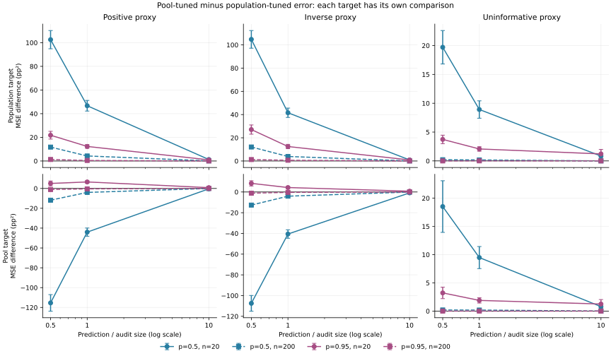
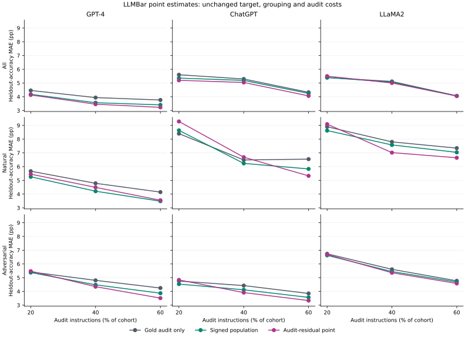

# The target changes the useful correction

[Derivation, primary sources and retrospective protocol](../../docs/ESTIMAND_PROTOCOL.md)

## Two different questions

A population mean `E[Y]` and the actual mean `mean(Y_U)` of a held-out pool are different targets. This study compares the same corrected point estimates against both, using explicitly matched uncertainty calculations. The existing population PPI API retains its stated meaning; this is target sensitivity, not a claim that its coefficient formula was wrong.

For the estimate `mean(Y_L) + lambda*(mean(F_U)-mean(F_L))`, let `R=Y-lambda*F`. Under independent, identically distributed pools, population error variance is `Var(R)/n + lambda² Var(F)/N`, while random-pool prediction error variance is `(1/n+1/N) Var(R)`. With `b=Cov(Y,F)/Var(F)`, their unrestricted oracle coefficients are `N/(n+N)*b` and `b`. The estimate and held-out target share proxy information; their covariance cannot be ignored. A perfect proxy illustrates the distinction: coefficient one recovers the pool mean exactly, whereas population shrinkage combines both samples.

Both fitted coefficient ranges are fixed at `[-1,1]`. Population tuning uses the existing per-pool criterion. Pool tuning minimizes audit residual variance; it never reads held-out outcomes. The new IID prediction interval estimates marginal error over draws of both pools. It does not promise coverage conditional on a particular frozen pool or proxy composition.

## Known-truth target comparison

The run uses 1,000 independent replications per setting and master seed 2030. All 36 settings cross prevalence 0.5/0.95, positive/inverse/uninformative binary proxy laws, audit sizes 20/200, and prediction/audit ratios 0.5/1/10. Four methods share each draw: audit only, fixed coefficient one, signed population tuning and signed audit-residual tuning. The simulation retains held-out outcomes strictly for scoring.

Every method is scored against both named targets. Each also retains both target-matched normal uncertainty calculations. Same-audit fitted coefficients remain plug-in asymptotic methods: exact Monte Carlo intervals quantify simulation coverage uncertainty, not exact validity of the underlying normal intervals. Coverage scoring allows a numerical margin of `8 * float64_epsilon * max(1, |lower|, |upper|, |truth|)` at either endpoint. This avoids roundoff-only misses for algebraically exact predictions; it changes no point, interval endpoint, interval width or variance.

The table subtracts population-tuned squared error from pool-tuned squared error **within the same target and draw**. Negative differences favor pool tuning. Compare each contrast with its paired Monte Carlo standard error; values across different targets do not establish a superiority claim.

| Proxy | Prevalence | Audit n | N/n | Population-target MSE difference | Paired MCSE | Pool-target MSE difference | Paired MCSE |
|---|---:|---:|---:|---:|---:|---:|---:|
| positive | 0.50 | 20 | 0.5 | 0.010258 | 0.000769 | -0.011541 | 0.000835 |
| positive | 0.50 | 20 | 1 | 0.004672 | 0.000451 | -0.004404 | 0.000411 |
| positive | 0.50 | 20 | 10 | 0.000126 | 0.000052 | -0.000037 | 0.000048 |
| positive | 0.50 | 200 | 0.5 | 0.001176 | 0.000082 | -0.001183 | 0.000090 |
| positive | 0.50 | 200 | 1 | 0.000427 | 0.000043 | -0.000399 | 0.000036 |
| positive | 0.50 | 200 | 10 | 0.000012 | 0.000004 | -0.000004 | 0.000004 |
| inverse | 0.50 | 20 | 0.5 | 0.010478 | 0.000759 | -0.010747 | 0.000759 |
| inverse | 0.50 | 20 | 1 | 0.004157 | 0.000401 | -0.004057 | 0.000410 |
| inverse | 0.50 | 20 | 10 | 0.000090 | 0.000041 | -0.000086 | 0.000041 |
| inverse | 0.50 | 200 | 0.5 | 0.001207 | 0.000082 | -0.001265 | 0.000092 |
| inverse | 0.50 | 200 | 1 | 0.000391 | 0.000043 | -0.000406 | 0.000037 |
| inverse | 0.50 | 200 | 10 | 0.000008 | 0.000003 | -0.000009 | 0.000003 |
| uninformative | 0.50 | 20 | 0.5 | 0.001971 | 0.000290 | 0.001852 | 0.000457 |
| uninformative | 0.50 | 20 | 1 | 0.000891 | 0.000151 | 0.000948 | 0.000196 |
| uninformative | 0.50 | 20 | 10 | 0.000084 | 0.000022 | 0.000078 | 0.000021 |
| uninformative | 0.50 | 200 | 0.5 | 0.000021 | 0.000007 | 0.000019 | 0.000011 |
| uninformative | 0.50 | 200 | 1 | 0.000017 | 0.000004 | 0.000018 | 0.000006 |
| uninformative | 0.50 | 200 | 10 | 0.000001 | 0.000001 | 0.000000 | 0.000001 |
| positive | 0.95 | 20 | 0.5 | 0.002180 | 0.000328 | 0.000505 | 0.000246 |
| positive | 0.95 | 20 | 1 | 0.001232 | 0.000162 | 0.000655 | 0.000122 |
| positive | 0.95 | 20 | 10 | 0.000096 | 0.000013 | 0.000082 | 0.000011 |
| positive | 0.95 | 200 | 0.5 | 0.000130 | 0.000014 | -0.000110 | 0.000018 |
| positive | 0.95 | 200 | 1 | 0.000046 | 0.000006 | -0.000043 | 0.000008 |
| positive | 0.95 | 200 | 10 | 0.000003 | 0.000001 | 0.000001 | 0.000001 |
| inverse | 0.95 | 20 | 0.5 | 0.002708 | 0.000399 | 0.000830 | 0.000253 |
| inverse | 0.95 | 20 | 1 | 0.001248 | 0.000188 | 0.000429 | 0.000111 |
| inverse | 0.95 | 20 | 10 | 0.000089 | 0.000013 | 0.000074 | 0.000011 |
| inverse | 0.95 | 200 | 0.5 | 0.000125 | 0.000013 | -0.000117 | 0.000017 |
| inverse | 0.95 | 200 | 1 | 0.000065 | 0.000008 | -0.000037 | 0.000008 |
| inverse | 0.95 | 200 | 10 | 0.000002 | 0.000001 | 0.000001 | 0.000001 |
| uninformative | 0.95 | 20 | 0.5 | 0.000373 | 0.000074 | 0.000322 | 0.000101 |
| uninformative | 0.95 | 20 | 1 | 0.000207 | 0.000039 | 0.000189 | 0.000047 |
| uninformative | 0.95 | 20 | 10 | 0.000122 | 0.000078 | 0.000125 | 0.000079 |
| uninformative | 0.95 | 200 | 0.5 | 0.000000 | 0.000001 | -0.000000 | 0.000002 |
| uninformative | 0.95 | 200 | 1 | 0.000001 | 0.000001 | 0.000000 | 0.000001 |
| uninformative | 0.95 | 200 | 10 | 0.000000 | 0.000000 | 0.000000 | 0.000000 |



Bars show one paired Monte Carlo standard error; they are pointwise simulation diagnostics.

For the positive proxy with prevalence 0.5, 200 audit rows and 100 prediction rows, switching from population tuning to pool tuning changes population RMSE from 0.0309 to 0.0462, while pool-target RMSE changes from 0.0472 to 0.0323. The two within-target comparisons have opposite directions.

Matching a target's oracle criterion does not guarantee finite-sample gains after fitting. For the positive proxy at prevalence 0.95 with 20 audit and 10 prediction rows, pool-target RMSE changes from 0.0728 to 0.0762; the pool-tuned marginal prediction interval covers in 77.4% of replications. The full grid and its Monte Carlo uncertainty are retained below.

### Matched interval coverage

Population-tuned estimates below use population confidence intervals; pool-tuned estimates use marginal prediction intervals for the random pool mean. Brackets show exact pointwise 95% Monte Carlo intervals for the observed coverage rate. The nominal target is 95% for both.

| Proxy | Prevalence | Audit n | N/n | Population CI coverage [MC interval] | Random-pool PI coverage [MC interval] |
|---|---:|---:|---:|---|---|
| positive | 0.50 | 20 | 0.5 | 0.919 [0.900, 0.935] | 0.868 [0.845, 0.888] |
| positive | 0.50 | 20 | 1 | 0.928 [0.910, 0.943] | 0.810 [0.784, 0.834] |
| positive | 0.50 | 20 | 10 | 0.937 [0.920, 0.951] | 0.757 [0.729, 0.783] |
| positive | 0.50 | 200 | 0.5 | 0.950 [0.935, 0.963] | 0.939 [0.922, 0.953] |
| positive | 0.50 | 200 | 1 | 0.951 [0.936, 0.964] | 0.945 [0.929, 0.958] |
| positive | 0.50 | 200 | 10 | 0.947 [0.931, 0.960] | 0.934 [0.917, 0.949] |
| inverse | 0.50 | 20 | 0.5 | 0.930 [0.912, 0.945] | 0.869 [0.846, 0.889] |
| inverse | 0.50 | 20 | 1 | 0.926 [0.908, 0.941] | 0.822 [0.797, 0.845] |
| inverse | 0.50 | 20 | 10 | 0.934 [0.917, 0.949] | 0.772 [0.745, 0.798] |
| inverse | 0.50 | 200 | 0.5 | 0.954 [0.939, 0.966] | 0.947 [0.931, 0.960] |
| inverse | 0.50 | 200 | 1 | 0.944 [0.928, 0.957] | 0.946 [0.930, 0.959] |
| inverse | 0.50 | 200 | 10 | 0.950 [0.935, 0.963] | 0.949 [0.933, 0.962] |
| uninformative | 0.50 | 20 | 0.5 | 0.934 [0.917, 0.949] | 0.920 [0.901, 0.936] |
| uninformative | 0.50 | 20 | 1 | 0.930 [0.912, 0.945] | 0.925 [0.907, 0.941] |
| uninformative | 0.50 | 20 | 10 | 0.928 [0.910, 0.943] | 0.928 [0.910, 0.943] |
| uninformative | 0.50 | 200 | 0.5 | 0.953 [0.938, 0.965] | 0.958 [0.944, 0.970] |
| uninformative | 0.50 | 200 | 1 | 0.942 [0.926, 0.956] | 0.942 [0.926, 0.956] |
| uninformative | 0.50 | 200 | 10 | 0.934 [0.917, 0.949] | 0.943 [0.927, 0.957] |
| positive | 0.95 | 20 | 0.5 | 0.575 [0.544, 0.606] | 0.774 [0.747, 0.800] |
| positive | 0.95 | 20 | 1 | 0.628 [0.597, 0.658] | 0.634 [0.603, 0.664] |
| positive | 0.95 | 20 | 10 | 0.515 [0.484, 0.546] | 0.418 [0.387, 0.449] |
| positive | 0.95 | 200 | 0.5 | 0.910 [0.891, 0.927] | 0.914 [0.895, 0.931] |
| positive | 0.95 | 200 | 1 | 0.931 [0.913, 0.946] | 0.924 [0.906, 0.940] |
| positive | 0.95 | 200 | 10 | 0.918 [0.899, 0.934] | 0.923 [0.905, 0.939] |
| inverse | 0.95 | 20 | 0.5 | 0.589 [0.558, 0.620] | 0.764 [0.736, 0.790] |
| inverse | 0.95 | 20 | 1 | 0.623 [0.592, 0.653] | 0.633 [0.602, 0.663] |
| inverse | 0.95 | 20 | 10 | 0.512 [0.481, 0.543] | 0.427 [0.396, 0.458] |
| inverse | 0.95 | 200 | 0.5 | 0.928 [0.910, 0.943] | 0.923 [0.905, 0.939] |
| inverse | 0.95 | 200 | 1 | 0.917 [0.898, 0.933] | 0.908 [0.888, 0.925] |
| inverse | 0.95 | 200 | 10 | 0.928 [0.910, 0.943] | 0.928 [0.910, 0.943] |
| uninformative | 0.95 | 20 | 0.5 | 0.625 [0.594, 0.655] | 0.836 [0.812, 0.858] |
| uninformative | 0.95 | 20 | 1 | 0.670 [0.640, 0.699] | 0.771 [0.744, 0.797] |
| uninformative | 0.95 | 20 | 10 | 0.628 [0.597, 0.658] | 0.627 [0.596, 0.657] |
| uninformative | 0.95 | 200 | 0.5 | 0.936 [0.919, 0.950] | 0.945 [0.929, 0.958] |
| uninformative | 0.95 | 200 | 1 | 0.932 [0.915, 0.947] | 0.936 [0.919, 0.950] |
| uninformative | 0.95 | 200 | 10 | 0.933 [0.916, 0.948] | 0.936 [0.919, 0.950] |

All four methods' RMSE, bias, interval width, matched coverage and exact coverage Monte Carlo intervals are retained in `simulation_summary.csv`; every draw is in `simulation_trials.csv.gz`. No estimate, interval or failed small-audit case is clipped or dropped.

## LLMBar point-error sensitivity

The complete original comparison panel, invalid-output policy, instruction grouping, audit costs and fixed heldout targets are unchanged. A sixth method minimizes **audit cluster residual variance**. This is a point-only empirical candidate; unequal instruction groups do not inherit the IID pool prediction interval. Its interval and standard-error fields are left empty for this method in the shared CSV. The preceding population interval fields retain their old scope.

This run uses 30 seeds and verifies every overlapping historical split and all five preceding methods before export. The comparison is retrospective on the same curated, historical-model benchmark. Its errors concern reference correctness, not latent truth.

| Cohort | Judge | Audit fraction | Gold audit MAE (pp) | Signed population MAE (pp) | Audit-residual MAE (pp) | Residual minus population (pp) |
|---|---|---:|---:|---:|---:|---:|
| Adversarial | ChatGPT | 20% | 4.754 | 4.534 | 4.835 | +0.300 |
| Adversarial | ChatGPT | 40% | 4.424 | 4.118 | 3.914 | -0.203 |
| Adversarial | ChatGPT | 60% | 3.851 | 3.564 | 3.335 | -0.229 |
| Adversarial | GPT-4 | 20% | 5.418 | 5.374 | 5.475 | +0.100 |
| Adversarial | GPT-4 | 40% | 4.805 | 4.480 | 4.345 | -0.134 |
| Adversarial | GPT-4 | 60% | 4.246 | 3.869 | 3.512 | -0.358 |
| Adversarial | LLaMA2 | 20% | 6.737 | 6.625 | 6.682 | +0.056 |
| Adversarial | LLaMA2 | 40% | 5.607 | 5.443 | 5.358 | -0.084 |
| Adversarial | LLaMA2 | 60% | 4.770 | 4.683 | 4.580 | -0.104 |
| All | ChatGPT | 20% | 5.601 | 5.356 | 5.196 | -0.160 |
| All | ChatGPT | 40% | 5.292 | 5.191 | 5.040 | -0.151 |
| All | ChatGPT | 60% | 4.322 | 4.245 | 4.062 | -0.182 |
| All | GPT-4 | 20% | 4.457 | 4.175 | 4.132 | -0.043 |
| All | GPT-4 | 40% | 3.939 | 3.566 | 3.457 | -0.109 |
| All | GPT-4 | 60% | 3.763 | 3.409 | 3.227 | -0.181 |
| All | LLaMA2 | 20% | 5.394 | 5.403 | 5.498 | +0.096 |
| All | LLaMA2 | 40% | 5.113 | 5.056 | 5.004 | -0.052 |
| All | LLaMA2 | 60% | 4.065 | 4.062 | 4.048 | -0.014 |
| Natural | ChatGPT | 20% | 8.400 | 8.638 | 9.287 | +0.649 |
| Natural | ChatGPT | 40% | 6.483 | 6.234 | 6.684 | +0.449 |
| Natural | ChatGPT | 60% | 6.544 | 5.830 | 5.326 | -0.504 |
| Natural | GPT-4 | 20% | 5.667 | 5.257 | 5.450 | +0.192 |
| Natural | GPT-4 | 40% | 4.783 | 4.208 | 4.488 | +0.280 |
| Natural | GPT-4 | 60% | 4.144 | 3.483 | 3.550 | +0.067 |
| Natural | LLaMA2 | 20% | 8.900 | 8.624 | 9.089 | +0.466 |
| Natural | LLaMA2 | 40% | 7.800 | 7.576 | 7.019 | -0.558 |
| Natural | LLaMA2 | 60% | 7.344 | 7.039 | 6.642 | -0.396 |

Audit-residual tuning has lower MAE in 17/27 cells, ties in 0, and has higher MAE in 10. The six-method exports retain all outcomes. These are descriptive paired comparisons, with no empirical coverage or independent-deployment significance claim.



## Sampling and interpretation limits

- A marginal prediction interval for a random heldout mean is different from a population confidence interval and from a guarantee conditional on every realized pool. Outcome or residual shift invalidates the simple transport of audit residual moments.
- Uniform disjoint row partitions of a fixed finite population have a related fixed-coefficient variance identity: finite-population corrections cancel with negative cross-pool covariance. An exhaustive small-population test verifies that identity. It is joint randomization over both pools, not a conditional guarantee after freezing U, and does not make adaptive tuning exact.
- Instruction sampling with unequal group sizes creates ratio estimators. The empirical audit-residual criterion is not advertised as the exact finite-corpus conditional optimum. No IID pool interval is applied to those grouped rows.
- Original PPI already studies finite-population calibration. This project contributes an explicit, reproducible comparison of targets and assumptions, not new finite-sample theory.
- Existing gold labels are shared across judges, and both tuned empirical methods consume the same cached inputs. There are no new model calls, bought labels or inferred dollar savings.

## Reproduce

```bash
pip install -e ".[dev,report]"
python examples/estimand_study.py --output reports/reproduced/estimand --plot
```

Use `--repetitions 5 --seeds 2` for a recorded smoke run. Configuration includes generators, target definitions and historical alignment; the manifest pins inputs, source and every artifact.
