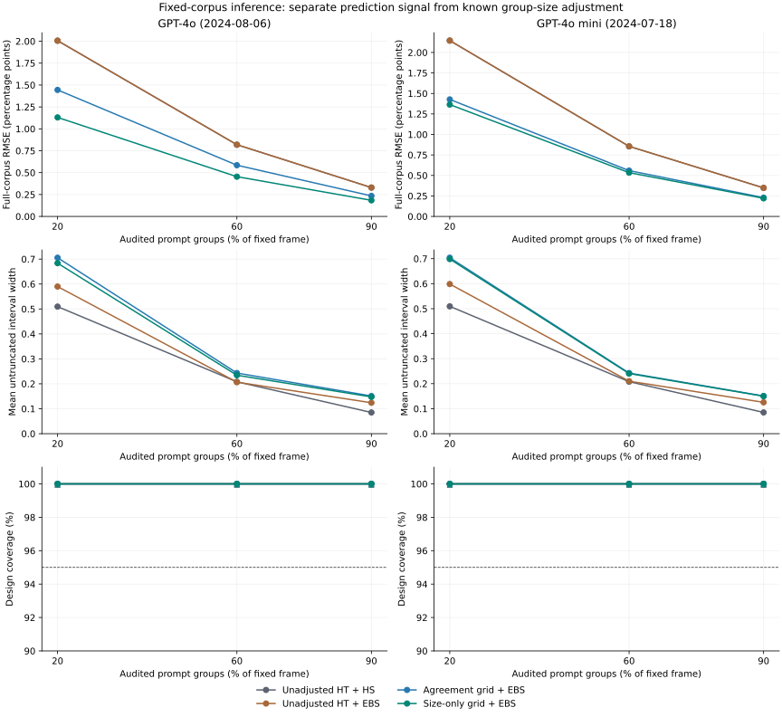

# Can agreement improve a finite-corpus audit beyond known group size?

This retrospective study targets the **complete fixed corpus's row-average reference correctness**. It applies classical difference estimation and Bardenet–Maillard sampling-without-replacement bounds. It introduces no new estimator or theorem and does not reinterpret the earlier held-out target.

The pinned NonLLMBar frame has 2,566 comparisons in 2,315 exact-prompt groups. Two dated judge caches, four procedures and three budgets share 2,000 independent random permutations, producing 48,000 retained method-trial rows. Nested budgets, procedures and target directions are paired, not independent new datasets. There are no new LLM calls or newly purchased reference labels.

## Observed comparison

The primary comparison gives the agreement signal and the size-only control without auxiliary judge information the same coefficient grid and error allocation. Both can use known group sizes; only the agreement rule uses the cross-judge signal. A lower error than unadjusted HT alone is insufficient to attribute the gain to the LLM proxy.

Agreement-grid has lower observed MSE than size-only in 0/6 cells and lower mean width in 0/6. These are observed signs, not significance declarations or guarantees for new corpora. The paired differences and Monte Carlo standard errors below retain every configured comparison.

Paired MSE differences use squared outcome fractions; width differences use outcome fractions. Complete-results RMSE, bias and width also use fractions. Only plotted RMSE uses percentage points.

Observed coverage across all 24 cells is 100.00–100.00%. The finite guarantee comes from the assumptions and inequalities, not this empirical coverage. High coverage can coexist with conservative width and biased grid-selected points.

| Target cache | Group fraction | Agreement minus size-only MSE | Paired MCSE | Width difference | Paired MCSE |
|---|---:|---:|---:|---:|---:|
| GPT-4o (2024-08-06) | 20% | 8.083873e-05 | 5.847416e-06 | 0.0217545 | 0.000107086 |
| GPT-4o mini (2024-07-18) | 20% | 1.753909e-05 | 6.235163e-06 | 0.00529753 | 0.000111169 |
| GPT-4o (2024-08-06) | 60% | 1.360667e-05 | 9.518041e-07 | 0.00883777 | 1.75548e-05 |
| GPT-4o mini (2024-07-18) | 60% | 2.70246e-06 | 9.626184e-07 | 0.0020989 | 1.79855e-05 |
| GPT-4o (2024-08-06) | 90% | 2.109461e-06 | 1.582081e-07 | 0.0036113 | 2.95816e-06 |
| GPT-4o mini (2024-07-18) | 90% | 3.619365e-07 | 1.552629e-07 | 0.000854758 | 3.0018e-06 |



RMSE is in percentage points; widths are outcome fractions. Width bars are pointwise approximate 95% Monte Carlo intervals, and coverage bars are pointwise exact 95% binomial intervals. Overlapping curves may hide methods; all values remain in the table. Unadjusted HT's two interval families have identical point estimates.

## Target, sampling and guarantee

Every comparison has a frozen reference outcome in [0,1]. Complete prompt groups are sampling units, with known sizes n_g and known proxy totals F_g. A uniform permutation's fixed k-prefix is a simple random sample of groups without replacement. Every row in each selected group is audited.

```text
M = sum_g n_g; theta = sum_g Y_g / M
estimate(lambda) = lambda*sum_all F_g/M + G/(k*M)*sum_sample(Y_g-lambda*F_g)
```

Fixed coefficients give a design-unbiased estimate of the row-weighted full-corpus mean. A sampled-row ratio and an equal average of group accuracies are different estimators. The same-audit finite-grid selector retains simultaneous interval coverage within its own family but need not retain unbiasedness. No unsampled outcomes enter fitting, candidate selection or the residual support range. Full outcomes enter scoring only.

The four families are fixed-zero HT with Hoeffding–Serfling (HS), fixed-zero HT with empirical Bernstein–Serfling (EBS), agreement-grid EBS, and size-only-grid EBS. Both grids are (0,.25,.5,.75,1); size-only uses F_g=n_g and no auxiliary judge signal. The common support is [min_g(-lambda F_g),max_g(n_g-lambda F_g)]. EBS uses the audited residual variance with divisor k and the full known support width, never an observed residual range. HS uses log(2K/alpha); EBS uses log(10K/alpha) and kappa=7/3+3/sqrt(2). Census returns the exactly observed mean and zero width.

Coverage is marginal over the specified group-sampling design, conditional on this fixed frame and all its fixed outcomes. It requires neither independent group outcomes nor an iid superpopulation. It does require complete frame membership, fixed k, uniform group inclusion and complete audited groups. Convenience samples, stopping at a row-label cap, nonresponse and post-hoc selection across the four families are not covered. The reported intervals do not jointly cover all methods, judges and budgets at the nominal level.

All intervals are untruncated. The scoring-only eight-epsilon membership margin changes neither estimates nor endpoints. Coverage MC intervals are 95% regardless of the chosen inference alpha. The finite target is recorded benchmark correctness, not error-free latent quality, the unobserved remainder mean or a new deployment population.

[Frozen protocol and primary sources](../../docs/FINITE_CORPUS_PROTOCOL.md). [Original cache provenance and notices](../rewardbench/NOTICE.md). This is a reanalysis of the same cached panel, not additional external validation. The historical synthesis retains its own earlier scope and fingerprints.

## Complete results

| Target cache | Groups | Procedure | RMSE | Bias (MCSE) | Coverage (MC bounds) | Mean width | Full [0,1] containment |
|---|---:|---|---:|---|---|---:|---:|
| GPT-4o (2024-08-06) | 463 | Unadjusted HT + HS | 0.020063 | 0.001032 (0.000448) | 1.00000 ([0.99816, 1.00000]) | 0.509446 | 0.000 |
| GPT-4o (2024-08-06) | 463 | Unadjusted HT + EBS | 0.020063 | 0.001032 (0.000448) | 1.00000 ([0.99816, 1.00000]) | 0.589908 | 0.000 |
| GPT-4o (2024-08-06) | 463 | Agreement grid + EBS | 0.014443 | 0.000410 (0.000323) | 1.00000 ([0.99816, 1.00000]) | 0.705425 | 0.000 |
| GPT-4o (2024-08-06) | 463 | Size-only grid + EBS | 0.011303 | 0.000260 (0.000253) | 1.00000 ([0.99816, 1.00000]) | 0.683671 | 0.000 |
| GPT-4o mini (2024-07-18) | 463 | Unadjusted HT + HS | 0.021450 | 0.001271 (0.000479) | 1.00000 ([0.99816, 1.00000]) | 0.509446 | 0.000 |
| GPT-4o mini (2024-07-18) | 463 | Unadjusted HT + EBS | 0.021450 | 0.001271 (0.000479) | 1.00000 ([0.99816, 1.00000]) | 0.598576 | 0.000 |
| GPT-4o mini (2024-07-18) | 463 | Agreement grid + EBS | 0.014273 | 0.000649 (0.000319) | 1.00000 ([0.99816, 1.00000]) | 0.703849 | 0.000 |
| GPT-4o mini (2024-07-18) | 463 | Size-only grid + EBS | 0.013645 | 0.000501 (0.000305) | 1.00000 ([0.99816, 1.00000]) | 0.698552 | 0.000 |
| GPT-4o (2024-08-06) | 1389 | Unadjusted HT + HS | 0.008188 | -0.000022 (0.000183) | 1.00000 ([0.99816, 1.00000]) | 0.207999 | 0.000 |
| GPT-4o (2024-08-06) | 1389 | Unadjusted HT + EBS | 0.008188 | -0.000022 (0.000183) | 1.00000 ([0.99816, 1.00000]) | 0.206415 | 0.000 |
| GPT-4o (2024-08-06) | 1389 | Agreement grid + EBS | 0.005848 | -0.000115 (0.000131) | 1.00000 ([0.99816, 1.00000]) | 0.243151 | 0.000 |
| GPT-4o (2024-08-06) | 1389 | Size-only grid + EBS | 0.004538 | -0.000057 (0.000101) | 1.00000 ([0.99816, 1.00000]) | 0.234313 | 0.000 |
| GPT-4o mini (2024-07-18) | 1389 | Unadjusted HT + HS | 0.008549 | 0.000075 (0.000191) | 1.00000 ([0.99816, 1.00000]) | 0.207999 | 0.000 |
| GPT-4o mini (2024-07-18) | 1389 | Unadjusted HT + EBS | 0.008549 | 0.000075 (0.000191) | 1.00000 ([0.99816, 1.00000]) | 0.209947 | 0.000 |
| GPT-4o mini (2024-07-18) | 1389 | Agreement grid + EBS | 0.005589 | -0.000018 (0.000125) | 1.00000 ([0.99816, 1.00000]) | 0.242488 | 0.000 |
| GPT-4o mini (2024-07-18) | 1389 | Size-only grid + EBS | 0.005341 | 0.000040 (0.000119) | 1.00000 ([0.99816, 1.00000]) | 0.240390 | 0.000 |
| GPT-4o (2024-08-06) | 2083 | Unadjusted HT + HS | 0.003296 | -0.000071 (0.000074) | 1.00000 ([0.99816, 1.00000]) | 0.085007 | 0.000 |
| GPT-4o (2024-08-06) | 2083 | Unadjusted HT + EBS | 0.003296 | -0.000071 (0.000074) | 1.00000 ([0.99816, 1.00000]) | 0.123934 | 0.000 |
| GPT-4o (2024-08-06) | 2083 | Agreement grid + EBS | 0.002343 | -0.000080 (0.000052) | 1.00000 ([0.99816, 1.00000]) | 0.150971 | 0.000 |
| GPT-4o (2024-08-06) | 2083 | Size-only grid + EBS | 0.001839 | -0.000059 (0.000041) | 1.00000 ([0.99816, 1.00000]) | 0.147359 | 0.000 |
| GPT-4o mini (2024-07-18) | 2083 | Unadjusted HT + HS | 0.003482 | -0.000038 (0.000078) | 1.00000 ([0.99816, 1.00000]) | 0.085007 | 0.000 |
| GPT-4o mini (2024-07-18) | 2083 | Unadjusted HT + EBS | 0.003482 | -0.000038 (0.000078) | 1.00000 ([0.99816, 1.00000]) | 0.125381 | 0.000 |
| GPT-4o mini (2024-07-18) | 2083 | Agreement grid + EBS | 0.002290 | -0.000047 (0.000051) | 1.00000 ([0.99816, 1.00000]) | 0.150700 | 0.000 |
| GPT-4o mini (2024-07-18) | 2083 | Size-only grid + EBS | 0.002209 | -0.000026 (0.000049) | 1.00000 ([0.99816, 1.00000]) | 0.149845 | 0.000 |

## Cost and census

The budget fixes numbers of groups, not labels. Actual reference-label cost is the sum of sampled group sizes and is shared across all procedures and both target directions. One full panel materializes two cached choices per row. Agreement requires the corresponding full-frame cross-judge signal; the size-only rule requires no such signal. These input counts are not measured compute, latency or dollar savings.

| Audited groups | Expected row labels | Mean (MCSE) | Observed min–max | 10/50/90% cost quantiles |
|---:|---:|---|---|---|
| 463 | 513.200 | 513.593 (0.192) | 484–540 | 503/514/525 |
| 1389 | 1539.600 | 1539.654 (0.235) | 1498–1580 | 1526/1540/1553 |
| 2083 | 2308.846 | 2308.818 (0.143) | 2288–2327 | 2301/2309/2317 |

All 8 deterministic census checks return the exact full-row mean and zero width. They are in `census.csv`, outside replication and coverage summaries. They do not represent additional evidence from thousands of repeated identical censuses.

## Reproduction and artifact inventory

```bash
python examples/finite_corpus_study.py --repetitions 2000 --seed 2032 --alpha 0.05 --output reports/reproduced/finite-corpus --plot
```

- `trials.csv.gz`: every fitted rule, candidate, endpoint, selected power and scored error.
- `summary.csv` and `paired_differences.csv`: all 24 cells and 36 wide paired comparisons with MCSEs.
- `splits.csv`: one shared sample per repetition/budget, actual costs and group/row ID hashes.
- `frame_catalog.json` and `permutations.json.gz`: lossless indexed membership of every draw; `judgecal.finite_corpus_study.decode_sample` reconstructs the exact IDs.
- `census.csv`: eight exact structural checks, without Monte Carlo error bars.
- `study_config.json` and `reproducibility.json`: randomization, data, source, environment and artifact fingerprints.
