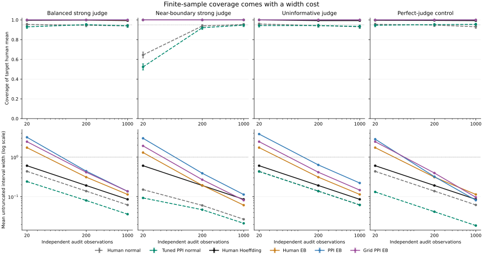

# Finite-sample coverage and the cost of conservative intervals

Established bounded-mean inequalities applied to prediction-powered inference, with all simulation outcomes retained.

[Retrospective protocol and derivation](../../docs/FINITE_SAMPLE_PROTOCOL.md)

## Question and scope

Earlier experiments exposed small-audit undercoverage for normal PPI intervals. This follow-up asks how finite-sample bounded-score intervals trade width for coverage. It implements established Hoeffding and Maurer–Pontil empirical Bernstein (EB) bounds, not a new PPI estimator or a claim of improved practical efficiency.

Finite-sample coverage claims require independent iid audit pairs and an independent prediction pool, bounded outcomes/predictions, fixed sample sizes and a frozen predictor. The audit outcome and predictor marginals must represent the intended target. These assumptions cannot be verified from score arrays alone.

Fixed-power methods use powers 0 or 1. Grid EB chooses the smallest untruncated radius over the prespecified powers `[0, 0.25, 0.5, 0.75, 1]`, with a simultaneous error budget across all residual candidates and one shared prediction-mean bound. This is different from inserting an unrestricted fitted coefficient into a fixed-power guarantee. No data-dependent choice between bound families is made.

## Design

Actual run: 1,000 independent replications per scenario; master seed 2028. All eight methods share every draw. The 12 iid scenarios combine four profiles (balanced strong judge, near-boundary strong judge, uninformative judge, and perfect-judge control) with 20, 200 and 1,000 audit observations. Prediction pools have ten times as many observations. Exact generation parameters and candidate powers are in `config.json`.

Every interval is untruncated, including those extending beyond [0,1]. A known bounded parameter allows intersection with [0,1], but clipping would obscure the raw width cost, so it is not used here. Zero observed variance does not justify zero finite-sample width. Perfect sampled predictions do not shrink the known residual range.

## IID coverage and width

Across the 60 theorem-applicable method/scenario cells, observed coverage ranges from 0.993 to 1.000. These Monte Carlo observations do not prove the theorem or guarantee performance outside its assumptions. Grid EB is narrower than the standalone human Hoeffding interval in 1/12 iid scenarios. All widths and underperforming cases remain visible.

The near-boundary case (human prevalence 0.95, audit size 20) separates point accuracy from interval validity. Tuned PPI has RMSE 0.0413, versus 0.0496 for human-only, but its nominal 95% normal interval covers only 52.4% of replications; 353/1,000 intervals have zero width. Human Hoeffding coverage is 100.0%, with mean width 0.6074, versus 0.0931 for tuned normal. Grid EB is wider still (1.9238), containing the entire [0,1] parameter range in 64.7% of replications. Improving point RMSE does not validate a narrow interval, and conservative coverage can be uninformative.

Coverage uncertainty below is a pointwise 95% exact-binomial Monte Carlo interval. Even a run with no misses has a lower endpoint below 1. These intervals describe the simulation's coverage probability; they are not the estimator's own confidence interval and are not simultaneous across all table rows.

| Scenario | Method | Coverage | MC interval | Mean width | Full [0,1] containment | Mean power |
|---|---|---:|---|---:|---:|---:|
| iid_balanced_strong_n0020 | Human normal | 0.954 | [0.939, 0.966] | 0.4373 | 0.000 | 0.000 |
| iid_balanced_strong_n0020 | PPI normal | 0.942 | [0.926, 0.956] | 0.2642 | 0.000 | 1.000 |
| iid_balanced_strong_n0020 | Tuned PPI normal | 0.930 | [0.912, 0.945] | 0.2418 | 0.000 | 0.772 |
| iid_balanced_strong_n0020 | Human Hoeffding | 0.996 | [0.990, 0.999] | 0.6074 | 0.000 | 0.000 |
| iid_balanced_strong_n0020 | PPI Hoeffding | 1.000 | [0.996, 1.000] | 1.2298 | 0.915 | 1.000 |
| iid_balanced_strong_n0020 | Human EB | 1.000 | [0.996, 1.000] | 1.7368 | 0.996 | 0.000 |
| iid_balanced_strong_n0020 | PPI EB | 1.000 | [0.996, 1.000] | 3.1740 | 1.000 | 1.000 |
| iid_balanced_strong_n0020 | Grid PPI EB | 1.000 | [0.996, 1.000] | 2.4576 | 1.000 | 0.000 |
| iid_balanced_strong_n0200 | Human normal | 0.946 | [0.930, 0.959] | 0.1386 | 0.000 | 0.000 |
| iid_balanced_strong_n0200 | PPI normal | 0.944 | [0.928, 0.957] | 0.0868 | 0.000 | 1.000 |
| iid_balanced_strong_n0200 | Tuned PPI normal | 0.952 | [0.937, 0.964] | 0.0805 | 0.000 | 0.775 |
| iid_balanced_strong_n0200 | Human Hoeffding | 0.998 | [0.993, 1.000] | 0.1921 | 0.000 | 0.000 |
| iid_balanced_strong_n0200 | PPI Hoeffding | 1.000 | [0.996, 1.000] | 0.3889 | 0.000 | 1.000 |
| iid_balanced_strong_n0200 | Human EB | 1.000 | [0.996, 1.000] | 0.3121 | 0.000 | 0.000 |
| iid_balanced_strong_n0200 | PPI EB | 1.000 | [0.996, 1.000] | 0.4427 | 0.000 | 1.000 |
| iid_balanced_strong_n0200 | Grid PPI EB | 1.000 | [0.996, 1.000] | 0.4153 | 0.000 | 0.001 |
| iid_balanced_strong_n1000 | Human normal | 0.940 | [0.923, 0.954] | 0.0620 | 0.000 | 0.000 |
| iid_balanced_strong_n1000 | PPI normal | 0.957 | [0.943, 0.969] | 0.0391 | 0.000 | 1.000 |
| iid_balanced_strong_n1000 | Tuned PPI normal | 0.941 | [0.925, 0.955] | 0.0362 | 0.000 | 0.774 |
| iid_balanced_strong_n1000 | Human Hoeffding | 0.993 | [0.986, 0.997] | 0.0859 | 0.000 | 0.000 |
| iid_balanced_strong_n1000 | PPI Hoeffding | 1.000 | [0.996, 1.000] | 0.1739 | 0.000 | 1.000 |
| iid_balanced_strong_n1000 | Human EB | 0.998 | [0.993, 1.000] | 0.1141 | 0.000 | 0.000 |
| iid_balanced_strong_n1000 | PPI EB | 1.000 | [0.996, 1.000] | 0.1365 | 0.000 | 1.000 |
| iid_balanced_strong_n1000 | Grid PPI EB | 1.000 | [0.996, 1.000] | 0.1370 | 0.000 | 0.500 |
| iid_rare_strong_n0020 | Human normal | 0.645 | [0.614, 0.675] | 0.1512 | 0.000 | 0.000 |
| iid_rare_strong_n0020 | PPI normal | 0.783 | [0.756, 0.808] | 0.1902 | 0.000 | 1.000 |
| iid_rare_strong_n0020 | Tuned PPI normal | 0.524 | [0.493, 0.555] | 0.0931 | 0.000 | 0.384 |
| iid_rare_strong_n0020 | Human Hoeffding | 1.000 | [0.996, 1.000] | 0.6074 | 0.000 | 0.000 |
| iid_rare_strong_n0020 | PPI Hoeffding | 1.000 | [0.996, 1.000] | 1.2298 | 0.000 | 1.000 |
| iid_rare_strong_n0020 | Human EB | 1.000 | [0.996, 1.000] | 1.3046 | 0.018 | 0.000 |
| iid_rare_strong_n0020 | PPI EB | 1.000 | [0.996, 1.000] | 2.9905 | 1.000 | 1.000 |
| iid_rare_strong_n0020 | Grid PPI EB | 1.000 | [0.996, 1.000] | 1.9238 | 0.647 | 0.000 |
| iid_rare_strong_n0200 | Human normal | 0.939 | [0.922, 0.953] | 0.0603 | 0.000 | 0.000 |
| iid_rare_strong_n0200 | PPI normal | 0.931 | [0.913, 0.946] | 0.0666 | 0.000 | 1.000 |
| iid_rare_strong_n0200 | Tuned PPI normal | 0.921 | [0.903, 0.937] | 0.0470 | 0.000 | 0.443 |
| iid_rare_strong_n0200 | Human Hoeffding | 1.000 | [0.996, 1.000] | 0.1921 | 0.000 | 0.000 |
| iid_rare_strong_n0200 | PPI Hoeffding | 1.000 | [0.996, 1.000] | 0.3889 | 0.000 | 1.000 |
| iid_rare_strong_n0200 | Human EB | 1.000 | [0.996, 1.000] | 0.1939 | 0.000 | 0.000 |
| iid_rare_strong_n0200 | PPI EB | 1.000 | [0.996, 1.000] | 0.3910 | 0.000 | 1.000 |
| iid_rare_strong_n0200 | Grid PPI EB | 1.000 | [0.996, 1.000] | 0.2693 | 0.000 | 0.000 |
| iid_rare_strong_n1000 | Human normal | 0.953 | [0.938, 0.965] | 0.0269 | 0.000 | 0.000 |
| iid_rare_strong_n1000 | PPI normal | 0.943 | [0.927, 0.957] | 0.0301 | 0.000 | 1.000 |
| iid_rare_strong_n1000 | Tuned PPI normal | 0.947 | [0.931, 0.960] | 0.0213 | 0.000 | 0.437 |
| iid_rare_strong_n1000 | Human Hoeffding | 1.000 | [0.996, 1.000] | 0.0859 | 0.000 | 0.000 |
| iid_rare_strong_n1000 | PPI Hoeffding | 1.000 | [0.996, 1.000] | 0.1739 | 0.000 | 1.000 |
| iid_rare_strong_n1000 | Human EB | 1.000 | [0.996, 1.000] | 0.0612 | 0.000 | 0.000 |
| iid_rare_strong_n1000 | PPI EB | 1.000 | [0.996, 1.000] | 0.1135 | 0.000 | 1.000 |
| iid_rare_strong_n1000 | Grid PPI EB | 1.000 | [0.996, 1.000] | 0.0815 | 0.000 | 0.000 |
| iid_balanced_uninformative_n0020 | Human normal | 0.959 | [0.945, 0.970] | 0.4382 | 0.000 | 0.000 |
| iid_balanced_uninformative_n0020 | PPI normal | 0.940 | [0.923, 0.954] | 0.6269 | 0.000 | 1.000 |
| iid_balanced_uninformative_n0020 | Tuned PPI normal | 0.943 | [0.927, 0.957] | 0.4327 | 0.000 | 0.086 |
| iid_balanced_uninformative_n0020 | Human Hoeffding | 1.000 | [0.996, 1.000] | 0.6074 | 0.000 | 0.000 |
| iid_balanced_uninformative_n0020 | PPI Hoeffding | 1.000 | [0.996, 1.000] | 1.2298 | 0.511 | 1.000 |
| iid_balanced_uninformative_n0020 | Human EB | 1.000 | [0.996, 1.000] | 1.7382 | 1.000 | 0.000 |
| iid_balanced_uninformative_n0020 | PPI EB | 1.000 | [0.996, 1.000] | 3.8272 | 1.000 | 1.000 |
| iid_balanced_uninformative_n0020 | Grid PPI EB | 1.000 | [0.996, 1.000] | 2.4594 | 1.000 | 0.000 |
| iid_balanced_uninformative_n0200 | Human normal | 0.942 | [0.926, 0.956] | 0.1386 | 0.000 | 0.000 |
| iid_balanced_uninformative_n0200 | PPI normal | 0.956 | [0.941, 0.968] | 0.1988 | 0.000 | 1.000 |
| iid_balanced_uninformative_n0200 | Tuned PPI normal | 0.943 | [0.927, 0.957] | 0.1384 | 0.000 | 0.027 |
| iid_balanced_uninformative_n0200 | Human Hoeffding | 0.993 | [0.986, 0.997] | 0.1921 | 0.000 | 0.000 |
| iid_balanced_uninformative_n0200 | PPI Hoeffding | 1.000 | [0.996, 1.000] | 0.3889 | 0.000 | 1.000 |
| iid_balanced_uninformative_n0200 | Human EB | 1.000 | [0.996, 1.000] | 0.3121 | 0.000 | 0.000 |
| iid_balanced_uninformative_n0200 | PPI EB | 1.000 | [0.996, 1.000] | 0.6352 | 0.000 | 1.000 |
| iid_balanced_uninformative_n0200 | Grid PPI EB | 1.000 | [0.996, 1.000] | 0.4153 | 0.000 | 0.000 |
| iid_balanced_uninformative_n1000 | Human normal | 0.931 | [0.913, 0.946] | 0.0620 | 0.000 | 0.000 |
| iid_balanced_uninformative_n1000 | PPI normal | 0.949 | [0.933, 0.962] | 0.0888 | 0.000 | 1.000 |
| iid_balanced_uninformative_n1000 | Tuned PPI normal | 0.934 | [0.917, 0.949] | 0.0620 | 0.000 | 0.012 |
| iid_balanced_uninformative_n1000 | Human Hoeffding | 0.993 | [0.986, 0.997] | 0.0859 | 0.000 | 0.000 |
| iid_balanced_uninformative_n1000 | PPI Hoeffding | 1.000 | [0.996, 1.000] | 0.1739 | 0.000 | 1.000 |
| iid_balanced_uninformative_n1000 | Human EB | 1.000 | [0.996, 1.000] | 0.1141 | 0.000 | 0.000 |
| iid_balanced_uninformative_n1000 | PPI EB | 1.000 | [0.996, 1.000] | 0.2220 | 0.000 | 1.000 |
| iid_balanced_uninformative_n1000 | Grid PPI EB | 1.000 | [0.996, 1.000] | 0.1468 | 0.000 | 0.000 |
| iid_balanced_perfect_n0020 | Human normal | 0.955 | [0.940, 0.967] | 0.4373 | 0.000 | 0.000 |
| iid_balanced_perfect_n0020 | PPI normal | 0.949 | [0.933, 0.962] | 0.1386 | 0.000 | 1.000 |
| iid_balanced_perfect_n0020 | Tuned PPI normal | 0.946 | [0.930, 0.959] | 0.1321 | 0.000 | 0.908 |
| iid_balanced_perfect_n0020 | Human Hoeffding | 0.996 | [0.990, 0.999] | 0.6074 | 0.000 | 0.000 |
| iid_balanced_perfect_n0020 | PPI Hoeffding | 1.000 | [0.996, 1.000] | 1.2298 | 0.999 | 1.000 |
| iid_balanced_perfect_n0020 | Human EB | 1.000 | [0.996, 1.000] | 1.7367 | 0.996 | 0.000 |
| iid_balanced_perfect_n0020 | PPI EB | 1.000 | [0.996, 1.000] | 2.8374 | 1.000 | 1.000 |
| iid_balanced_perfect_n0020 | Grid PPI EB | 1.000 | [0.996, 1.000] | 2.4576 | 1.000 | 0.000 |
| iid_balanced_perfect_n0200 | Human normal | 0.948 | [0.932, 0.961] | 0.1386 | 0.000 | 0.000 |
| iid_balanced_perfect_n0200 | PPI normal | 0.954 | [0.939, 0.966] | 0.0438 | 0.000 | 1.000 |
| iid_balanced_perfect_n0200 | Tuned PPI normal | 0.952 | [0.937, 0.964] | 0.0418 | 0.000 | 0.909 |
| iid_balanced_perfect_n0200 | Human Hoeffding | 0.995 | [0.988, 0.998] | 0.1921 | 0.000 | 0.000 |
| iid_balanced_perfect_n0200 | PPI Hoeffding | 1.000 | [0.996, 1.000] | 0.3889 | 0.000 | 1.000 |
| iid_balanced_perfect_n0200 | Human EB | 1.000 | [0.996, 1.000] | 0.3121 | 0.000 | 0.000 |
| iid_balanced_perfect_n0200 | PPI EB | 1.000 | [0.996, 1.000] | 0.3211 | 0.000 | 1.000 |
| iid_balanced_perfect_n0200 | Grid PPI EB | 1.000 | [0.996, 1.000] | 0.3966 | 0.000 | 1.000 |
| iid_balanced_perfect_n1000 | Human normal | 0.931 | [0.913, 0.946] | 0.0620 | 0.000 | 0.000 |
| iid_balanced_perfect_n1000 | PPI normal | 0.957 | [0.943, 0.969] | 0.0196 | 0.000 | 1.000 |
| iid_balanced_perfect_n1000 | Tuned PPI normal | 0.955 | [0.940, 0.967] | 0.0187 | 0.000 | 0.909 |
| iid_balanced_perfect_n1000 | Human Hoeffding | 0.993 | [0.986, 0.997] | 0.0859 | 0.000 | 0.000 |
| iid_balanced_perfect_n1000 | PPI Hoeffding | 1.000 | [0.996, 1.000] | 0.1739 | 0.000 | 1.000 |
| iid_balanced_perfect_n1000 | Human EB | 1.000 | [0.996, 1.000] | 0.1141 | 0.000 | 0.000 |
| iid_balanced_perfect_n1000 | PPI EB | 1.000 | [0.996, 1.000] | 0.0816 | 0.000 | 1.000 |
| iid_balanced_perfect_n1000 | Grid PPI EB | 1.000 | [0.996, 1.000] | 0.0967 | 0.000 | 1.000 |



The plot shows six methods for readability; the table and trial data retain all eight. Coverage bars are pointwise 95% exact-binomial Monte Carlo intervals; width uses a log scale. Axes share scales across profiles. Normal intervals are asymptotic; the stated finite-sample claims apply to the bounded-score methods under the specified iid assumptions.

## Deliberate assumption failures

Repeated rows are analyzed as iid to demonstrate misspecification. The shift scenario changes human prevalence between audit and target with the conditional judge law held fixed. Neither situation carries the finite-sample guarantee for the intended target human mean. Intervals can remain numerically wide or contain truth without restoring the violated assumptions.

| Scenario | Method | Target coverage | MC interval | Mean width | Bias |
|---|---|---:|---|---:|---:|
| violation_repeated_clusters | Human normal | 0.682 | [0.652, 0.711] | 0.1375 | -0.0025 |
| violation_repeated_clusters | PPI normal | 0.678 | [0.648, 0.707] | 0.0851 | -0.0012 |
| violation_repeated_clusters | Tuned PPI normal | 0.673 | [0.643, 0.702] | 0.0786 | -0.0016 |
| violation_repeated_clusters | Human Hoeffding | 0.794 | [0.768, 0.819] | 0.1921 | -0.0025 |
| violation_repeated_clusters | PPI Hoeffding | 1.000 | [0.996, 1.000] | 0.3889 | -0.0012 |
| violation_repeated_clusters | Human EB | 0.967 | [0.954, 0.977] | 0.3105 | -0.0025 |
| violation_repeated_clusters | PPI EB | 1.000 | [0.996, 1.000] | 0.4379 | -0.0012 |
| violation_repeated_clusters | Grid PPI EB | 0.991 | [0.983, 0.996] | 0.4129 | -0.0025 |
| violation_audit_target_shift | Human normal | 0.000 | [0.000, 0.004] | 0.0607 | -0.3512 |
| violation_audit_target_shift | PPI normal | 0.000 | [0.000, 0.004] | 0.0517 | -0.1057 |
| violation_audit_target_shift | Tuned PPI normal | 0.000 | [0.000, 0.004] | 0.0456 | -0.1984 |
| violation_audit_target_shift | Human Hoeffding | 0.000 | [0.000, 0.004] | 0.0859 | -0.3512 |
| violation_audit_target_shift | PPI Hoeffding | 0.068 | [0.053, 0.085] | 0.1739 | -0.1057 |
| violation_audit_target_shift | Human EB | 0.000 | [0.000, 0.004] | 0.1121 | -0.3512 |
| violation_audit_target_shift | PPI EB | 0.017 | [0.010, 0.027] | 0.1572 | -0.1057 |
| violation_audit_target_shift | Grid PPI EB | 0.000 | [0.000, 0.004] | 0.1425 | -0.2899 |

Human-only intervals in the iid shift scenario still estimate the audit prevalence. The exports distinguish that native parameter from target prevalence. Nonhuman shifted rectified-functionals are not reported as native targets here; this omission does not assert that component inequalities fail for their own expectations.

## What the artifacts retain

- `trials.csv.gz`: every draw/method result, population truth, interval, power, candidate powers/radii and theorem-applicability metadata. No failed-coverage or uninformative interval is removed.
- `summary.csv`: bias, RMSE, coverage, width, Monte Carlo errors and exact coverage intervals; width greater than one and full-domain containment are separate diagnostics.
- Paired width differences compare each PPI method to the human-only interval in its own family on the same draw, with paired Monte Carlo errors. Grid selection can reduce width within its simultaneously calibrated candidates but need not beat a separately calibrated baseline.
- Configuration, package versions and source/artifact hashes make the run auditable. This synthetic retrospective grid does not establish savings or coverage on real LLM evaluations.

## Reproduce offline

```bash
pip install -e ".[dev,report]"
python examples/finite_sample_study.py --output reports/reproduced/finite-sample --plot
```

Defaults use 1,000 replications and seed 2028. Smaller `--repetitions` runs are explicitly recorded smoke checks. No network, model API, private data or purchased annotation is used.
