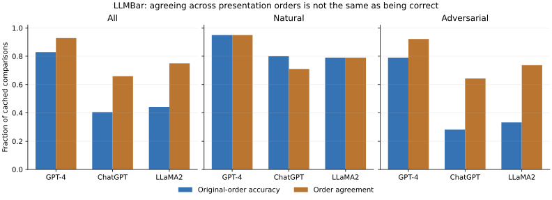
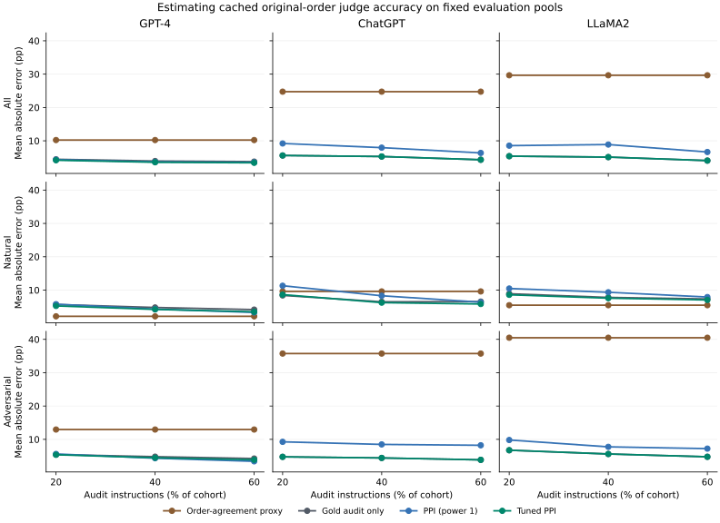

# Auditing judge accuracy with an imperfect consistency proxy

A second public benchmark with three cached judges, two presentation orders and published instruction-following references.

[Retrospective protocol](../../docs/LLMBAR_PROTOCOL.md) | [Data provenance and license](../llmbar/DATA_LICENSE.md)

## Target and proxy

The outcome is whether the designated judge's **original-order canonical choice** matches LLMBar's supplied gold preference. An invalid original-order output counts as incorrect and is retained. This estimates correctness relative to the benchmark's instruction-following labels, not a model's win rate or a survey of subjective human preference.

The proxy is one when both presentation orders yield valid, identical canonical choices, and zero otherwise. It uses no gold reference. Both orders can consistently choose the wrong output, so consistency is not accuracy. The original cache already maps reversed-order choices to original response IDs; the loader does not reverse them again.

All 419 comparisons are retained for GPT-4, ChatGPT and LLaMA2 with the source's Vanilla+Rules prompt. They share 418 exact instruction strings; both comparisons of a repeated instruction remain together. The Natural set has 100 comparisons and the four Adversarial categories total 319. All-cohort means weight comparisons equally; they are not a 50/50 Natural/Adversarial macro-average.

## Corpus diagnostics

These full-corpus reference-based diagnostics describe the cached judges; they never enter proxy construction or fitting. Both choices are canonicalized in the source, and invalid outputs remain in each denominator.

| Cohort | Judge | Comparisons | Original accuracy | Reversed accuracy | Order agreement | Consistent but wrong | Invalid original / reversed |
|---|---|---:|---:|---:|---:|---:|---|
| All | ChatGPT | 419 | 0.406 | 0.394 | 0.659 | 180 | 0 / 0 |
| All | GPT-4 | 419 | 0.828 | 0.862 | 0.928 | 50 | 0 / 0 |
| All | LLaMA2 | 419 | 0.442 | 0.442 | 0.749 | 181 | 1 / 1 |
| Natural | ChatGPT | 100 | 0.800 | 0.830 | 0.710 | 4 | 0 / 0 |
| Natural | GPT-4 | 100 | 0.950 | 0.960 | 0.950 | 2 | 0 / 0 |
| Natural | LLaMA2 | 100 | 0.790 | 0.820 | 0.790 | 9 | 0 / 0 |
| Adversarial | ChatGPT | 319 | 0.282 | 0.257 | 0.643 | 176 | 0 / 0 |
| Adversarial | GPT-4 | 319 | 0.790 | 0.831 | 0.922 | 48 | 0 / 0 |
| Adversarial | LLaMA2 | 319 | 0.332 | 0.323 | 0.737 | 172 | 1 / 1 |
| GPTInst | ChatGPT | 92 | 0.272 | 0.261 | 0.620 | 50 | 0 / 0 |
| GPTInst | GPT-4 | 92 | 0.848 | 0.880 | 0.946 | 10 | 0 / 0 |
| GPTInst | LLaMA2 | 92 | 0.304 | 0.304 | 0.728 | 51 | 1 / 0 |
| GPTOut | ChatGPT | 47 | 0.362 | 0.468 | 0.596 | 18 | 0 / 0 |
| GPTOut | GPT-4 | 47 | 0.745 | 0.809 | 0.936 | 9 | 0 / 0 |
| GPTOut | LLaMA2 | 47 | 0.574 | 0.553 | 0.723 | 14 | 0 / 1 |
| Manual | ChatGPT | 46 | 0.391 | 0.304 | 0.522 | 19 | 0 / 0 |
| Manual | GPT-4 | 46 | 0.761 | 0.848 | 0.826 | 5 | 0 / 0 |
| Manual | LLaMA2 | 46 | 0.370 | 0.370 | 0.652 | 21 | 0 / 0 |
| Neighbor | ChatGPT | 134 | 0.224 | 0.164 | 0.716 | 89 | 0 / 0 |
| Neighbor | GPT-4 | 134 | 0.776 | 0.799 | 0.933 | 24 | 0 / 0 |
| Neighbor | LLaMA2 | 134 | 0.254 | 0.239 | 0.776 | 86 | 0 / 0 |



## Fixed-target audit experiment

For every cohort and each of 30 deterministic seeds, 25% of instruction groups form a fixed evaluation pool. Audits use nested 20%, 40% and 60% fractions of total cohort instructions. Splits are identical across all three judges. Whole instruction groups stay together. Unused comparisons supply neither audit labels nor proxy predictions.

Four estimators see the same pools: raw consistency proxy, gold audit only, fixed-power PPI and tuned PPI. PPI uses the numeric mean API with instruction-cluster variance. Audit gold fits the correction and scalar power; evaluation gold only scores the already formed estimates. Errors target realized heldout original-order accuracy, not a population confidence-interval coverage experiment.

| Cohort | Judge | Audit instructions | Method | MAE (pp) | RMSE (pp) | Mean power |
|---|---|---:|---|---:|---:|---:|
| Adversarial | ChatGPT | 20% | Gold audit only | 4.754 | 6.208 | 0.000 |
| Adversarial | ChatGPT | 20% | PPI (power 1) | 9.258 | 11.698 | 1.000 |
| Adversarial | ChatGPT | 20% | Tuned PPI | 4.754 | 6.208 | 0.000 |
| Adversarial | ChatGPT | 20% | Order-agreement proxy | 35.742 | 36.303 | -- |
| Adversarial | ChatGPT | 40% | Gold audit only | 4.424 | 5.280 | 0.000 |
| Adversarial | ChatGPT | 40% | PPI (power 1) | 8.485 | 10.417 | 1.000 |
| Adversarial | ChatGPT | 40% | Tuned PPI | 4.424 | 5.280 | 0.000 |
| Adversarial | ChatGPT | 40% | Order-agreement proxy | 35.742 | 36.303 | -- |
| Adversarial | ChatGPT | 60% | Gold audit only | 3.851 | 4.823 | 0.000 |
| Adversarial | ChatGPT | 60% | PPI (power 1) | 8.224 | 9.436 | 1.000 |
| Adversarial | ChatGPT | 60% | Tuned PPI | 3.851 | 4.823 | 0.000 |
| Adversarial | ChatGPT | 60% | Order-agreement proxy | 35.742 | 36.303 | -- |
| Adversarial | GPT-4 | 20% | Gold audit only | 5.418 | 6.552 | 0.000 |
| Adversarial | GPT-4 | 20% | PPI (power 1) | 5.617 | 6.900 | 1.000 |
| Adversarial | GPT-4 | 20% | Tuned PPI | 5.374 | 6.497 | 0.339 |
| Adversarial | GPT-4 | 20% | Order-agreement proxy | 12.950 | 13.288 | -- |
| Adversarial | GPT-4 | 40% | Gold audit only | 4.805 | 5.800 | 0.000 |
| Adversarial | GPT-4 | 40% | PPI (power 1) | 4.344 | 5.511 | 1.000 |
| Adversarial | GPT-4 | 40% | Tuned PPI | 4.480 | 5.499 | 0.235 |
| Adversarial | GPT-4 | 40% | Order-agreement proxy | 12.950 | 13.288 | -- |
| Adversarial | GPT-4 | 60% | Gold audit only | 4.246 | 5.183 | 0.000 |
| Adversarial | GPT-4 | 60% | PPI (power 1) | 3.410 | 4.238 | 1.000 |
| Adversarial | GPT-4 | 60% | Tuned PPI | 3.869 | 4.760 | 0.190 |
| Adversarial | GPT-4 | 60% | Order-agreement proxy | 12.950 | 13.288 | -- |
| Adversarial | LLaMA2 | 20% | Gold audit only | 6.737 | 7.784 | 0.000 |
| Adversarial | LLaMA2 | 20% | PPI (power 1) | 9.807 | 12.551 | 1.000 |
| Adversarial | LLaMA2 | 20% | Tuned PPI | 6.737 | 7.784 | 0.000 |
| Adversarial | LLaMA2 | 20% | Order-agreement proxy | 40.491 | 40.917 | -- |
| Adversarial | LLaMA2 | 40% | Gold audit only | 5.607 | 6.394 | 0.000 |
| Adversarial | LLaMA2 | 40% | PPI (power 1) | 7.752 | 10.333 | 1.000 |
| Adversarial | LLaMA2 | 40% | Tuned PPI | 5.607 | 6.394 | 0.000 |
| Adversarial | LLaMA2 | 40% | Order-agreement proxy | 40.491 | 40.917 | -- |
| Adversarial | LLaMA2 | 60% | Gold audit only | 4.770 | 5.670 | 0.000 |
| Adversarial | LLaMA2 | 60% | PPI (power 1) | 7.221 | 9.076 | 1.000 |
| Adversarial | LLaMA2 | 60% | Tuned PPI | 4.770 | 5.670 | 0.000 |
| Adversarial | LLaMA2 | 60% | Order-agreement proxy | 40.491 | 40.917 | -- |
| All | ChatGPT | 20% | Gold audit only | 5.601 | 6.736 | 0.000 |
| All | ChatGPT | 20% | PPI (power 1) | 9.207 | 10.831 | 1.000 |
| All | ChatGPT | 20% | Tuned PPI | 5.601 | 6.736 | 0.000 |
| All | ChatGPT | 20% | Order-agreement proxy | 24.745 | 25.431 | -- |
| All | ChatGPT | 40% | Gold audit only | 5.292 | 6.436 | 0.000 |
| All | ChatGPT | 40% | PPI (power 1) | 7.953 | 9.587 | 1.000 |
| All | ChatGPT | 40% | Tuned PPI | 5.292 | 6.436 | 0.000 |
| All | ChatGPT | 40% | Order-agreement proxy | 24.745 | 25.431 | -- |
| All | ChatGPT | 60% | Gold audit only | 4.322 | 5.536 | 0.000 |
| All | ChatGPT | 60% | PPI (power 1) | 6.365 | 8.210 | 1.000 |
| All | ChatGPT | 60% | Tuned PPI | 4.322 | 5.536 | 0.000 |
| All | ChatGPT | 60% | Order-agreement proxy | 24.745 | 25.431 | -- |
| All | GPT-4 | 20% | Gold audit only | 4.457 | 5.584 | 0.000 |
| All | GPT-4 | 20% | PPI (power 1) | 4.333 | 5.349 | 1.000 |
| All | GPT-4 | 20% | Tuned PPI | 4.175 | 5.211 | 0.329 |
| All | GPT-4 | 20% | Order-agreement proxy | 10.234 | 10.632 | -- |
| All | GPT-4 | 40% | Gold audit only | 3.939 | 4.831 | 0.000 |
| All | GPT-4 | 40% | PPI (power 1) | 3.671 | 4.498 | 1.000 |
| All | GPT-4 | 40% | Tuned PPI | 3.566 | 4.501 | 0.238 |
| All | GPT-4 | 40% | Order-agreement proxy | 10.234 | 10.632 | -- |
| All | GPT-4 | 60% | Gold audit only | 3.763 | 4.617 | 0.000 |
| All | GPT-4 | 60% | PPI (power 1) | 3.539 | 4.286 | 1.000 |
| All | GPT-4 | 60% | Tuned PPI | 3.409 | 4.287 | 0.189 |
| All | GPT-4 | 60% | Order-agreement proxy | 10.234 | 10.632 | -- |
| All | LLaMA2 | 20% | Gold audit only | 5.394 | 7.014 | 0.000 |
| All | LLaMA2 | 20% | PPI (power 1) | 8.556 | 10.523 | 1.000 |
| All | LLaMA2 | 20% | Tuned PPI | 5.399 | 7.019 | 0.004 |
| All | LLaMA2 | 20% | Order-agreement proxy | 29.665 | 30.404 | -- |
| All | LLaMA2 | 40% | Gold audit only | 5.113 | 6.094 | 0.000 |
| All | LLaMA2 | 40% | PPI (power 1) | 8.885 | 10.491 | 1.000 |
| All | LLaMA2 | 40% | Tuned PPI | 5.119 | 6.102 | 0.001 |
| All | LLaMA2 | 40% | Order-agreement proxy | 29.665 | 30.404 | -- |
| All | LLaMA2 | 60% | Gold audit only | 4.065 | 4.976 | 0.000 |
| All | LLaMA2 | 60% | PPI (power 1) | 6.647 | 8.428 | 1.000 |
| All | LLaMA2 | 60% | Tuned PPI | 4.066 | 4.978 | 0.000 |
| All | LLaMA2 | 60% | Order-agreement proxy | 29.665 | 30.404 | -- |
| Natural | ChatGPT | 20% | Gold audit only | 8.400 | 10.912 | 0.000 |
| Natural | ChatGPT | 20% | PPI (power 1) | 11.300 | 12.929 | 1.000 |
| Natural | ChatGPT | 20% | Tuned PPI | 8.638 | 10.597 | 0.224 |
| Natural | ChatGPT | 20% | Order-agreement proxy | 9.600 | 11.075 | -- |
| Natural | ChatGPT | 40% | Gold audit only | 6.483 | 8.418 | 0.000 |
| Natural | ChatGPT | 40% | PPI (power 1) | 8.300 | 9.992 | 1.000 |
| Natural | ChatGPT | 40% | Tuned PPI | 6.234 | 7.857 | 0.181 |
| Natural | ChatGPT | 40% | Order-agreement proxy | 9.600 | 11.075 | -- |
| Natural | ChatGPT | 60% | Gold audit only | 6.544 | 8.090 | 0.000 |
| Natural | ChatGPT | 60% | PPI (power 1) | 6.356 | 8.347 | 1.000 |
| Natural | ChatGPT | 60% | Tuned PPI | 5.830 | 7.122 | 0.149 |
| Natural | ChatGPT | 60% | Order-agreement proxy | 9.600 | 11.075 | -- |
| Natural | GPT-4 | 20% | Gold audit only | 5.667 | 6.573 | 0.000 |
| Natural | GPT-4 | 20% | PPI (power 1) | 5.767 | 7.246 | 1.000 |
| Natural | GPT-4 | 20% | Tuned PPI | 5.249 | 6.166 | 0.275 |
| Natural | GPT-4 | 20% | Order-agreement proxy | 2.133 | 3.266 | -- |
| Natural | GPT-4 | 40% | Gold audit only | 4.783 | 5.641 | 0.000 |
| Natural | GPT-4 | 40% | PPI (power 1) | 4.300 | 5.268 | 1.000 |
| Natural | GPT-4 | 40% | Tuned PPI | 4.205 | 5.136 | 0.224 |
| Natural | GPT-4 | 40% | Order-agreement proxy | 2.133 | 3.266 | -- |
| Natural | GPT-4 | 60% | Gold audit only | 4.144 | 4.792 | 0.000 |
| Natural | GPT-4 | 60% | PPI (power 1) | 3.300 | 4.453 | 1.000 |
| Natural | GPT-4 | 60% | Tuned PPI | 3.483 | 4.076 | 0.227 |
| Natural | GPT-4 | 60% | Order-agreement proxy | 2.133 | 3.266 | -- |
| Natural | LLaMA2 | 20% | Gold audit only | 8.900 | 11.083 | 0.000 |
| Natural | LLaMA2 | 20% | PPI (power 1) | 10.467 | 12.617 | 1.000 |
| Natural | LLaMA2 | 20% | Tuned PPI | 8.581 | 10.399 | 0.223 |
| Natural | LLaMA2 | 20% | Order-agreement proxy | 5.467 | 6.967 | -- |
| Natural | LLaMA2 | 40% | Gold audit only | 7.800 | 9.161 | 0.000 |
| Natural | LLaMA2 | 40% | PPI (power 1) | 9.350 | 10.812 | 1.000 |
| Natural | LLaMA2 | 40% | Tuned PPI | 7.576 | 8.648 | 0.169 |
| Natural | LLaMA2 | 40% | Order-agreement proxy | 5.467 | 6.967 | -- |
| Natural | LLaMA2 | 60% | Gold audit only | 7.344 | 9.099 | 0.000 |
| Natural | LLaMA2 | 60% | PPI (power 1) | 7.911 | 9.435 | 1.000 |
| Natural | LLaMA2 | 60% | Tuned PPI | 7.039 | 8.559 | 0.136 |
| Natural | LLaMA2 | 60% | Order-agreement proxy | 5.467 | 6.967 | -- |

Tuned PPI has lower mean absolute error than the gold-audit-only baseline in 14/27 cohort/judge/budget cells, ties in 9, and has higher error in 4 (absolute tolerance 1e-12 for ties). This is descriptive of the retained fixed corpus and splits, not a probability of improvement in deployment. Raw consistency is an accuracy proxy whose errors may be systematic; its mean receives no accuracy confidence interval.

### A proxy can be consistently wrong

For ChatGPT on the Adversarial subset, order agreement is 64.3% while original-order accuracy is 28.2%. Of 205 comparisons with valid agreement, 176 consistently choose the reference-incorrect answer. A high agreement rate alone is therefore insufficient to validate this judge.

Across the 6 Adversarial judge/budget cells for ChatGPT and LLaMA2, 6 have zero tuned power in every retained split, recovering the gold-audit-only estimate. Fixed-power PPI instead increases MAE in 6 of these cells. This fallback reflects the restricted [0,1] coefficient family and observed audit covariance; the study does not compare negative coefficients or claim global estimator optimality.



## Costs and retained evidence

`human_labels_used` counts audited gold comparison labels and is zero for raw proxy inference. The same audited gold label reveals correctness for all three judges; do not sum that cost across judges. Cached judgment counts describe records consumed by each estimator, not new API calls or monetary costs. The proxy requires both presentation orders; audit-only inference uses original-order audit judgments. Heldout labels used for scoring are recorded separately from inference labels.

Every trial is retained in `trials.csv`; `paired_method_differences.csv` subtracts the same-split gold-audit-only error. Exact instruction and comparison IDs are in `split_manifest.json`. Repeated splits, nested cohorts and judges share data, so no independent-row significance test or naive Monte Carlo standard error is attached to those empirical contrasts.

## Limits

- These are curated references, not infallible latent truth. Adversarial construction/filtering makes the benchmark deliberately difficult; the source used ChatGPT evaluators in some filtering steps. It is not a random sample of deployment tasks, and comparative model results inherit that selection.
- The GPT-4 cache uses an undated `gpt-4` alias; ChatGPT configuration specifies Azure `gpt-35-turbo-0613`; LLaMA2 is `Llama-2-70b-chat-hf` without a weight revision. Cache pins reproduce this historical reanalysis, not fresh model calls or 2025/2026 model performance.
- One-way instruction grouping handles the known duplicate but does not prove arbitrary independence or normal-interval validity. Finite-sample iid bounds from the separate synthetic study are not applied here.
- No new human annotation or model call was purchased. No runtime label-saving or dollar-saving guarantee is claimed.

## Reproduce offline

```bash
pip install -e ".[dev,report]"
python examples/llmbar_audit.py --output reports/reproduced/llmbar-audit --plot
```

The committed derived labels contain only IDs, categories and choices. Their checksum is checked against pinned source provenance before analysis. `examples/prepare_llmbar.py` can rebuild that snapshot from the specified public files without running a model. Defaults use 30 split seeds; smaller `--seeds` runs are explicitly recorded in configuration.
