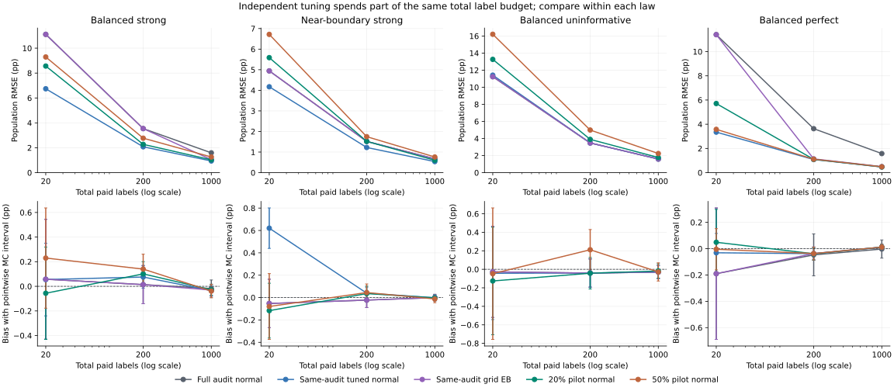
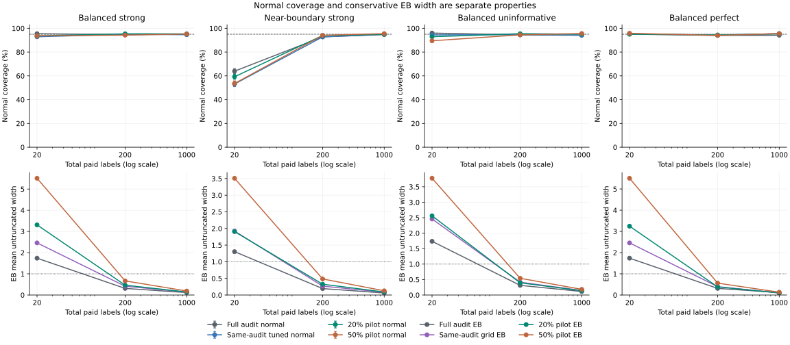

# What does independent tuning cost at a fixed label budget?

[Protocol, equations and primary sources](https://github.com/Siquan-Wang/llm-judge-calibration/blob/main/docs/PILOT_STUDY_PROTOCOL.md)

## Question and scope

This retrospective simulation compares established same-audit and independent-pilot control-variate procedures at the same total reference-label budget. It introduces no new estimator or theorem. Conditional on an independent pilot, its fitted coefficient is fixed, the corrected mean is unbiased, and the existing scalar empirical-Bernstein (EB) bound applies under the declared iid assumptions. These facts do not guarantee smaller error, narrower intervals or finite-sample validity of a normal interval.

The complete matrix has 12 laws/budgets, eight procedures and 2,000 independent replications per cell (192,000 retained method trials). Master seed: 2031. All configured cells and degenerate pilots are retained. No LLM calls, human annotations, benchmark observations or dollar savings were measured.

## Observed findings

At p=.95 and B=20, same-audit normal tuning has RMSE 0.04172 and coverage 53.15%. The 20% pilot gives 0.05587 and 59.25%; the 50% pilot gives 0.06717 and 53.60%. Its independent-pilot unbiasedness argument does not establish an accurate small-sample normal approximation. Bias and its Monte Carlo error are retained below, alongside all other cells.

Observed EB coverage ranges from 99.85% to 100.00%. The 20% pilot EB interval has smaller mean width than full-audit EB in 1/12 cells and the grid EB rule in 4/12; the corresponding 50% pilot counts are 0/12 and 0/12. Avoiding a grid-selection penalty does not remove the cost of fewer residual labels.

Even the perfect-proxy control retains small-pilot degeneracy. At B=20, 13.05% of four-label pilots have constant predictions, versus 0.35% of ten-label pilots. The two pilot rules have RMSE 0.05711 and 0.03577, respectively. This selected structural example does not choose a preferred allocation for other laws; the complete matrix stays visible.

## Design and cost accounting

Total paid labels are B=20,200,1000; the independent prediction pool always has N=10B rows. Profiles are balanced strong (p=.5, sensitivity=.95, specificity=.90), near-boundary strong (p=.95, same proxy), balanced uninformative (p=.5, sensitivity=.60, specificity=.40), and balanced perfect (p=.5, sensitivity=specificity=1). The perfect law is a structural control, not information supplied to a fitted rule. The target is the known population outcome mean p.

A pilot uses P=floor(.20B) or floor(.50B) labels and leaves m=B-P for residual estimation. Pilot rows are not reused in the residual mean or prediction pool. The coefficient uses only paired pilot moments and the known m,N counts; exact constant pilot predictions select zero. A zero pilot coefficient therefore uses only m final labels, despite paying for B. All full-audit rules use B labels. The experiment materializes B+N proxy scores per draw; the full-audit reference-only rules need no proxy scores for their mathematical estimates. These logical counts are not measured operational costs.

```text
lambda_P = clip((N/(m+N)) * Cov_P(Y,F)/Var_P(F), 0, 1)
estimate = mean(Y_R) + lambda_P * [mean(F_U) - mean(F_R)]
```

Same-audit normal tuning retains the existing per-pool variance formula. The pilot uses one pilot marginal variance for both pools, so this compares complete budget-matched procedures; it does not isolate independence from every other formula choice. The grid EB rule selects among the prespecified powers (0,.25,.5,.75,1) with simultaneous bounds. Each pilot EB rule instead conditions on its independently fitted scalar. Choosing whichever reported fraction or interval looks best afterwards is not a validated ninth procedure.

## Paired point-error comparisons

The signs below are observed per-cell MSE differences from shared draws, not probabilities of improvement on new tasks. Tabulated errors and widths are in outcome fractions; MSE contrasts use squared fractions. Plot RMSE and bias use percentage points (pp). No loss is pooled across laws or budgets. Standard errors use per-replication paired differences. Normal/EB variants of a pilot have identical points.

For scale, at p=.95 and B=200, the 20% pilot-minus-audit MSE contrast is 9.00302e-08 with MCSE 8.33017e-06. The sign-count table records observed signs even when their magnitude is small relative to Monte Carlo uncertainty; it does not declare every counted comparison statistically resolved.

| Pilot | Baseline | Lower MSE cells | Higher MSE cells | Exact ties |
|---|---|---:|---:|---:|
| 20% pilot normal | Full audit normal | 7/12 | 5/12 | 0/12 |
| 20% pilot normal | Same-audit tuned normal | 0/12 | 12/12 | 0/12 |
| 50% pilot normal | Full audit normal | 6/12 | 6/12 | 0/12 |
| 50% pilot normal | Same-audit tuned normal | 0/12 | 12/12 | 0/12 |

| Profile | Total B | Pilot | Baseline | Paired MSE difference | MCSE |
|---|---:|---|---|---:|---:|
| Balanced strong | 20 | 20% pilot normal | Full audit normal | -0.00500835 | 0.000366208 |
| Balanced strong | 20 | 20% pilot normal | Same-audit tuned normal | 0.00279187 | 0.000214593 |
| Balanced strong | 20 | 50% pilot normal | Full audit normal | -0.00370669 | 0.00046392 |
| Balanced strong | 20 | 50% pilot normal | Same-audit tuned normal | 0.00409353 | 0.00025755 |
| Balanced strong | 200 | 20% pilot normal | Full audit normal | -0.000736489 | 3.91582e-05 |
| Balanced strong | 200 | 20% pilot normal | Same-audit tuned normal | 8.52146e-05 | 9.48539e-06 |
| Balanced strong | 200 | 50% pilot normal | Full audit normal | -0.0004863 | 4.38789e-05 |
| Balanced strong | 200 | 50% pilot normal | Same-audit tuned normal | 0.000335403 | 2.0075e-05 |
| Balanced strong | 1000 | 20% pilot normal | Full audit normal | -0.000147773 | 7.48983e-06 |
| Balanced strong | 1000 | 20% pilot normal | Same-audit tuned normal | 1.76943e-05 | 1.84861e-06 |
| Balanced strong | 1000 | 50% pilot normal | Full audit normal | -9.53015e-05 | 8.43002e-06 |
| Balanced strong | 1000 | 50% pilot normal | Same-audit tuned normal | 7.01659e-05 | 4.07446e-06 |
| Near-boundary strong | 20 | 20% pilot normal | Full audit normal | 0.000678049 | 9.09096e-05 |
| Near-boundary strong | 20 | 20% pilot normal | Same-audit tuned normal | 0.00138109 | 0.000120655 |
| Near-boundary strong | 20 | 50% pilot normal | Full audit normal | 0.00206799 | 0.000175766 |
| Near-boundary strong | 20 | 50% pilot normal | Same-audit tuned normal | 0.00277103 | 0.000180269 |
| Near-boundary strong | 200 | 20% pilot normal | Full audit normal | 9.00302e-08 | 8.33017e-06 |
| Near-boundary strong | 200 | 20% pilot normal | Same-audit tuned normal | 8.12917e-05 | 6.217e-06 |
| Near-boundary strong | 200 | 50% pilot normal | Full audit normal | 7.50736e-05 | 1.06919e-05 |
| Near-boundary strong | 200 | 50% pilot normal | Same-audit tuned normal | 0.000156275 | 8.54728e-06 |
| Near-boundary strong | 1000 | 20% pilot normal | Full audit normal | -8.50494e-06 | 1.35528e-06 |
| Near-boundary strong | 1000 | 20% pilot normal | Same-audit tuned normal | 7.44501e-06 | 7.50818e-07 |
| Near-boundary strong | 1000 | 50% pilot normal | Full audit normal | 1.29154e-05 | 1.94608e-06 |
| Near-boundary strong | 1000 | 50% pilot normal | Same-audit tuned normal | 2.88653e-05 | 1.5846e-06 |
| Balanced uninformative | 20 | 20% pilot normal | Full audit normal | 0.0049659 | 0.000406755 |
| Balanced uninformative | 20 | 20% pilot normal | Same-audit tuned normal | 0.00456327 | 0.000387313 |
| Balanced uninformative | 20 | 50% pilot normal | Full audit normal | 0.0136303 | 0.000721069 |
| Balanced uninformative | 20 | 50% pilot normal | Same-audit tuned normal | 0.0132277 | 0.000713424 |
| Balanced uninformative | 200 | 20% pilot normal | Full audit normal | 0.000309455 | 2.97958e-05 |
| Balanced uninformative | 200 | 20% pilot normal | Same-audit tuned normal | 0.000307852 | 2.95589e-05 |
| Balanced uninformative | 200 | 50% pilot normal | Full audit normal | 0.00128141 | 6.7214e-05 |
| Balanced uninformative | 200 | 50% pilot normal | Same-audit tuned normal | 0.00127981 | 6.7301e-05 |
| Balanced uninformative | 1000 | 20% pilot normal | Full audit normal | 5.911e-05 | 5.87795e-06 |
| Balanced uninformative | 1000 | 20% pilot normal | Same-audit tuned normal | 5.91032e-05 | 5.85758e-06 |
| Balanced uninformative | 1000 | 50% pilot normal | Full audit normal | 0.000247645 | 1.42991e-05 |
| Balanced uninformative | 1000 | 50% pilot normal | Same-audit tuned normal | 0.000247639 | 1.42774e-05 |
| Balanced perfect | 20 | 20% pilot normal | Full audit normal | -0.0097385 | 0.00038566 |
| Balanced perfect | 20 | 20% pilot normal | Same-audit tuned normal | 0.00214037 | 0.00023103 |
| Balanced perfect | 20 | 50% pilot normal | Full audit normal | -0.0117202 | 0.000403027 |
| Balanced perfect | 20 | 50% pilot normal | Same-audit tuned normal | 0.00015862 | 7.04801e-05 |
| Balanced perfect | 200 | 20% pilot normal | Full audit normal | -0.00119996 | 4.18941e-05 |
| Balanced perfect | 200 | 20% pilot normal | Same-audit tuned normal | 2.56266e-06 | 6.88396e-07 |
| Balanced perfect | 200 | 50% pilot normal | Full audit normal | -0.00119674 | 4.20354e-05 |
| Balanced perfect | 200 | 50% pilot normal | Same-audit tuned normal | 5.77565e-06 | 1.12497e-06 |
| Balanced perfect | 1000 | 20% pilot normal | Full audit normal | -0.000226055 | 8.09188e-06 |
| Balanced perfect | 1000 | 20% pilot normal | Same-audit tuned normal | 3.65448e-07 | 1.37177e-07 |
| Balanced perfect | 1000 | 50% pilot normal | Full audit normal | -0.000225101 | 8.11277e-06 |
| Balanced perfect | 1000 | 50% pilot normal | Same-audit tuned normal | 1.31888e-06 | 2.27887e-07 |



Point errors target population p. Bias bars are pointwise approximate 95% Monte Carlo intervals (estimate +/-1.96 MCSE), not the procedure's inference intervals. Panel y scales may differ; compare rules within each law. Duplicate pilot EB point curves are omitted.

## Complete error and uncertainty results

Coverage means that the reported interval contains the known population p in this simulation. The protocol's eight-epsilon numerical membership margin affects scoring only, not estimates or interval endpoints. Coverage MC bounds are pointwise exact 95% binomial intervals. Monte Carlo precision does not establish universal validity or support a real-corpus coverage claim. All widths are untruncated. The full [0,1] containment fraction shows when a conservative interval covers every possible mean.

| Profile | B | Procedure | Pilot P | Residual m | RMSE | Bias (MCSE) | Coverage (MC bounds) | Mean width | Full domain |
|---|---:|---|---:|---:|---:|---|---|---:|---:|
| Balanced strong | 20 | Full audit normal | 0 | 20 | 0.11109 | 0.00058 (0.00248) | 0.955 [0.944,0.963] | 0.4381 | 0.000 |
| Balanced strong | 20 | Full audit EB | 0 | 20 | 0.11109 | 0.00058 (0.00248) | 1.000 [0.998,1.000] | 1.7380 | 0.998 |
| Balanced strong | 20 | Same-audit tuned normal | 0 | 20 | 0.06739 | 0.00055 (0.00151) | 0.928 [0.916,0.939] | 0.2396 | 0.000 |
| Balanced strong | 20 | Same-audit grid EB | 0 | 20 | 0.11109 | 0.00058 (0.00248) | 1.000 [0.998,1.000] | 2.4591 | 1.000 |
| Balanced strong | 20 | 20% pilot normal | 4 | 16 | 0.08563 | -0.00056 (0.00192) | 0.936 [0.924,0.946] | 0.3143 | 0.000 |
| Balanced strong | 20 | 20% pilot EB | 4 | 16 | 0.08563 | -0.00056 (0.00192) | 1.000 [0.998,1.000] | 3.3092 | 1.000 |
| Balanced strong | 20 | 50% pilot normal | 10 | 10 | 0.09292 | 0.00230 (0.00208) | 0.936 [0.925,0.947] | 0.3242 | 0.000 |
| Balanced strong | 20 | 50% pilot EB | 10 | 10 | 0.09292 | 0.00230 (0.00208) | 1.000 [0.998,1.000] | 5.5089 | 1.000 |
| Balanced strong | 200 | Full audit normal | 0 | 200 | 0.03540 | 0.00014 (0.00079) | 0.947 [0.936,0.956] | 0.1386 | 0.000 |
| Balanced strong | 200 | Full audit EB | 0 | 200 | 0.03540 | 0.00014 (0.00079) | 1.000 [0.998,1.000] | 0.3121 | 0.000 |
| Balanced strong | 200 | Same-audit tuned normal | 0 | 200 | 0.02077 | 0.00076 (0.00046) | 0.951 [0.940,0.960] | 0.0806 | 0.000 |
| Balanced strong | 200 | Same-audit grid EB | 0 | 200 | 0.03540 | 0.00014 (0.00079) | 1.000 [0.998,1.000] | 0.4153 | 0.000 |
| Balanced strong | 200 | 20% pilot normal | 40 | 160 | 0.02273 | 0.00101 (0.00051) | 0.954 [0.943,0.962] | 0.0893 | 0.000 |
| Balanced strong | 200 | 20% pilot EB | 40 | 160 | 0.02273 | 0.00101 (0.00051) | 1.000 [0.998,1.000] | 0.4653 | 0.000 |
| Balanced strong | 200 | 50% pilot normal | 100 | 100 | 0.02769 | 0.00140 (0.00062) | 0.943 [0.931,0.952] | 0.1084 | 0.000 |
| Balanced strong | 200 | 50% pilot EB | 100 | 100 | 0.02769 | 0.00140 (0.00062) | 1.000 [0.998,1.000] | 0.6667 | 0.000 |
| Balanced strong | 1000 | Full audit normal | 0 | 1000 | 0.01593 | -0.00018 (0.00036) | 0.950 [0.939,0.959] | 0.0620 | 0.000 |
| Balanced strong | 1000 | Full audit EB | 0 | 1000 | 0.01593 | -0.00018 (0.00036) | 1.000 [0.998,1.000] | 0.1141 | 0.000 |
| Balanced strong | 1000 | Same-audit tuned normal | 0 | 1000 | 0.00939 | -0.00035 (0.00021) | 0.946 [0.935,0.955] | 0.0362 | 0.000 |
| Balanced strong | 1000 | Same-audit grid EB | 0 | 1000 | 0.01043 | -0.00030 (0.00023) | 1.000 [0.998,1.000] | 0.1370 | 0.000 |
| Balanced strong | 1000 | 20% pilot normal | 200 | 800 | 0.01029 | -0.00028 (0.00023) | 0.953 [0.943,0.962] | 0.0399 | 0.000 |
| Balanced strong | 1000 | 20% pilot EB | 200 | 800 | 0.01029 | -0.00028 (0.00023) | 1.000 [0.998,1.000] | 0.1398 | 0.000 |
| Balanced strong | 1000 | 50% pilot normal | 500 | 500 | 0.01259 | -0.00039 (0.00028) | 0.952 [0.942,0.961] | 0.0488 | 0.000 |
| Balanced strong | 1000 | 50% pilot EB | 500 | 500 | 0.01259 | -0.00039 (0.00028) | 1.000 [0.998,1.000] | 0.1887 | 0.000 |
| Near-boundary strong | 20 | Full audit normal | 0 | 20 | 0.04943 | -0.00052 (0.00111) | 0.639 [0.618,0.661] | 0.1506 | 0.000 |
| Near-boundary strong | 20 | Full audit EB | 0 | 20 | 0.04943 | -0.00052 (0.00111) | 1.000 [0.998,1.000] | 1.3037 | 0.017 |
| Near-boundary strong | 20 | Same-audit tuned normal | 0 | 20 | 0.04172 | 0.00620 (0.00092) | 0.531 [0.509,0.554] | 0.0946 | 0.000 |
| Near-boundary strong | 20 | Same-audit grid EB | 0 | 20 | 0.04943 | -0.00052 (0.00111) | 1.000 [0.998,1.000] | 1.9227 | 0.643 |
| Near-boundary strong | 20 | 20% pilot normal | 4 | 16 | 0.05587 | -0.00117 (0.00125) | 0.593 [0.571,0.614] | 0.1622 | 0.000 |
| Near-boundary strong | 20 | 20% pilot EB | 4 | 16 | 0.05587 | -0.00117 (0.00125) | 1.000 [0.998,1.000] | 1.9064 | 0.327 |
| Near-boundary strong | 20 | 50% pilot normal | 10 | 10 | 0.06717 | -0.00080 (0.00150) | 0.536 [0.514,0.558] | 0.1831 | 0.000 |
| Near-boundary strong | 20 | 50% pilot EB | 10 | 10 | 0.06717 | -0.00080 (0.00150) | 1.000 [0.998,1.000] | 3.5092 | 1.000 |
| Near-boundary strong | 200 | Full audit normal | 0 | 200 | 0.01519 | -0.00022 (0.00034) | 0.928 [0.916,0.939] | 0.0599 | 0.000 |
| Near-boundary strong | 200 | Full audit EB | 0 | 200 | 0.01519 | -0.00022 (0.00034) | 1.000 [0.998,1.000] | 0.1932 | 0.000 |
| Near-boundary strong | 200 | Same-audit tuned normal | 0 | 200 | 0.01223 | 0.00039 (0.00027) | 0.927 [0.915,0.938] | 0.0468 | 0.000 |
| Near-boundary strong | 200 | Same-audit grid EB | 0 | 200 | 0.01519 | -0.00022 (0.00034) | 1.000 [0.998,1.000] | 0.2685 | 0.000 |
| Near-boundary strong | 200 | 20% pilot normal | 40 | 160 | 0.01519 | 0.00036 (0.00034) | 0.940 [0.928,0.950] | 0.0586 | 0.000 |
| Near-boundary strong | 200 | 20% pilot EB | 40 | 160 | 0.01519 | 0.00036 (0.00034) | 1.000 [0.998,1.000] | 0.3254 | 0.000 |
| Near-boundary strong | 200 | 50% pilot normal | 100 | 100 | 0.01749 | 0.00045 (0.00039) | 0.941 [0.930,0.951] | 0.0688 | 0.000 |
| Near-boundary strong | 200 | 50% pilot EB | 100 | 100 | 0.01749 | 0.00045 (0.00039) | 1.000 [0.998,1.000] | 0.4833 | 0.000 |
| Near-boundary strong | 1000 | Full audit normal | 0 | 1000 | 0.00670 | 0.00000 (0.00015) | 0.947 [0.936,0.956] | 0.0270 | 0.000 |
| Near-boundary strong | 1000 | Full audit EB | 0 | 1000 | 0.00670 | 0.00000 (0.00015) | 1.000 [0.998,1.000] | 0.0612 | 0.000 |
| Near-boundary strong | 1000 | Same-audit tuned normal | 0 | 1000 | 0.00538 | -0.00002 (0.00012) | 0.950 [0.939,0.959] | 0.0213 | 0.000 |
| Near-boundary strong | 1000 | Same-audit grid EB | 0 | 1000 | 0.00670 | 0.00000 (0.00015) | 1.000 [0.998,1.000] | 0.0815 | 0.000 |
| Near-boundary strong | 1000 | 20% pilot normal | 200 | 800 | 0.00604 | -0.00002 (0.00014) | 0.949 [0.938,0.958] | 0.0242 | 0.000 |
| Near-boundary strong | 1000 | 20% pilot EB | 200 | 800 | 0.00604 | -0.00002 (0.00014) | 1.000 [0.998,1.000] | 0.0906 | 0.000 |
| Near-boundary strong | 1000 | 50% pilot normal | 500 | 500 | 0.00761 | -0.00012 (0.00017) | 0.955 [0.945,0.964] | 0.0300 | 0.000 |
| Near-boundary strong | 1000 | 50% pilot EB | 500 | 500 | 0.00761 | -0.00012 (0.00017) | 1.000 [0.998,1.000] | 0.1268 | 0.000 |
| Balanced uninformative | 20 | Full audit normal | 0 | 20 | 0.11238 | -0.00027 (0.00251) | 0.960 [0.950,0.968] | 0.4378 | 0.000 |
| Balanced uninformative | 20 | Full audit EB | 0 | 20 | 0.11238 | -0.00027 (0.00251) | 1.000 [0.998,1.000] | 1.7376 | 0.999 |
| Balanced uninformative | 20 | Same-audit tuned normal | 0 | 20 | 0.11416 | -0.00043 (0.00255) | 0.944 [0.933,0.954] | 0.4325 | 0.000 |
| Balanced uninformative | 20 | Same-audit grid EB | 0 | 20 | 0.11238 | -0.00027 (0.00251) | 1.000 [0.998,1.000] | 2.4586 | 1.000 |
| Balanced uninformative | 20 | 20% pilot normal | 4 | 16 | 0.13264 | -0.00126 (0.00297) | 0.929 [0.917,0.940] | 0.5134 | 0.000 |
| Balanced uninformative | 20 | 20% pilot EB | 4 | 16 | 0.13264 | -0.00126 (0.00297) | 1.000 [0.998,1.000] | 2.5604 | 1.000 |
| Balanced uninformative | 20 | 50% pilot normal | 10 | 10 | 0.16205 | -0.00047 (0.00362) | 0.895 [0.881,0.908] | 0.6301 | 0.000 |
| Balanced uninformative | 20 | 50% pilot EB | 10 | 10 | 0.16205 | -0.00047 (0.00362) | 1.000 [0.998,1.000] | 3.7775 | 1.000 |
| Balanced uninformative | 200 | Full audit normal | 0 | 200 | 0.03476 | -0.00041 (0.00078) | 0.944 [0.933,0.954] | 0.1386 | 0.000 |
| Balanced uninformative | 200 | Full audit EB | 0 | 200 | 0.03476 | -0.00041 (0.00078) | 1.000 [0.998,1.000] | 0.3121 | 0.000 |
| Balanced uninformative | 200 | Same-audit tuned normal | 0 | 200 | 0.03478 | -0.00039 (0.00078) | 0.947 [0.936,0.956] | 0.1385 | 0.000 |
| Balanced uninformative | 200 | Same-audit grid EB | 0 | 200 | 0.03476 | -0.00041 (0.00078) | 1.000 [0.998,1.000] | 0.4153 | 0.000 |
| Balanced uninformative | 200 | 20% pilot normal | 40 | 160 | 0.03896 | -0.00042 (0.00087) | 0.955 [0.944,0.963] | 0.1558 | 0.000 |
| Balanced uninformative | 200 | 20% pilot EB | 40 | 160 | 0.03896 | -0.00042 (0.00087) | 1.000 [0.998,1.000] | 0.3945 | 0.000 |
| Balanced uninformative | 200 | 50% pilot normal | 100 | 100 | 0.04990 | 0.00211 (0.00111) | 0.945 [0.934,0.955] | 0.1964 | 0.000 |
| Balanced uninformative | 200 | 50% pilot EB | 100 | 100 | 0.04990 | 0.00211 (0.00111) | 1.000 [0.998,1.000] | 0.5418 | 0.000 |
| Balanced uninformative | 1000 | Full audit normal | 0 | 1000 | 0.01597 | -0.00029 (0.00036) | 0.942 [0.930,0.951] | 0.0620 | 0.000 |
| Balanced uninformative | 1000 | Full audit EB | 0 | 1000 | 0.01597 | -0.00029 (0.00036) | 0.999 [0.996,1.000] | 0.1141 | 0.000 |
| Balanced uninformative | 1000 | Same-audit tuned normal | 0 | 1000 | 0.01597 | -0.00030 (0.00036) | 0.942 [0.931,0.952] | 0.0620 | 0.000 |
| Balanced uninformative | 1000 | Same-audit grid EB | 0 | 1000 | 0.01597 | -0.00029 (0.00036) | 1.000 [0.998,1.000] | 0.1469 | 0.000 |
| Balanced uninformative | 1000 | 20% pilot normal | 200 | 800 | 0.01772 | -0.00018 (0.00040) | 0.951 [0.941,0.960] | 0.0694 | 0.000 |
| Balanced uninformative | 1000 | 20% pilot EB | 200 | 800 | 0.01772 | -0.00018 (0.00040) | 1.000 [0.998,1.000] | 0.1382 | 0.000 |
| Balanced uninformative | 1000 | 50% pilot normal | 500 | 500 | 0.02242 | -0.00028 (0.00050) | 0.956 [0.946,0.965] | 0.0877 | 0.000 |
| Balanced uninformative | 1000 | 50% pilot EB | 500 | 500 | 0.02242 | -0.00028 (0.00050) | 1.000 [0.998,1.000] | 0.1831 | 0.000 |
| Balanced perfect | 20 | Full audit normal | 0 | 20 | 0.11402 | -0.00190 (0.00255) | 0.951 [0.940,0.960] | 0.4374 | 0.000 |
| Balanced perfect | 20 | Full audit EB | 0 | 20 | 0.11402 | -0.00190 (0.00255) | 1.000 [0.998,1.000] | 1.7370 | 0.997 |
| Balanced perfect | 20 | Same-audit tuned normal | 0 | 20 | 0.03348 | -0.00031 (0.00075) | 0.954 [0.944,0.963] | 0.1321 | 0.000 |
| Balanced perfect | 20 | Same-audit grid EB | 0 | 20 | 0.11402 | -0.00190 (0.00255) | 1.000 [0.998,1.000] | 2.4579 | 1.000 |
| Balanced perfect | 20 | 20% pilot normal | 4 | 16 | 0.05711 | 0.00049 (0.00128) | 0.951 [0.940,0.960] | 0.1795 | 0.000 |
| Balanced perfect | 20 | 20% pilot EB | 4 | 16 | 0.05711 | 0.00049 (0.00128) | 1.000 [0.998,1.000] | 3.2464 | 1.000 |
| Balanced perfect | 20 | 50% pilot normal | 10 | 10 | 0.03577 | -0.00004 (0.00080) | 0.958 [0.948,0.966] | 0.1369 | 0.000 |
| Balanced perfect | 20 | 50% pilot EB | 10 | 10 | 0.03577 | -0.00004 (0.00080) | 1.000 [0.998,1.000] | 5.5052 | 1.000 |
| Balanced perfect | 200 | Full audit normal | 0 | 200 | 0.03634 | -0.00047 (0.00081) | 0.940 [0.929,0.950] | 0.1386 | 0.000 |
| Balanced perfect | 200 | Full audit EB | 0 | 200 | 0.03634 | -0.00047 (0.00081) | 1.000 [0.998,1.000] | 0.3121 | 0.000 |
| Balanced perfect | 200 | Same-audit tuned normal | 0 | 200 | 0.01085 | -0.00038 (0.00024) | 0.943 [0.931,0.952] | 0.0418 | 0.000 |
| Balanced perfect | 200 | Same-audit grid EB | 0 | 200 | 0.01139 | -0.00037 (0.00025) | 1.000 [0.998,1.000] | 0.3966 | 0.000 |
| Balanced perfect | 200 | 20% pilot normal | 40 | 160 | 0.01097 | -0.00039 (0.00025) | 0.944 [0.933,0.954] | 0.0422 | 0.000 |
| Balanced perfect | 200 | 20% pilot EB | 40 | 160 | 0.01097 | -0.00039 (0.00025) | 1.000 [0.998,1.000] | 0.3825 | 0.000 |
| Balanced perfect | 200 | 50% pilot normal | 100 | 100 | 0.01111 | -0.00037 (0.00025) | 0.940 [0.929,0.950] | 0.0428 | 0.000 |
| Balanced perfect | 200 | 50% pilot EB | 100 | 100 | 0.01111 | -0.00037 (0.00025) | 1.000 [0.998,1.000] | 0.5614 | 0.000 |
| Balanced perfect | 1000 | Full audit normal | 0 | 1000 | 0.01576 | -0.00003 (0.00035) | 0.942 [0.930,0.951] | 0.0620 | 0.000 |
| Balanced perfect | 1000 | Full audit EB | 0 | 1000 | 0.01576 | -0.00003 (0.00035) | 0.999 [0.996,1.000] | 0.1141 | 0.000 |
| Balanced perfect | 1000 | Same-audit tuned normal | 0 | 1000 | 0.00470 | 0.00011 (0.00011) | 0.955 [0.945,0.964] | 0.0187 | 0.000 |
| Balanced perfect | 1000 | Same-audit grid EB | 0 | 1000 | 0.00496 | 0.00012 (0.00011) | 1.000 [0.998,1.000] | 0.0967 | 0.000 |
| Balanced perfect | 1000 | 20% pilot normal | 200 | 800 | 0.00474 | 0.00012 (0.00011) | 0.954 [0.944,0.963] | 0.0189 | 0.000 |
| Balanced perfect | 1000 | 20% pilot EB | 200 | 800 | 0.00474 | 0.00012 (0.00011) | 1.000 [0.998,1.000] | 0.0971 | 0.000 |
| Balanced perfect | 1000 | 50% pilot normal | 500 | 500 | 0.00484 | 0.00012 (0.00011) | 0.956 [0.946,0.964] | 0.0191 | 0.000 |
| Balanced perfect | 1000 | 50% pilot EB | 500 | 500 | 0.00484 | 0.00012 (0.00011) | 1.000 [0.998,1.000] | 0.1320 | 0.000 |



Top: normal interval coverage with exact pointwise Monte Carlo error bars. Bottom: EB widths; the dotted line is the full parameter-domain width. Full EB coverage and all widths remain in the table. Same-audit normal tuning and same-audit finite-grid EB are different procedures.

## Degenerate pilots and interpretation

| Profile | B | Pilot | Constant pilot fraction | Zero power fraction | Zero-width normal fraction |
|---|---:|---|---:|---:|---:|
| Balanced strong | 20 | 20% pilot normal | 0.130 | 0.176 | 0.000 |
| Balanced strong | 20 | 50% pilot normal | 0.002 | 0.004 | 0.000 |
| Balanced strong | 200 | 20% pilot normal | 0.000 | 0.000 | 0.000 |
| Balanced strong | 200 | 50% pilot normal | 0.000 | 0.000 | 0.000 |
| Balanced strong | 1000 | 20% pilot normal | 0.000 | 0.000 | 0.000 |
| Balanced strong | 1000 | 50% pilot normal | 0.000 | 0.000 | 0.000 |
| Near-boundary strong | 20 | 20% pilot normal | 0.679 | 0.832 | 0.366 |
| Near-boundary strong | 20 | 50% pilot normal | 0.379 | 0.631 | 0.378 |
| Near-boundary strong | 200 | 20% pilot normal | 0.019 | 0.162 | 0.000 |
| Near-boundary strong | 200 | 50% pilot normal | 0.000 | 0.009 | 0.000 |
| Near-boundary strong | 1000 | 20% pilot normal | 0.000 | 0.000 | 0.000 |
| Near-boundary strong | 1000 | 50% pilot normal | 0.000 | 0.000 | 0.000 |
| Balanced uninformative | 20 | 20% pilot normal | 0.155 | 0.680 | 0.000 |
| Balanced uninformative | 20 | 50% pilot normal | 0.006 | 0.574 | 0.002 |
| Balanced uninformative | 200 | 20% pilot normal | 0.000 | 0.538 | 0.000 |
| Balanced uninformative | 200 | 50% pilot normal | 0.000 | 0.514 | 0.000 |
| Balanced uninformative | 1000 | 20% pilot normal | 0.000 | 0.495 | 0.000 |
| Balanced uninformative | 1000 | 50% pilot normal | 0.000 | 0.504 | 0.000 |
| Balanced perfect | 20 | 20% pilot normal | 0.131 | 0.131 | 0.000 |
| Balanced perfect | 20 | 50% pilot normal | 0.004 | 0.004 | 0.000 |
| Balanced perfect | 200 | 20% pilot normal | 0.000 | 0.000 | 0.000 |
| Balanced perfect | 200 | 50% pilot normal | 0.000 | 0.000 | 0.000 |
| Balanced perfect | 1000 | 20% pilot normal | 0.000 | 0.000 | 0.000 |
| Balanced perfect | 1000 | 50% pilot normal | 0.000 | 0.000 | 0.000 |

The independent-pilot unbiasedness argument is mathematical and conditional on the design; a small Monte Carlo bias estimate does not prove it. Nor does an unbiased sample variance estimate make a small-sample normal interval exact. A four-label pilot at B=20 is deliberately retained. When a proxy is uninformative, splitting spends labels without population covariance to recover their value; the protocol gives the exact fixed-coefficient variance decomposition. Neither fractions nor proxy profiles were selected by favorable outcomes.

The study is restricted to iid bounded binary laws and fixed sampling sizes. It does not cover clustered corpora, sampling without replacement, distribution shift, predictor training on these labels, optional stopping or cross-fitting. Its mechanism families overlap earlier simulations, so the new results are a targeted procedural comparison, not external validation or twelve independent deployment domains.

## Artifacts and reproduction

- `trials.csv.gz`: every method/draw, pilot diagnostics, costs, errors and interval endpoints.
- `summary.csv`: all method/cell summaries, exact coverage MC bounds and diagnostics.
- `paired_differences.csv`: paired squared-error, coverage and width contrasts with MCSE.
- `study_config.json`: full declared design, stream keys, method and sampling contracts.
- `reproducibility.json`: environment, source and artifact fingerprints.

```bash
python examples/independent_pilot_study.py --repetitions 2000 --seed 2031 --alpha 0.05 --output reports/reproduced/pilot-study --plot
```

The experiment uses addressable Philox streams. Extending the replication count preserves earlier keyed draws. Reproducing requires the recorded software environment; bitwise identity across different NumPy or rendering versions is not asserted. Smaller runs retain their actual repetition counts and are smoke checks, not the published full experiment.
