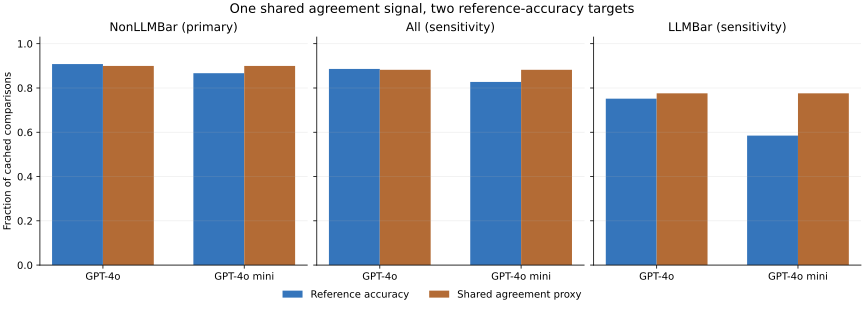
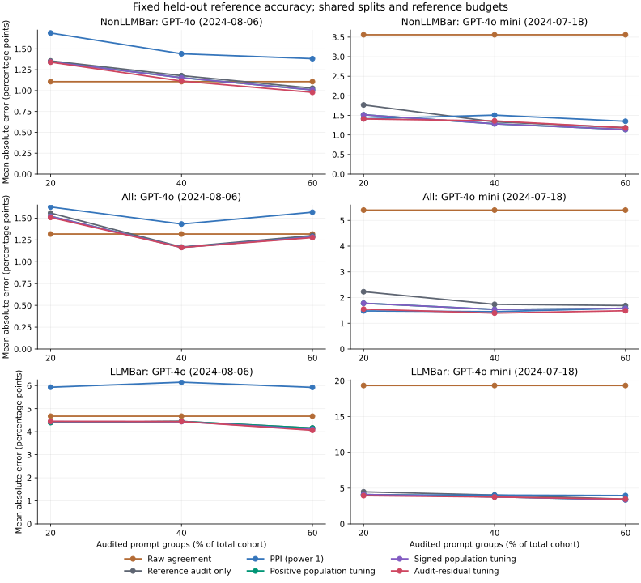

# Cross-judge agreement as an accuracy-audit proxy

[Retrospective protocol](../../docs/REWARDBENCH_PROTOCOL.md) | [Source notices](../rewardbench/NOTICE.md)

## Question and design

Does the same cross-judge agreement signal help estimate either judge's benchmark-reference accuracy? This study fixes the GPT-4o 2024-08-06 and GPT-4o mini 2024-07-18 caches, both target/auxiliary directions, and all 2,985 comparisons before fitting. It makes no new model calls.

The binary proxy is equality of the two canonical choices. It can be reconstructed as equality of two binary correctness bits because each judge selects one of the same two answers. Reversing the common reference flips both bits and leaves agreement unchanged. A single auxiliary correctness bit would leak gold and is never used as the proxy. Both judges can agree on a wrong answer.

NonLLMBar is the primary component: 2,566 comparisons and 2,315 exact-prompt groups. All is mixture sensitivity (2,985/2,733), and LLMBar is overlap sensitivity (419/418). The LLMBar component revisits source material represented in the preceding benchmark; it is not independent new evidence. Comparisons have equal weight; these row means are not the official weighted leaderboard score.

## Full-corpus diagnostics

These reference-based descriptions never enter proxy construction or coefficient fitting. The complete 23-subset breakdown is retained in `corpus_diagnostics.csv`.

| Cohort | Target judge | Comparisons | Accuracy | Shared agreement | Agree but wrong | Accuracy if agree / disagree |
|---|---|---:|---:|---:|---:|---|
| NonLLMBar | GPT-4o (2024-08-06) | 2566 | 0.908 | 0.899 | 160 | 0.931 / 0.705 |
| NonLLMBar | GPT-4o mini (2024-07-18) | 2566 | 0.867 | 0.899 | 160 | 0.931 / 0.295 |
| All | GPT-4o (2024-08-06) | 2985 | 0.886 | 0.882 | 252 | 0.904 / 0.750 |
| All | GPT-4o mini (2024-07-18) | 2985 | 0.827 | 0.882 | 252 | 0.904 / 0.250 |
| LLMBar | GPT-4o (2024-08-06) | 419 | 0.752 | 0.776 | 92 | 0.717 / 0.872 |
| LLMBar | GPT-4o mini (2024-07-18) | 419 | 0.585 | 0.776 | 92 | 0.717 / 0.128 |



In the primary component, the shared agreement rate is 89.95%, while the two target accuracies are 90.80% and 86.67%. Both models agree on the reference-incorrect answer in 160 comparisons. Equal proxy values therefore do not imply equal accuracy or equal usefulness for the two targets.

The relationship also changes across components: for GPT-4o in LLMBar, accuracy given agreement is 71.7%, versus 87.2% given disagreement. These are descriptive conditional rates; the experiment never assumes that agreement always predicts correctness.

## Fixed-target audit results

For each cohort and 30 deterministic seeds, floor(25% of all prompt groups) form the fixed evaluation pool. Audit prefixes contain floor(20%, 40%, 60% of total cohort groups), nested within the remaining bank. Both judge directions and all six methods use the same whole-group splits. Exact repeated prompts across subsets stay together. Actual comparison-label costs can differ from group counts and are recorded per trial.

Only audit reference labels fit corrections. Errors target realized held-out reference accuracy. The four corrected methods use fixed coefficient one, population tuning over [0,1], population tuning over [-1,1], or audit-residual tuning over [-1,1]. The last is a point-only grouped candidate, without a prediction interval. Existing population interval fields have their original target and assumptions; they are not scored for fixed-pool coverage.

| Cohort | Target judge | Audit groups | Method | MAE (pp) | RMSE (pp) | Mean power | Mean reference labels |
|---|---|---:|---|---:|---:|---:|---:|
| NonLLMBar | GPT-4o (2024-08-06) | 20% | Audit-residual tuning | 1.340 | 1.729 | 0.216 | 512.2 |
| NonLLMBar | GPT-4o (2024-08-06) | 20% | Reference audit only | 1.356 | 1.776 | 0.000 | 512.2 |
| NonLLMBar | GPT-4o (2024-08-06) | 20% | PPI (power 1) | 1.690 | 2.292 | 1.000 | 512.2 |
| NonLLMBar | GPT-4o (2024-08-06) | 20% | Signed population tuning | 1.345 | 1.738 | 0.122 | 512.2 |
| NonLLMBar | GPT-4o (2024-08-06) | 20% | Positive population tuning | 1.345 | 1.738 | 0.122 | 512.2 |
| NonLLMBar | GPT-4o (2024-08-06) | 20% | Raw agreement | 1.107 | 1.375 | -- | 0.0 |
| NonLLMBar | GPT-4o (2024-08-06) | 40% | Audit-residual tuning | 1.115 | 1.432 | 0.223 | 1028.1 |
| NonLLMBar | GPT-4o (2024-08-06) | 40% | Reference audit only | 1.179 | 1.421 | 0.000 | 1028.1 |
| NonLLMBar | GPT-4o (2024-08-06) | 40% | PPI (power 1) | 1.441 | 1.982 | 1.000 | 1028.1 |
| NonLLMBar | GPT-4o (2024-08-06) | 40% | Signed population tuning | 1.154 | 1.420 | 0.088 | 1028.1 |
| NonLLMBar | GPT-4o (2024-08-06) | 40% | Positive population tuning | 1.154 | 1.420 | 0.088 | 1028.1 |
| NonLLMBar | GPT-4o (2024-08-06) | 40% | Raw agreement | 1.107 | 1.375 | -- | 0.0 |
| NonLLMBar | GPT-4o (2024-08-06) | 60% | Audit-residual tuning | 0.979 | 1.304 | 0.228 | 1539.6 |
| NonLLMBar | GPT-4o (2024-08-06) | 60% | Reference audit only | 1.029 | 1.289 | 0.000 | 1539.6 |
| NonLLMBar | GPT-4o (2024-08-06) | 60% | PPI (power 1) | 1.382 | 1.842 | 1.000 | 1539.6 |
| NonLLMBar | GPT-4o (2024-08-06) | 60% | Signed population tuning | 1.008 | 1.286 | 0.069 | 1539.6 |
| NonLLMBar | GPT-4o (2024-08-06) | 60% | Positive population tuning | 1.008 | 1.286 | 0.069 | 1539.6 |
| NonLLMBar | GPT-4o (2024-08-06) | 60% | Raw agreement | 1.107 | 1.375 | -- | 0.0 |
| NonLLMBar | GPT-4o mini (2024-07-18) | 20% | Audit-residual tuning | 1.410 | 1.611 | 0.657 | 512.2 |
| NonLLMBar | GPT-4o mini (2024-07-18) | 20% | Reference audit only | 1.768 | 2.000 | 0.000 | 512.2 |
| NonLLMBar | GPT-4o mini (2024-07-18) | 20% | PPI (power 1) | 1.412 | 1.650 | 1.000 | 512.2 |
| NonLLMBar | GPT-4o mini (2024-07-18) | 20% | Signed population tuning | 1.515 | 1.697 | 0.373 | 512.2 |
| NonLLMBar | GPT-4o mini (2024-07-18) | 20% | Positive population tuning | 1.515 | 1.697 | 0.373 | 512.2 |
| NonLLMBar | GPT-4o mini (2024-07-18) | 20% | Raw agreement | 3.560 | 3.750 | -- | 0.0 |
| NonLLMBar | GPT-4o mini (2024-07-18) | 40% | Audit-residual tuning | 1.360 | 1.624 | 0.652 | 1028.1 |
| NonLLMBar | GPT-4o mini (2024-07-18) | 40% | Reference audit only | 1.335 | 1.646 | 0.000 | 1028.1 |
| NonLLMBar | GPT-4o mini (2024-07-18) | 40% | PPI (power 1) | 1.507 | 1.794 | 1.000 | 1028.1 |
| NonLLMBar | GPT-4o mini (2024-07-18) | 40% | Signed population tuning | 1.285 | 1.582 | 0.257 | 1028.1 |
| NonLLMBar | GPT-4o mini (2024-07-18) | 40% | Positive population tuning | 1.285 | 1.582 | 0.257 | 1028.1 |
| NonLLMBar | GPT-4o mini (2024-07-18) | 40% | Raw agreement | 3.560 | 3.750 | -- | 0.0 |
| NonLLMBar | GPT-4o mini (2024-07-18) | 60% | Audit-residual tuning | 1.181 | 1.466 | 0.644 | 1539.6 |
| NonLLMBar | GPT-4o mini (2024-07-18) | 60% | Reference audit only | 1.188 | 1.495 | 0.000 | 1539.6 |
| NonLLMBar | GPT-4o mini (2024-07-18) | 60% | PPI (power 1) | 1.350 | 1.663 | 1.000 | 1539.6 |
| NonLLMBar | GPT-4o mini (2024-07-18) | 60% | Signed population tuning | 1.138 | 1.435 | 0.195 | 1539.6 |
| NonLLMBar | GPT-4o mini (2024-07-18) | 60% | Positive population tuning | 1.138 | 1.435 | 0.195 | 1539.6 |
| NonLLMBar | GPT-4o mini (2024-07-18) | 60% | Raw agreement | 3.560 | 3.750 | -- | 0.0 |
| All | GPT-4o (2024-08-06) | 20% | Audit-residual tuning | 1.508 | 1.845 | 0.155 | 595.1 |
| All | GPT-4o (2024-08-06) | 20% | Reference audit only | 1.558 | 1.878 | 0.000 | 595.1 |
| All | GPT-4o (2024-08-06) | 20% | PPI (power 1) | 1.628 | 2.159 | 1.000 | 595.1 |
| All | GPT-4o (2024-08-06) | 20% | Signed population tuning | 1.521 | 1.850 | 0.085 | 595.1 |
| All | GPT-4o (2024-08-06) | 20% | Positive population tuning | 1.521 | 1.850 | 0.085 | 595.1 |
| All | GPT-4o (2024-08-06) | 20% | Raw agreement | 1.318 | 1.755 | -- | 0.0 |
| All | GPT-4o (2024-08-06) | 40% | Audit-residual tuning | 1.163 | 1.445 | 0.156 | 1191.6 |
| All | GPT-4o (2024-08-06) | 40% | Reference audit only | 1.169 | 1.440 | 0.000 | 1191.6 |
| All | GPT-4o (2024-08-06) | 40% | PPI (power 1) | 1.433 | 1.951 | 1.000 | 1191.6 |
| All | GPT-4o (2024-08-06) | 40% | Signed population tuning | 1.165 | 1.434 | 0.060 | 1191.6 |
| All | GPT-4o (2024-08-06) | 40% | Positive population tuning | 1.165 | 1.434 | 0.060 | 1191.6 |
| All | GPT-4o (2024-08-06) | 40% | Raw agreement | 1.318 | 1.755 | -- | 0.0 |
| All | GPT-4o (2024-08-06) | 60% | Audit-residual tuning | 1.277 | 1.535 | 0.164 | 1786.8 |
| All | GPT-4o (2024-08-06) | 60% | Reference audit only | 1.300 | 1.527 | 0.000 | 1786.8 |
| All | GPT-4o (2024-08-06) | 60% | PPI (power 1) | 1.568 | 2.079 | 1.000 | 1786.8 |
| All | GPT-4o (2024-08-06) | 60% | Signed population tuning | 1.285 | 1.523 | 0.048 | 1786.8 |
| All | GPT-4o (2024-08-06) | 60% | Positive population tuning | 1.285 | 1.523 | 0.048 | 1786.8 |
| All | GPT-4o (2024-08-06) | 60% | Raw agreement | 1.318 | 1.755 | -- | 0.0 |
| All | GPT-4o mini (2024-07-18) | 20% | Audit-residual tuning | 1.550 | 1.995 | 0.662 | 595.1 |
| All | GPT-4o mini (2024-07-18) | 20% | Reference audit only | 2.228 | 2.592 | 0.000 | 595.1 |
| All | GPT-4o mini (2024-07-18) | 20% | PPI (power 1) | 1.481 | 1.894 | 1.000 | 595.1 |
| All | GPT-4o mini (2024-07-18) | 20% | Signed population tuning | 1.778 | 2.213 | 0.367 | 595.1 |
| All | GPT-4o mini (2024-07-18) | 20% | Positive population tuning | 1.778 | 2.213 | 0.367 | 595.1 |
| All | GPT-4o mini (2024-07-18) | 20% | Raw agreement | 5.402 | 5.569 | -- | 0.0 |
| All | GPT-4o mini (2024-07-18) | 40% | Audit-residual tuning | 1.396 | 1.727 | 0.666 | 1191.6 |
| All | GPT-4o mini (2024-07-18) | 40% | Reference audit only | 1.737 | 2.142 | 0.000 | 1191.6 |
| All | GPT-4o mini (2024-07-18) | 40% | PPI (power 1) | 1.452 | 1.714 | 1.000 | 1191.6 |
| All | GPT-4o mini (2024-07-18) | 40% | Signed population tuning | 1.538 | 1.937 | 0.256 | 1191.6 |
| All | GPT-4o mini (2024-07-18) | 40% | Positive population tuning | 1.538 | 1.937 | 0.256 | 1191.6 |
| All | GPT-4o mini (2024-07-18) | 40% | Raw agreement | 5.402 | 5.569 | -- | 0.0 |
| All | GPT-4o mini (2024-07-18) | 60% | Audit-residual tuning | 1.488 | 1.772 | 0.659 | 1786.8 |
| All | GPT-4o mini (2024-07-18) | 60% | Reference audit only | 1.689 | 2.073 | 0.000 | 1786.8 |
| All | GPT-4o mini (2024-07-18) | 60% | PPI (power 1) | 1.584 | 1.847 | 1.000 | 1786.8 |
| All | GPT-4o mini (2024-07-18) | 60% | Signed population tuning | 1.582 | 1.940 | 0.193 | 1786.8 |
| All | GPT-4o mini (2024-07-18) | 60% | Positive population tuning | 1.582 | 1.940 | 0.193 | 1786.8 |
| All | GPT-4o mini (2024-07-18) | 60% | Raw agreement | 5.402 | 5.569 | -- | 0.0 |
| LLMBar | GPT-4o (2024-08-06) | 20% | Audit-residual tuning | 4.446 | 5.305 | -0.145 | 83.3 |
| LLMBar | GPT-4o (2024-08-06) | 20% | Reference audit only | 4.396 | 5.231 | 0.000 | 83.3 |
| LLMBar | GPT-4o (2024-08-06) | 20% | PPI (power 1) | 5.928 | 7.207 | 1.000 | 83.3 |
| LLMBar | GPT-4o (2024-08-06) | 20% | Signed population tuning | 4.435 | 5.267 | -0.080 | 83.3 |
| LLMBar | GPT-4o (2024-08-06) | 20% | Positive population tuning | 4.395 | 5.230 | 0.000 | 83.3 |
| LLMBar | GPT-4o (2024-08-06) | 20% | Raw agreement | 4.671 | 5.416 | -- | 0.0 |
| LLMBar | GPT-4o (2024-08-06) | 40% | Audit-residual tuning | 4.439 | 5.264 | -0.160 | 167.5 |
| LLMBar | GPT-4o (2024-08-06) | 40% | Reference audit only | 4.444 | 5.214 | 0.000 | 167.5 |
| LLMBar | GPT-4o (2024-08-06) | 40% | PPI (power 1) | 6.144 | 7.088 | 1.000 | 167.5 |
| LLMBar | GPT-4o (2024-08-06) | 40% | Signed population tuning | 4.432 | 5.222 | -0.061 | 167.5 |
| LLMBar | GPT-4o (2024-08-06) | 40% | Positive population tuning | 4.444 | 5.214 | 0.000 | 167.5 |
| LLMBar | GPT-4o (2024-08-06) | 40% | Raw agreement | 4.671 | 5.416 | -- | 0.0 |
| LLMBar | GPT-4o (2024-08-06) | 60% | Audit-residual tuning | 4.059 | 4.917 | -0.158 | 250.6 |
| LLMBar | GPT-4o (2024-08-06) | 60% | Reference audit only | 4.155 | 5.013 | 0.000 | 250.6 |
| LLMBar | GPT-4o (2024-08-06) | 60% | PPI (power 1) | 5.921 | 7.051 | 1.000 | 250.6 |
| LLMBar | GPT-4o (2024-08-06) | 60% | Signed population tuning | 4.103 | 4.974 | -0.046 | 250.6 |
| LLMBar | GPT-4o (2024-08-06) | 60% | Positive population tuning | 4.155 | 5.013 | 0.000 | 250.6 |
| LLMBar | GPT-4o (2024-08-06) | 60% | Raw agreement | 4.671 | 5.416 | -- | 0.0 |
| LLMBar | GPT-4o mini (2024-07-18) | 20% | Audit-residual tuning | 3.953 | 4.817 | 0.571 | 83.3 |
| LLMBar | GPT-4o mini (2024-07-18) | 20% | Reference audit only | 4.492 | 5.684 | 0.000 | 83.3 |
| LLMBar | GPT-4o mini (2024-07-18) | 20% | PPI (power 1) | 4.071 | 4.951 | 1.000 | 83.3 |
| LLMBar | GPT-4o mini (2024-07-18) | 20% | Signed population tuning | 4.115 | 5.088 | 0.313 | 83.3 |
| LLMBar | GPT-4o mini (2024-07-18) | 20% | Positive population tuning | 4.115 | 5.088 | 0.313 | 83.3 |
| LLMBar | GPT-4o mini (2024-07-18) | 20% | Raw agreement | 19.339 | 19.657 | -- | 0.0 |
| LLMBar | GPT-4o mini (2024-07-18) | 40% | Audit-residual tuning | 3.767 | 4.483 | 0.563 | 167.5 |
| LLMBar | GPT-4o mini (2024-07-18) | 40% | Reference audit only | 4.037 | 4.966 | 0.000 | 167.5 |
| LLMBar | GPT-4o mini (2024-07-18) | 40% | PPI (power 1) | 4.032 | 5.045 | 1.000 | 167.5 |
| LLMBar | GPT-4o mini (2024-07-18) | 40% | Signed population tuning | 3.783 | 4.613 | 0.215 | 167.5 |
| LLMBar | GPT-4o mini (2024-07-18) | 40% | Positive population tuning | 3.783 | 4.613 | 0.215 | 167.5 |
| LLMBar | GPT-4o mini (2024-07-18) | 40% | Raw agreement | 19.339 | 19.657 | -- | 0.0 |
| LLMBar | GPT-4o mini (2024-07-18) | 60% | Audit-residual tuning | 3.472 | 4.362 | 0.585 | 250.6 |
| LLMBar | GPT-4o mini (2024-07-18) | 60% | Reference audit only | 3.465 | 4.562 | 0.000 | 250.6 |
| LLMBar | GPT-4o mini (2024-07-18) | 60% | PPI (power 1) | 3.974 | 5.028 | 1.000 | 250.6 |
| LLMBar | GPT-4o mini (2024-07-18) | 60% | Signed population tuning | 3.371 | 4.367 | 0.172 | 250.6 |
| LLMBar | GPT-4o mini (2024-07-18) | 60% | Positive population tuning | 3.371 | 4.367 | 0.172 | 250.6 |
| LLMBar | GPT-4o mini (2024-07-18) | 60% | Raw agreement | 19.339 | 19.657 | -- | 0.0 |

### Primary paired direction of change

Each comparison uses the same target, audit budget and splits. The following counts are descriptive cell comparisons, not significance tests or probabilities of deployment improvement.

- PPI (power 1) versus reference-audit-only: 1 lower-MAE, 0 tied, 5 higher-MAE cells out of six.
- Positive population tuning versus reference-audit-only: 6 lower-MAE, 0 tied, 0 higher-MAE cells out of six.
- Signed population tuning versus reference-audit-only: 6 lower-MAE, 0 tied, 0 higher-MAE cells out of six.
- Audit-residual tuning versus reference-audit-only: 5 lower-MAE, 0 tied, 1 higher-MAE cells out of six.

At the primary 20% group budget, raw agreement has MAE 1.107 pp for GPT-4o, compared with 1.356 pp for the reference audit and 1.345 pp for signed population tuning. For this configuration, signed population tuning has higher MAE relative to raw agreement for that target and budget. For GPT-4o mini on the same pools, raw MAE is 3.560 pp, reference-audit MAE 1.768 pp, and signed-population MAE 1.515 pp. At the mini model's 40% budget, audit-residual tuning has MAE 1.360 pp versus 1.335 pp for reference audit (higher MAE). All directions of change remain in the complete tables.

Ties use absolute tolerance 1e-12. All primary and sensitivity cells, including losses, remain in the tables. `paired_method_differences.csv` retains same-split absolute/squared error contrasts against reference audit and signed population tuning. `paired_summary.csv` averages those contrasts descriptively; overlapping splits receive no independent-replication standard errors.



Panels use different vertical scales; compare methods within the same target and component.

## Costs, provenance and limits

`reference_labels_used` counts inference reference labels; a single revealed reference scores both judges. `shared_costs.csv` deduplicates inputs across both directions: raw agreement uses 2N cached judgments and no audit reference, reference-audit-only uses n references and 2n judgments across the two targets, and corrected methods use n references and 2(n+N) judgments. Held-out scoring uses N additional references and 2N target judgments, whose overlap with inference reads is explicitly deduplicated. These are logical cached records, not fresh API calls, money, token counts or guaranteed annotation savings.

- The 23 subsets mix curated preference, instruction following, safety conventions and code/math constructions. Their supplied references are the target, not infallible latent truth.
- Both selected judges belong to one model family. A third inspected Gemini cache has two nonbinary fallback scores and is excluded as a whole under the binary reconstruction contract; no comparisons are removed from the selected complete panel.
- Exact prompt grouping preserves known repeats, including cross-subset repeats, but does not prove independence of semantically related tasks. The unequal-group empirical study does not inherit IID prediction or finite-sample interval guarantees.
- Cache pins reproduce historical 2024 results. Exact executed code, shuffle states, raw verdicts and complete invocation are absent. The inspected implementation documents scoring semantics, not a recovered execution trace or current-model performance.
- Source notices distinguish benchmark, source-content, code and cached-result terms. The results card releases research results without a named license; the package MIT license does not relicense those source records. Only derived numeric data and hashes are included.

## Reproduce

```bash
pip install -e ".[dev,report]"
python examples/rewardbench_audit.py --output reports/reproduced/rewardbench-audit --plot
```

This uses the certified committed numeric panel, with no network or model. To independently rebuild the panel from pinned public sources, install the `data` extra and run:

```bash
python examples/prepare_rewardbench.py --download --output reports/reproduced/rewardbench
```

The preparation verifies all source bytes, full-content joins, reference orientation and 46 source subset aggregates. Stable content keys preserve the two distinct rows with raw ID 3692. All exact splits are retained in deterministic `split_manifest.json.gz`, using shared sorted identity catalogs and zero-based index lists. `decode_split_manifest` in this runner losslessly restores every original ID list and its order. `reproducibility.json` fingerprints source code, data, configuration and every report artifact.
