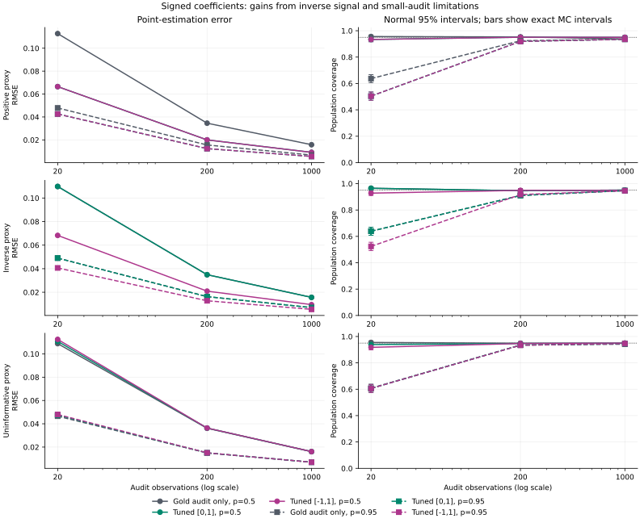
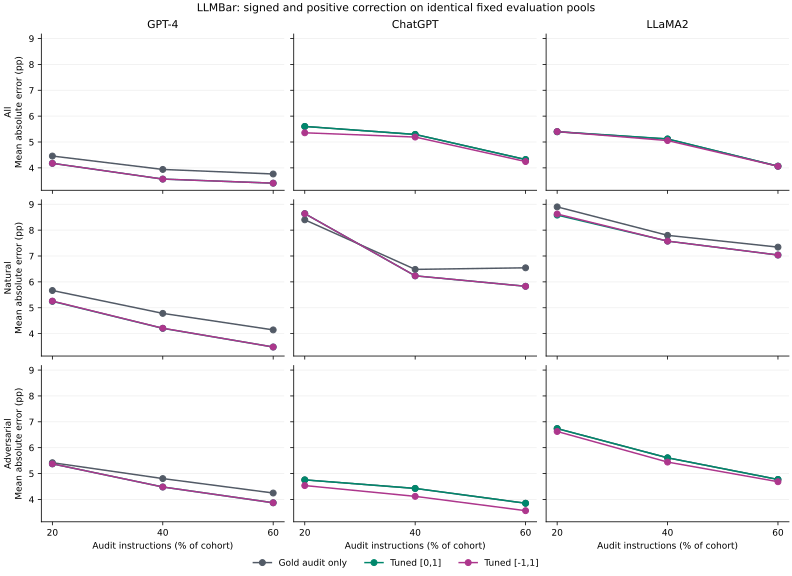

# Can an inverse proxy still help an audit?

[Retrospective protocol, equations and sources](../../docs/SIGNED_POWER_PROTOCOL.md)

## Question and method

The preceding LLMBar study found that order agreement can be negatively associated with reference correctness. The default `[0,1]` coefficient then falls back to zero. This exploratory follow-up asks whether allowing an explicitly selected `[-1,1]` range can use that inverse signal. It applies the established PPI++ mean-estimation principle; it is not a new estimator or a preregistered validation of a newly discovered proxy.

The estimate remains `mean(Y_L) + lambda * (mean(F_U) - mean(F_L))`. The signed coefficient minimizes the same per-pool estimated variance as before over `[-1,1]`. Sign and magnitude use audit correctness and both proxy pools, never evaluation correctness. The numeric API requires `power_bounds=(-1,1)` to opt in; existing defaults, categorical win-rate behavior and finite-sample bounds are unchanged.

Using a negative coefficient on `F` is algebraically equivalent to using a positive coefficient on `1-F`. For LLMBar this complements the entire agreement score, including invalid-score zeros; it is not a relabeling of canonical choices or literal valid disagreement. Normal intervals remain asymptotic. Optimizing estimated variance does not guarantee lower realized MSE or nominal finite-sample coverage.

## Known-truth experiment

All 18 settings use 1,000 independent replications, master seed 2029. Prevalence is 0.5 or 0.95; proxy sensitivity/specificity is 0.95/0.90 (positive), 0.05/0.10 (inverse), or 0.60/0.40 (uninformative). Audit sizes are 20, 200 and 1,000, with prediction pools ten times larger. Four methods share every draw and target the known population prevalence. The oracle coefficient is a diagnostic, never an estimator input.

| Profile | Prevalence | Audit n | Method | RMSE | Bias | Coverage | Exact MC 95% interval | Width | Mean power |
|---|---:|---:|---|---:|---:|---:|---|---:|---:|
| positive | 0.50 | 20 | Gold audit only | 0.1128 | 0.0005 | 0.956 | [0.941, 0.968] | 0.4378 | 0.000 |
| positive | 0.50 | 20 | PPI (power +1) | 0.0709 | 0.0010 | 0.957 | [0.943, 0.969] | 0.2647 | 1.000 |
| positive | 0.50 | 20 | Tuned [0,1] | 0.0665 | 0.0013 | 0.934 | [0.917, 0.949] | 0.2424 | 0.772 |
| positive | 0.50 | 20 | Tuned [-1,1] | 0.0665 | 0.0013 | 0.934 | [0.917, 0.949] | 0.2424 | 0.772 |
| positive | 0.50 | 200 | Gold audit only | 0.0346 | -0.0014 | 0.953 | [0.938, 0.965] | 0.1386 | 0.000 |
| positive | 0.50 | 200 | PPI (power +1) | 0.0216 | 0.0002 | 0.948 | [0.932, 0.961] | 0.0868 | 1.000 |
| positive | 0.50 | 200 | Tuned [0,1] | 0.0200 | -0.0001 | 0.951 | [0.936, 0.964] | 0.0804 | 0.775 |
| positive | 0.50 | 200 | Tuned [-1,1] | 0.0200 | -0.0001 | 0.951 | [0.936, 0.964] | 0.0804 | 0.775 |
| positive | 0.50 | 1000 | Gold audit only | 0.0158 | -0.0004 | 0.938 | [0.921, 0.952] | 0.0620 | 0.000 |
| positive | 0.50 | 1000 | PPI (power +1) | 0.0098 | 0.0000 | 0.964 | [0.951, 0.975] | 0.0391 | 1.000 |
| positive | 0.50 | 1000 | Tuned [0,1] | 0.0091 | -0.0001 | 0.950 | [0.935, 0.963] | 0.0362 | 0.774 |
| positive | 0.50 | 1000 | Tuned [-1,1] | 0.0091 | -0.0001 | 0.950 | [0.935, 0.963] | 0.0362 | 0.774 |
| inverse | 0.50 | 20 | Gold audit only | 0.1098 | 0.0006 | 0.965 | [0.952, 0.976] | 0.4384 | 0.000 |
| inverse | 0.50 | 20 | PPI (power +1) | 0.2136 | 0.0031 | 0.942 | [0.926, 0.956] | 0.8519 | 1.000 |
| inverse | 0.50 | 20 | Tuned [0,1] | 0.1098 | 0.0006 | 0.965 | [0.952, 0.976] | 0.4384 | 0.000 |
| inverse | 0.50 | 20 | Tuned [-1,1] | 0.0683 | -0.0012 | 0.928 | [0.910, 0.943] | 0.2464 | -0.768 |
| inverse | 0.50 | 200 | Gold audit only | 0.0349 | -0.0015 | 0.946 | [0.930, 0.959] | 0.1386 | 0.000 |
| inverse | 0.50 | 200 | PPI (power +1) | 0.0682 | -0.0034 | 0.951 | [0.936, 0.964] | 0.2701 | 1.000 |
| inverse | 0.50 | 200 | Tuned [0,1] | 0.0349 | -0.0015 | 0.946 | [0.930, 0.959] | 0.1386 | 0.000 |
| inverse | 0.50 | 200 | Tuned [-1,1] | 0.0209 | -0.0001 | 0.949 | [0.933, 0.962] | 0.0804 | -0.775 |
| inverse | 0.50 | 1000 | Gold audit only | 0.0156 | -0.0008 | 0.951 | [0.936, 0.964] | 0.0620 | 0.000 |
| inverse | 0.50 | 1000 | PPI (power +1) | 0.0305 | -0.0016 | 0.952 | [0.937, 0.964] | 0.1208 | 1.000 |
| inverse | 0.50 | 1000 | Tuned [0,1] | 0.0156 | -0.0008 | 0.951 | [0.936, 0.964] | 0.0620 | 0.000 |
| inverse | 0.50 | 1000 | Tuned [-1,1] | 0.0095 | -0.0001 | 0.949 | [0.933, 0.962] | 0.0362 | -0.774 |
| uninformative | 0.50 | 20 | Gold audit only | 0.1088 | 0.0007 | 0.955 | [0.940, 0.967] | 0.4385 | 0.000 |
| uninformative | 0.50 | 20 | PPI (power +1) | 0.1556 | 0.0035 | 0.948 | [0.932, 0.961] | 0.6274 | 1.000 |
| uninformative | 0.50 | 20 | Tuned [0,1] | 0.1108 | -0.0003 | 0.939 | [0.922, 0.953] | 0.4335 | 0.082 |
| uninformative | 0.50 | 20 | Tuned [-1,1] | 0.1125 | -0.0007 | 0.918 | [0.899, 0.934] | 0.4279 | -0.005 |
| uninformative | 0.50 | 200 | Gold audit only | 0.0362 | 0.0005 | 0.949 | [0.933, 0.962] | 0.1386 | 0.000 |
| uninformative | 0.50 | 200 | PPI (power +1) | 0.0517 | 0.0013 | 0.951 | [0.936, 0.964] | 0.1988 | 1.000 |
| uninformative | 0.50 | 200 | Tuned [0,1] | 0.0363 | 0.0005 | 0.947 | [0.931, 0.960] | 0.1384 | 0.025 |
| uninformative | 0.50 | 200 | Tuned [-1,1] | 0.0364 | 0.0005 | 0.947 | [0.931, 0.960] | 0.1383 | -0.002 |
| uninformative | 0.50 | 1000 | Gold audit only | 0.0161 | 0.0006 | 0.949 | [0.933, 0.962] | 0.0620 | 0.000 |
| uninformative | 0.50 | 1000 | PPI (power +1) | 0.0223 | 0.0013 | 0.953 | [0.938, 0.965] | 0.0889 | 1.000 |
| uninformative | 0.50 | 1000 | Tuned [0,1] | 0.0161 | 0.0006 | 0.949 | [0.933, 0.962] | 0.0620 | 0.012 |
| uninformative | 0.50 | 1000 | Tuned [-1,1] | 0.0161 | 0.0006 | 0.950 | [0.935, 0.963] | 0.0620 | 0.000 |
| positive | 0.95 | 20 | Gold audit only | 0.0479 | 0.0008 | 0.637 | [0.606, 0.667] | 0.1485 | 0.000 |
| positive | 0.95 | 20 | PPI (power +1) | 0.0577 | -0.0005 | 0.763 | [0.735, 0.789] | 0.1924 | 1.000 |
| positive | 0.95 | 20 | Tuned [0,1] | 0.0426 | 0.0051 | 0.504 | [0.473, 0.535] | 0.0918 | 0.380 |
| positive | 0.95 | 20 | Tuned [-1,1] | 0.0426 | 0.0051 | 0.504 | [0.473, 0.535] | 0.0918 | 0.378 |
| positive | 0.95 | 200 | Gold audit only | 0.0156 | -0.0003 | 0.924 | [0.906, 0.940] | 0.0599 | 0.000 |
| positive | 0.95 | 200 | PPI (power +1) | 0.0168 | -0.0003 | 0.945 | [0.929, 0.958] | 0.0666 | 1.000 |
| positive | 0.95 | 200 | Tuned [0,1] | 0.0124 | -0.0000 | 0.919 | [0.900, 0.935] | 0.0466 | 0.439 |
| positive | 0.95 | 200 | Tuned [-1,1] | 0.0124 | -0.0000 | 0.919 | [0.900, 0.935] | 0.0466 | 0.439 |
| positive | 0.95 | 1000 | Gold audit only | 0.0068 | 0.0002 | 0.936 | [0.919, 0.950] | 0.0269 | 0.000 |
| positive | 0.95 | 1000 | PPI (power +1) | 0.0080 | 0.0003 | 0.947 | [0.931, 0.960] | 0.0301 | 1.000 |
| positive | 0.95 | 1000 | Tuned [0,1] | 0.0056 | 0.0002 | 0.935 | [0.918, 0.949] | 0.0213 | 0.436 |
| positive | 0.95 | 1000 | Tuned [-1,1] | 0.0056 | 0.0002 | 0.935 | [0.918, 0.949] | 0.0213 | 0.436 |
| inverse | 0.95 | 20 | Gold audit only | 0.0490 | 0.0003 | 0.639 | [0.608, 0.669] | 0.1491 | 0.000 |
| inverse | 0.95 | 20 | PPI (power +1) | 0.1043 | 0.0008 | 0.828 | [0.803, 0.851] | 0.3734 | 1.000 |
| inverse | 0.95 | 20 | Tuned [0,1] | 0.0490 | 0.0003 | 0.639 | [0.608, 0.669] | 0.1491 | 0.001 |
| inverse | 0.95 | 20 | Tuned [-1,1] | 0.0406 | 0.0070 | 0.524 | [0.493, 0.555] | 0.0929 | -0.372 |
| inverse | 0.95 | 200 | Gold audit only | 0.0163 | -0.0001 | 0.910 | [0.891, 0.927] | 0.0597 | 0.000 |
| inverse | 0.95 | 200 | PPI (power +1) | 0.0345 | -0.0003 | 0.932 | [0.915, 0.947] | 0.1294 | 1.000 |
| inverse | 0.95 | 200 | Tuned [0,1] | 0.0163 | -0.0001 | 0.910 | [0.891, 0.927] | 0.0597 | 0.000 |
| inverse | 0.95 | 200 | Tuned [-1,1] | 0.0128 | 0.0003 | 0.917 | [0.898, 0.933] | 0.0465 | -0.435 |
| inverse | 0.95 | 1000 | Gold audit only | 0.0070 | -0.0003 | 0.947 | [0.931, 0.960] | 0.0270 | 0.000 |
| inverse | 0.95 | 1000 | PPI (power +1) | 0.0147 | -0.0001 | 0.955 | [0.940, 0.967] | 0.0582 | 1.000 |
| inverse | 0.95 | 1000 | Tuned [0,1] | 0.0070 | -0.0003 | 0.947 | [0.931, 0.960] | 0.0270 | 0.000 |
| inverse | 0.95 | 1000 | Tuned [-1,1] | 0.0055 | -0.0003 | 0.946 | [0.930, 0.959] | 0.0213 | -0.439 |
| uninformative | 0.95 | 20 | Gold audit only | 0.0465 | 0.0041 | 0.608 | [0.577, 0.638] | 0.1404 | 0.000 |
| uninformative | 0.95 | 20 | PPI (power +1) | 0.1230 | 0.0074 | 0.946 | [0.930, 0.959] | 0.4846 | 1.000 |
| uninformative | 0.95 | 20 | Tuned [0,1] | 0.0475 | 0.0039 | 0.606 | [0.575, 0.636] | 0.1385 | 0.030 |
| uninformative | 0.95 | 20 | Tuned [-1,1] | 0.0480 | 0.0038 | 0.606 | [0.575, 0.636] | 0.1370 | -0.001 |
| uninformative | 0.95 | 200 | Gold audit only | 0.0150 | -0.0006 | 0.935 | [0.918, 0.949] | 0.0601 | 0.000 |
| uninformative | 0.95 | 200 | PPI (power +1) | 0.0393 | -0.0028 | 0.952 | [0.937, 0.964] | 0.1548 | 1.000 |
| uninformative | 0.95 | 200 | Tuned [0,1] | 0.0150 | -0.0006 | 0.935 | [0.918, 0.949] | 0.0600 | 0.011 |
| uninformative | 0.95 | 200 | Tuned [-1,1] | 0.0151 | -0.0005 | 0.934 | [0.917, 0.949] | 0.0600 | -0.001 |
| uninformative | 0.95 | 1000 | Gold audit only | 0.0070 | -0.0002 | 0.942 | [0.926, 0.956] | 0.0270 | 0.000 |
| uninformative | 0.95 | 1000 | PPI (power +1) | 0.0180 | -0.0002 | 0.950 | [0.935, 0.963] | 0.0692 | 1.000 |
| uninformative | 0.95 | 1000 | Tuned [0,1] | 0.0070 | -0.0003 | 0.945 | [0.929, 0.958] | 0.0270 | 0.005 |
| uninformative | 0.95 | 1000 | Tuned [-1,1] | 0.0070 | -0.0003 | 0.946 | [0.930, 0.959] | 0.0270 | -0.000 |

Signed tuning has lower observed RMSE than positive-range tuning in 7/18 settings, ties in 5, and has higher RMSE in 6. These are simulation results with sampling uncertainty. The paired squared-error contrasts below use the same draws; a lower point estimate alone does not establish a resolved improvement.

At prevalence 0.5 with 20 audit labels, inverse-proxy RMSE changes from 0.1098 under positive tuning to 0.0683 under signed tuning. For an uninformative proxy at the same prevalence and budget, it instead changes from 0.1108 to 0.1125. The larger coefficient family can exploit inverse signal, but also fit noise.

For the inverse proxy at prevalence 0.95 and 20 audit labels, signed interval coverage is 52.4% (exact Monte Carlo interval 49.3%–55.5%). Point-estimation improvement does not resolve the small-audit normal-interval failure.

| Profile | Prevalence | Audit n | Signed minus positive MSE | Paired MCSE | Signed minus audit MSE | Paired MCSE |
|---|---:|---:|---:|---:|---:|---:|
| positive | 0.50 | 20 | 0.000000 | 0.000000 | -0.008294 | 0.000480 |
| positive | 0.50 | 200 | 0.000000 | 0.000000 | -0.000796 | 0.000049 |
| positive | 0.50 | 1000 | 0.000000 | 0.000000 | -0.000167 | 0.000010 |
| inverse | 0.50 | 20 | -0.007398 | 0.000439 | -0.007398 | 0.000439 |
| inverse | 0.50 | 200 | -0.000779 | 0.000050 | -0.000779 | 0.000050 |
| inverse | 0.50 | 1000 | -0.000155 | 0.000010 | -0.000155 | 0.000010 |
| uninformative | 0.50 | 20 | 0.000381 | 0.000122 | 0.000805 | 0.000168 |
| uninformative | 0.50 | 200 | 0.000002 | 0.000003 | 0.000015 | 0.000006 |
| uninformative | 0.50 | 1000 | 0.000001 | 0.000000 | 0.000001 | 0.000001 |
| positive | 0.95 | 20 | 0.000000 | 0.000000 | -0.000477 | 0.000114 |
| positive | 0.95 | 200 | 0.000000 | 0.000000 | -0.000089 | 0.000009 |
| positive | 0.95 | 1000 | 0.000000 | 0.000000 | -0.000015 | 0.000002 |
| inverse | 0.95 | 20 | -0.000750 | 0.000116 | -0.000751 | 0.000116 |
| inverse | 0.95 | 200 | -0.000102 | 0.000009 | -0.000102 | 0.000009 |
| inverse | 0.95 | 1000 | -0.000018 | 0.000002 | -0.000018 | 0.000002 |
| uninformative | 0.95 | 20 | 0.000050 | 0.000029 | 0.000140 | 0.000044 |
| uninformative | 0.95 | 200 | 0.000001 | 0.000001 | 0.000003 | 0.000001 |
| uninformative | 0.95 | 1000 | -0.000000 | 0.000000 | -0.000000 | 0.000000 |

The figure focuses on audit-only and the two tuned methods; the table retains all four methods.



## LLMBar: identical fixed targets and budgets

The same certified 419-comparison, three-judge snapshot is analyzed with 30 shared instruction-group seeds, fixed 25% evaluation groups and nested 20/40/60% audits. The preceding four methods remain in every export; signed tuning adds a fifth method. The runner verifies every overlapping historical split and all preceding method outputs before writing a report. All comparisons use original-order accuracy relative to curated LLMBar instruction-following references.

| Cohort | Judge | Audit fraction | Method | MAE (pp) | RMSE (pp) | Mean power |
|---|---|---:|---|---:|---:|---:|
| Adversarial | ChatGPT | 20% | Gold audit only | 4.754 | 6.208 | 0.000 |
| Adversarial | ChatGPT | 20% | PPI (power +1) | 9.258 | 11.698 | 1.000 |
| Adversarial | ChatGPT | 20% | Tuned [-1,1] | 4.534 | 5.843 | -0.208 |
| Adversarial | ChatGPT | 20% | Tuned [0,1] | 4.754 | 6.208 | 0.000 |
| Adversarial | ChatGPT | 20% | Raw agreement | 35.742 | 36.303 | -- |
| Adversarial | ChatGPT | 40% | Gold audit only | 4.424 | 5.280 | 0.000 |
| Adversarial | ChatGPT | 40% | PPI (power +1) | 8.485 | 10.417 | 1.000 |
| Adversarial | ChatGPT | 40% | Tuned [-1,1] | 4.118 | 5.043 | -0.146 |
| Adversarial | ChatGPT | 40% | Tuned [0,1] | 4.424 | 5.280 | 0.000 |
| Adversarial | ChatGPT | 40% | Raw agreement | 35.742 | 36.303 | -- |
| Adversarial | ChatGPT | 60% | Gold audit only | 3.851 | 4.823 | 0.000 |
| Adversarial | ChatGPT | 60% | PPI (power +1) | 8.224 | 9.436 | 1.000 |
| Adversarial | ChatGPT | 60% | Tuned [-1,1] | 3.564 | 4.587 | -0.115 |
| Adversarial | ChatGPT | 60% | Tuned [0,1] | 3.851 | 4.823 | 0.000 |
| Adversarial | ChatGPT | 60% | Raw agreement | 35.742 | 36.303 | -- |
| Adversarial | GPT-4 | 20% | Gold audit only | 5.418 | 6.552 | 0.000 |
| Adversarial | GPT-4 | 20% | PPI (power +1) | 5.617 | 6.900 | 1.000 |
| Adversarial | GPT-4 | 20% | Tuned [-1,1] | 5.374 | 6.497 | 0.339 |
| Adversarial | GPT-4 | 20% | Tuned [0,1] | 5.374 | 6.497 | 0.339 |
| Adversarial | GPT-4 | 20% | Raw agreement | 12.950 | 13.288 | -- |
| Adversarial | GPT-4 | 40% | Gold audit only | 4.805 | 5.800 | 0.000 |
| Adversarial | GPT-4 | 40% | PPI (power +1) | 4.344 | 5.511 | 1.000 |
| Adversarial | GPT-4 | 40% | Tuned [-1,1] | 4.480 | 5.499 | 0.235 |
| Adversarial | GPT-4 | 40% | Tuned [0,1] | 4.480 | 5.499 | 0.235 |
| Adversarial | GPT-4 | 40% | Raw agreement | 12.950 | 13.288 | -- |
| Adversarial | GPT-4 | 60% | Gold audit only | 4.246 | 5.183 | 0.000 |
| Adversarial | GPT-4 | 60% | PPI (power +1) | 3.410 | 4.238 | 1.000 |
| Adversarial | GPT-4 | 60% | Tuned [-1,1] | 3.869 | 4.760 | 0.190 |
| Adversarial | GPT-4 | 60% | Tuned [0,1] | 3.869 | 4.760 | 0.190 |
| Adversarial | GPT-4 | 60% | Raw agreement | 12.950 | 13.288 | -- |
| Adversarial | LLaMA2 | 20% | Gold audit only | 6.737 | 7.784 | 0.000 |
| Adversarial | LLaMA2 | 20% | PPI (power +1) | 9.807 | 12.551 | 1.000 |
| Adversarial | LLaMA2 | 20% | Tuned [-1,1] | 6.625 | 7.547 | -0.128 |
| Adversarial | LLaMA2 | 20% | Tuned [0,1] | 6.737 | 7.784 | 0.000 |
| Adversarial | LLaMA2 | 20% | Raw agreement | 40.491 | 40.917 | -- |
| Adversarial | LLaMA2 | 40% | Gold audit only | 5.607 | 6.394 | 0.000 |
| Adversarial | LLaMA2 | 40% | PPI (power +1) | 7.752 | 10.333 | 1.000 |
| Adversarial | LLaMA2 | 40% | Tuned [-1,1] | 5.443 | 6.218 | -0.090 |
| Adversarial | LLaMA2 | 40% | Tuned [0,1] | 5.607 | 6.394 | 0.000 |
| Adversarial | LLaMA2 | 40% | Raw agreement | 40.491 | 40.917 | -- |
| Adversarial | LLaMA2 | 60% | Gold audit only | 4.770 | 5.670 | 0.000 |
| Adversarial | LLaMA2 | 60% | PPI (power +1) | 7.221 | 9.076 | 1.000 |
| Adversarial | LLaMA2 | 60% | Tuned [-1,1] | 4.683 | 5.623 | -0.072 |
| Adversarial | LLaMA2 | 60% | Tuned [0,1] | 4.770 | 5.670 | 0.000 |
| Adversarial | LLaMA2 | 60% | Raw agreement | 40.491 | 40.917 | -- |
| All | ChatGPT | 20% | Gold audit only | 5.601 | 6.736 | 0.000 |
| All | ChatGPT | 20% | PPI (power +1) | 9.207 | 10.831 | 1.000 |
| All | ChatGPT | 20% | Tuned [-1,1] | 5.356 | 6.614 | -0.095 |
| All | ChatGPT | 20% | Tuned [0,1] | 5.601 | 6.736 | 0.000 |
| All | ChatGPT | 20% | Raw agreement | 24.745 | 25.431 | -- |
| All | ChatGPT | 40% | Gold audit only | 5.292 | 6.436 | 0.000 |
| All | ChatGPT | 40% | PPI (power +1) | 7.953 | 9.587 | 1.000 |
| All | ChatGPT | 40% | Tuned [-1,1] | 5.191 | 6.326 | -0.068 |
| All | ChatGPT | 40% | Tuned [0,1] | 5.292 | 6.436 | 0.000 |
| All | ChatGPT | 40% | Raw agreement | 24.745 | 25.431 | -- |
| All | ChatGPT | 60% | Gold audit only | 4.322 | 5.536 | 0.000 |
| All | ChatGPT | 60% | PPI (power +1) | 6.365 | 8.210 | 1.000 |
| All | ChatGPT | 60% | Tuned [-1,1] | 4.245 | 5.463 | -0.050 |
| All | ChatGPT | 60% | Tuned [0,1] | 4.322 | 5.536 | 0.000 |
| All | ChatGPT | 60% | Raw agreement | 24.745 | 25.431 | -- |
| All | GPT-4 | 20% | Gold audit only | 4.457 | 5.584 | 0.000 |
| All | GPT-4 | 20% | PPI (power +1) | 4.333 | 5.349 | 1.000 |
| All | GPT-4 | 20% | Tuned [-1,1] | 4.175 | 5.211 | 0.329 |
| All | GPT-4 | 20% | Tuned [0,1] | 4.175 | 5.211 | 0.329 |
| All | GPT-4 | 20% | Raw agreement | 10.234 | 10.632 | -- |
| All | GPT-4 | 40% | Gold audit only | 3.939 | 4.831 | 0.000 |
| All | GPT-4 | 40% | PPI (power +1) | 3.671 | 4.498 | 1.000 |
| All | GPT-4 | 40% | Tuned [-1,1] | 3.566 | 4.501 | 0.238 |
| All | GPT-4 | 40% | Tuned [0,1] | 3.566 | 4.501 | 0.238 |
| All | GPT-4 | 40% | Raw agreement | 10.234 | 10.632 | -- |
| All | GPT-4 | 60% | Gold audit only | 3.763 | 4.617 | 0.000 |
| All | GPT-4 | 60% | PPI (power +1) | 3.539 | 4.286 | 1.000 |
| All | GPT-4 | 60% | Tuned [-1,1] | 3.409 | 4.287 | 0.189 |
| All | GPT-4 | 60% | Tuned [0,1] | 3.409 | 4.287 | 0.189 |
| All | GPT-4 | 60% | Raw agreement | 10.234 | 10.632 | -- |
| All | LLaMA2 | 20% | Gold audit only | 5.394 | 7.014 | 0.000 |
| All | LLaMA2 | 20% | PPI (power +1) | 8.556 | 10.523 | 1.000 |
| All | LLaMA2 | 20% | Tuned [-1,1] | 5.403 | 6.993 | -0.049 |
| All | LLaMA2 | 20% | Tuned [0,1] | 5.399 | 7.019 | 0.004 |
| All | LLaMA2 | 20% | Raw agreement | 29.665 | 30.404 | -- |
| All | LLaMA2 | 40% | Gold audit only | 5.113 | 6.094 | 0.000 |
| All | LLaMA2 | 40% | PPI (power +1) | 8.885 | 10.491 | 1.000 |
| All | LLaMA2 | 40% | Tuned [-1,1] | 5.056 | 6.050 | -0.028 |
| All | LLaMA2 | 40% | Tuned [0,1] | 5.119 | 6.102 | 0.001 |
| All | LLaMA2 | 40% | Raw agreement | 29.665 | 30.404 | -- |
| All | LLaMA2 | 60% | Gold audit only | 4.065 | 4.976 | 0.000 |
| All | LLaMA2 | 60% | PPI (power +1) | 6.647 | 8.428 | 1.000 |
| All | LLaMA2 | 60% | Tuned [-1,1] | 4.062 | 4.958 | -0.020 |
| All | LLaMA2 | 60% | Tuned [0,1] | 4.066 | 4.978 | 0.000 |
| All | LLaMA2 | 60% | Raw agreement | 29.665 | 30.404 | -- |
| Natural | ChatGPT | 20% | Gold audit only | 8.400 | 10.912 | 0.000 |
| Natural | ChatGPT | 20% | PPI (power +1) | 11.300 | 12.929 | 1.000 |
| Natural | ChatGPT | 20% | Tuned [-1,1] | 8.638 | 10.597 | 0.224 |
| Natural | ChatGPT | 20% | Tuned [0,1] | 8.638 | 10.597 | 0.224 |
| Natural | ChatGPT | 20% | Raw agreement | 9.600 | 11.075 | -- |
| Natural | ChatGPT | 40% | Gold audit only | 6.483 | 8.418 | 0.000 |
| Natural | ChatGPT | 40% | PPI (power +1) | 8.300 | 9.992 | 1.000 |
| Natural | ChatGPT | 40% | Tuned [-1,1] | 6.234 | 7.857 | 0.181 |
| Natural | ChatGPT | 40% | Tuned [0,1] | 6.234 | 7.857 | 0.181 |
| Natural | ChatGPT | 40% | Raw agreement | 9.600 | 11.075 | -- |
| Natural | ChatGPT | 60% | Gold audit only | 6.544 | 8.090 | 0.000 |
| Natural | ChatGPT | 60% | PPI (power +1) | 6.356 | 8.347 | 1.000 |
| Natural | ChatGPT | 60% | Tuned [-1,1] | 5.830 | 7.122 | 0.149 |
| Natural | ChatGPT | 60% | Tuned [0,1] | 5.830 | 7.122 | 0.149 |
| Natural | ChatGPT | 60% | Raw agreement | 9.600 | 11.075 | -- |
| Natural | GPT-4 | 20% | Gold audit only | 5.667 | 6.573 | 0.000 |
| Natural | GPT-4 | 20% | PPI (power +1) | 5.767 | 7.246 | 1.000 |
| Natural | GPT-4 | 20% | Tuned [-1,1] | 5.257 | 6.173 | 0.273 |
| Natural | GPT-4 | 20% | Tuned [0,1] | 5.249 | 6.166 | 0.275 |
| Natural | GPT-4 | 20% | Raw agreement | 2.133 | 3.266 | -- |
| Natural | GPT-4 | 40% | Gold audit only | 4.783 | 5.641 | 0.000 |
| Natural | GPT-4 | 40% | PPI (power +1) | 4.300 | 5.268 | 1.000 |
| Natural | GPT-4 | 40% | Tuned [-1,1] | 4.208 | 5.140 | 0.221 |
| Natural | GPT-4 | 40% | Tuned [0,1] | 4.205 | 5.136 | 0.224 |
| Natural | GPT-4 | 40% | Raw agreement | 2.133 | 3.266 | -- |
| Natural | GPT-4 | 60% | Gold audit only | 4.144 | 4.792 | 0.000 |
| Natural | GPT-4 | 60% | PPI (power +1) | 3.300 | 4.453 | 1.000 |
| Natural | GPT-4 | 60% | Tuned [-1,1] | 3.483 | 4.076 | 0.227 |
| Natural | GPT-4 | 60% | Tuned [0,1] | 3.483 | 4.076 | 0.227 |
| Natural | GPT-4 | 60% | Raw agreement | 2.133 | 3.266 | -- |
| Natural | LLaMA2 | 20% | Gold audit only | 8.900 | 11.083 | 0.000 |
| Natural | LLaMA2 | 20% | PPI (power +1) | 10.467 | 12.617 | 1.000 |
| Natural | LLaMA2 | 20% | Tuned [-1,1] | 8.624 | 10.434 | 0.218 |
| Natural | LLaMA2 | 20% | Tuned [0,1] | 8.581 | 10.399 | 0.223 |
| Natural | LLaMA2 | 20% | Raw agreement | 5.467 | 6.967 | -- |
| Natural | LLaMA2 | 40% | Gold audit only | 7.800 | 9.161 | 0.000 |
| Natural | LLaMA2 | 40% | PPI (power +1) | 9.350 | 10.812 | 1.000 |
| Natural | LLaMA2 | 40% | Tuned [-1,1] | 7.576 | 8.648 | 0.169 |
| Natural | LLaMA2 | 40% | Tuned [0,1] | 7.576 | 8.648 | 0.169 |
| Natural | LLaMA2 | 40% | Raw agreement | 5.467 | 6.967 | -- |
| Natural | LLaMA2 | 60% | Gold audit only | 7.344 | 9.099 | 0.000 |
| Natural | LLaMA2 | 60% | PPI (power +1) | 7.911 | 9.435 | 1.000 |
| Natural | LLaMA2 | 60% | Tuned [-1,1] | 7.039 | 8.559 | 0.136 |
| Natural | LLaMA2 | 60% | Tuned [0,1] | 7.039 | 8.559 | 0.136 |
| Natural | LLaMA2 | 60% | Raw agreement | 5.467 | 6.967 | -- |

Compared with positive-range tuning, signed tuning lowers MAE in 11/27 cells, ties in 12, and increases MAE in 4. These dependent-split averages are descriptive. The correction range was motivated by earlier results on this corpus; this is not independent external validation.

The figure focuses on audit-only and the two tuned methods; the table and exports retain all five methods.



## Interpretation and limits

- Restricting the coefficient to `[-1,1]` contains the iid population oracle for a binary proxy and bounded outcome. For continuous proxies or general grouped data it is a declared stabilizing constraint, not a universal optimality result.
- Both tuned methods use the same audit for correction and coefficient estimation. They may have finite-sample bias, zero empirical variance or poor normal coverage. No finite-sample bounds are transferred to adaptive sign selection.
- LLMBar normal interval widths are diagnostics, not coverage estimates for realized heldout accuracy. No independent-replication MCSE or significance test is attached to overlapping corpus splits.
- Gold audit labels are shared across judges. Signed tuning consumes exactly the same audit labels and cached two-order judgments as positive tuning; scoring labels are separate. No new API calls or human labels were purchased, and no deployment cost saving is inferred.
- Historical GPT-4, ChatGPT and LLaMA2 versions, curated references, and adversarial filtering remain the limits documented in the preceding LLMBar protocol. A negative coefficient here does not establish a universal inverse relationship.

## Reproduce

```bash
pip install -e ".[dev,report]"
python examples/signed_power_study.py --output reports/reproduced/signed-power --plot
```

All simulation trials are retained in deterministic `simulation_trials.csv.gz`; empirical trials, paired errors and exact split IDs are also retained. Configuration records the complete generator and historical alignment checks. Source/artifact hashes cover the actual run. Use `--repetitions 5 --seeds 2` for an explicitly recorded smoke run.
